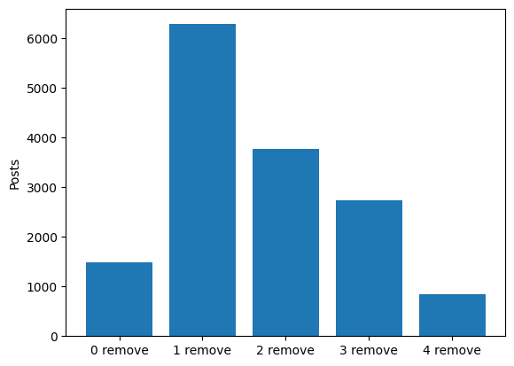

# Jev probabilities and human remove counts

Moderation trials have no skip decision. The human count is the number of remove votes among five labelers.

The mean difference score, human remove count minus Jev bin, is -0.1946.

## Human remove counts

| n_remove | n_posts |
| --- | --- |
| 0 | 3986 |
| 1 | 4592 |
| 2 | 3332 |
| 3 | 1929 |
| 4 | 950 |
| 5 | 324 |

## Jev probability bins

| jev_bin | n_posts |
| --- | --- |
| 0 | 1479 |
| 1 | 6282 |
| 2 | 3774 |
| 3 | 2738 |
| 4 | 840 |

## Difference scores

| difference_score | n_posts |
| --- | --- |
| -4 | 16 |
| -3 | 281 |
| -2 | 1352 |
| -1 | 4490 |
| 0 | 5123 |
| 1 | 2749 |
| 2 | 913 |
| 3 | 171 |
| 4 | 18 |
| 5 | 0 |

## Remove votes by Jev bin

| n_remove | 0 | 1 | 2 | 3 | 4 |
| --- | --- | --- | --- | --- | --- |
| 0 | 840 | 2240 | 687 | 203 | 16 |
| 1 | 467 | 2306 | 1229 | 512 | 78 |
| 2 | 138 | 1213 | 1023 | 805 | 153 |
| 3 | 26 | 424 | 563 | 700 | 216 |
| 4 | 8 | 89 | 216 | 383 | 254 |
| 5 | 0 | 10 | 56 | 135 | 123 |

