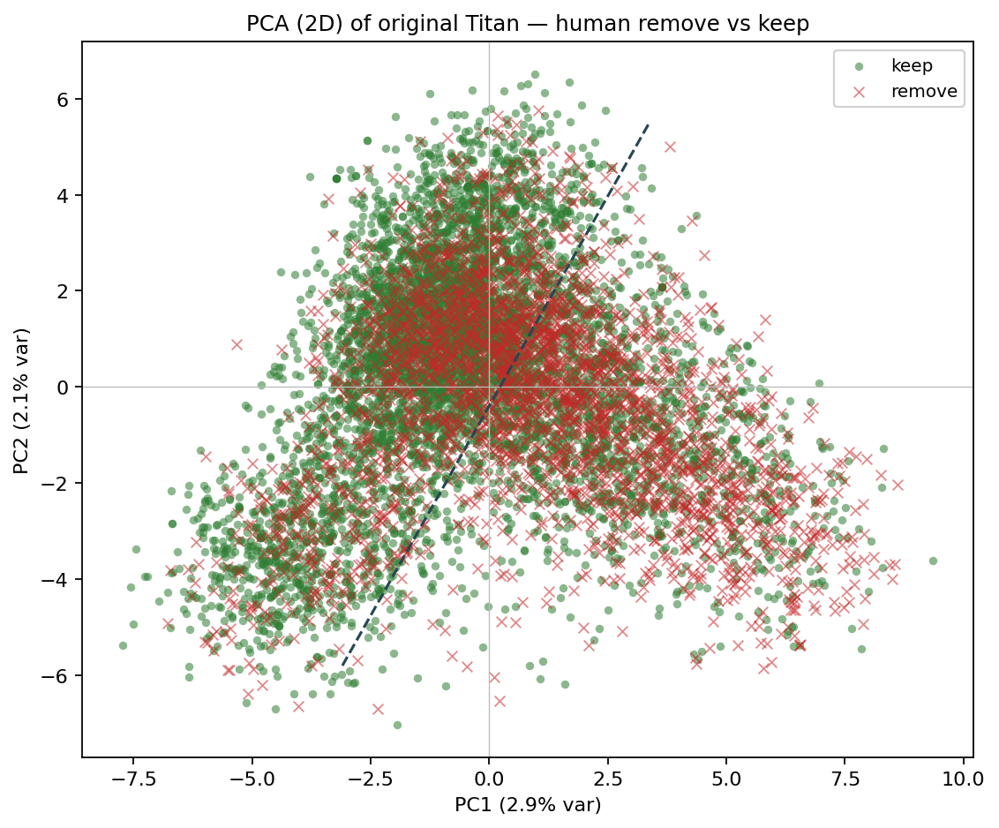
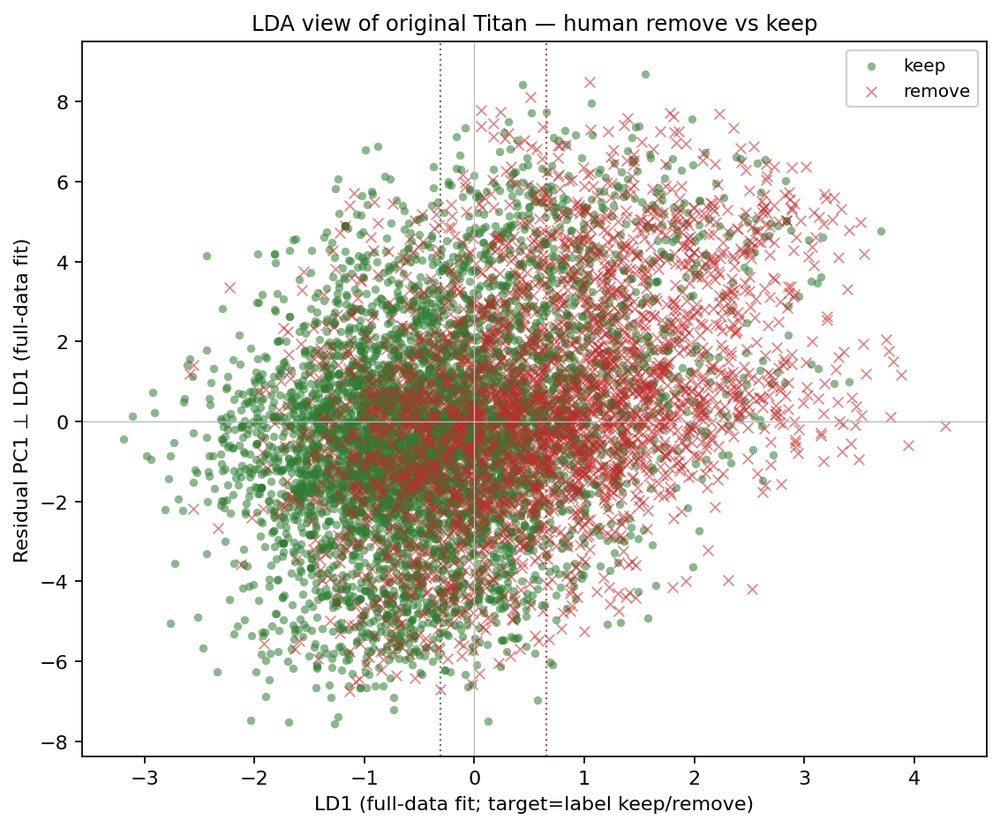
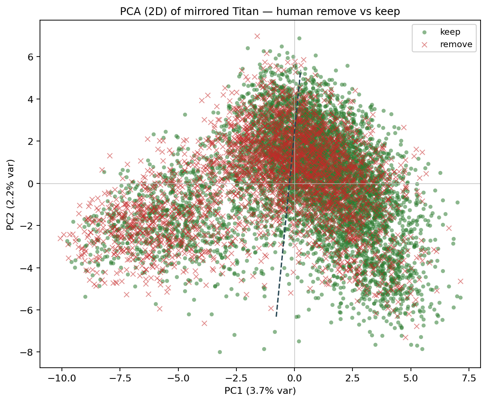
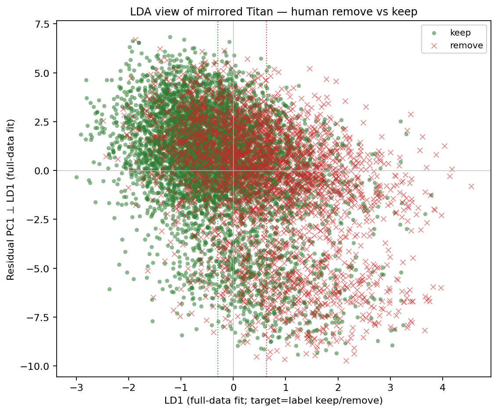
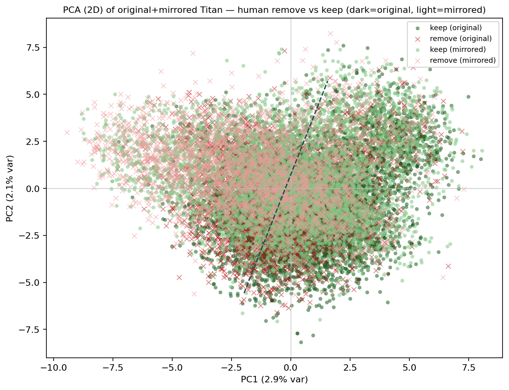
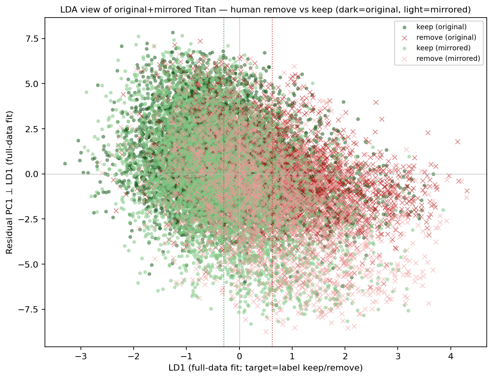

# Results — PCA/LDA on human keep/remove labels

Exploratory full-data fit on Titan embeddings (dim=256), colored by human `label` (`0=keep`, `1=remove`). Not holdout evaluation — Cohen-d below is descriptive only.

**n posts** = 8,791 (keep=5,978 / remove=2,813). Both-view stacks to 17,582 points.

## Original posts

| Metric | Value |
|--------|-------|
| PCA PC1 / PC2 variance | 2.88% / 2.14% |
| LD1 Cohen-d (remove − keep) | 0.96 |

## Mirrored posts

| Metric | Value |
|--------|-------|
| PCA PC1 / PC2 variance | 3.73% / 2.23% |
| LD1 Cohen-d (remove − keep) | 0.93 |

## Both (dark=original, light=mirrored)

| Metric | Value |
|--------|-------|
| PCA PC1 / PC2 variance | 2.90% / 2.10% |
| LD1 Cohen-d (remove − keep) | 0.92 |

## Brief notes

- First two PCs capture little of 256-d Titan variance (~5% combined); keep/remove clouds overlap heavily in the PC plane.
- Binary LDA finds a clearer 1D direction (~Cohen-d ≈ 0.9 across views) but this is an in-sample descriptive statistic under full-data fit — not a generalization claim.
- Mirrored-only PCA explains slightly more PC1 variance than original-only; LDA separability is similar across views.
- Linked-fate labels: one human label per `post_id` applies to both original and mirrored texts in the both-view stack.
