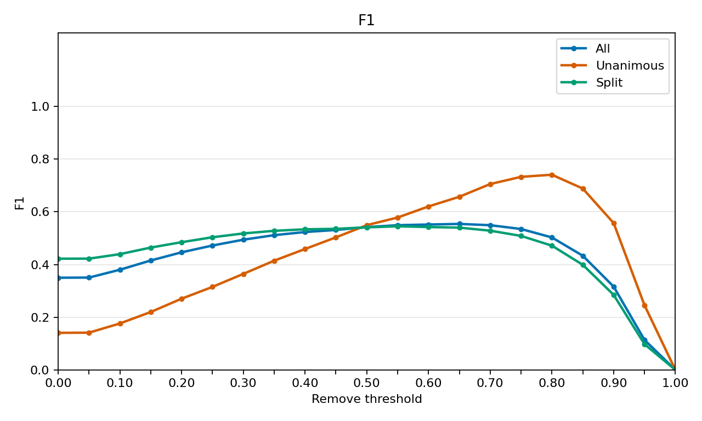
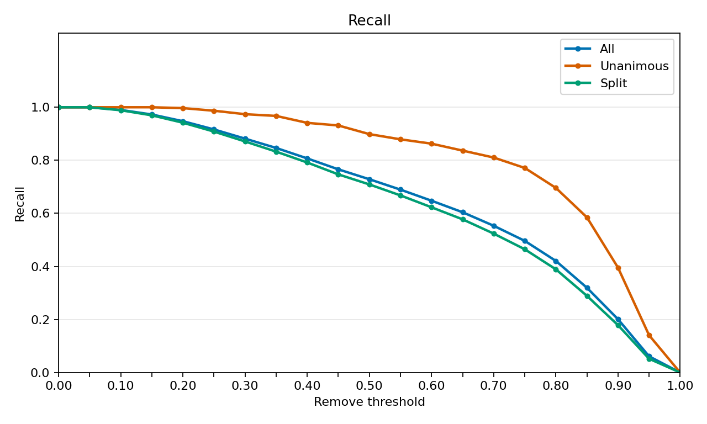
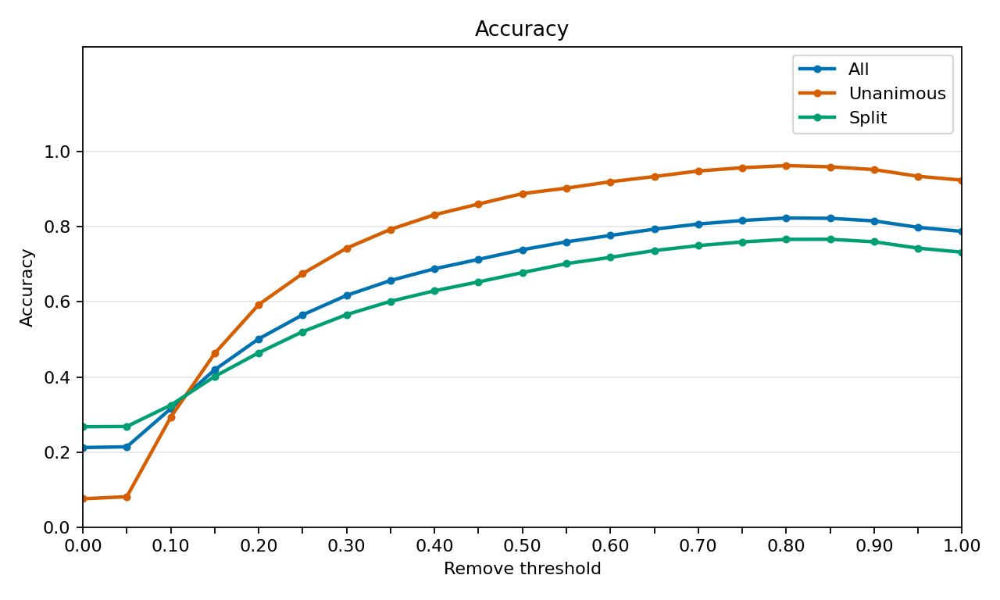
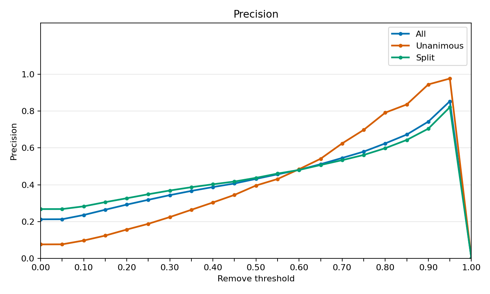
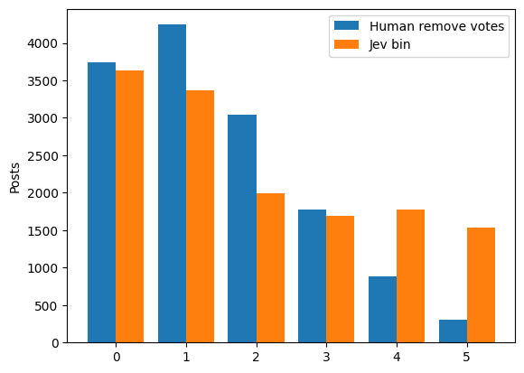

# Few-shot Jev inference with the balanced GEPA instruction

## Run record

Production run ID: `study2-jev-optimized-prompt-2026-10-04`.

S3 run prefix: `s3://mirrorview-experimental-artifacts/experiments/few_shot_jev_optimized_prompt_2026_10_04/runs/study2-jev-optimized-prompt-2026-10-04/jev_1_13_0/`.

Analysis prefix: `s3://mirrorview-experimental-artifacts/experiments/few_shot_jev_optimized_prompt_2026_10_04/analysis/study2-jev-optimized-prompt-2026-10-04/`.

Smoke measurement:

smoke_run_id=study2-jev-optimized-prompt-2026-10-04-smoke rows=5 predictions=5 unresolved_failures=0 status=complete real_seconds=3.78 input_tokens=9230 output_tokens=105 usd=0.000388

Production measurement:

production_run_id=study2-jev-optimized-prompt-2026-10-04 predictions=13992 unresolved_failures=0 status=complete real_seconds=804.78 input_tokens=25637525 output_tokens=293832 usd=1.076776

The prompt has ten demonstrations. Five of them are exact matches to prepared rows, and those five rows are unanimous. Model metrics leave those five rows out. Human label counts include all 13,992 predictions, including those five rows. The split-vote table counts the 9,941 split predictions, and those five unanimous rows are not in it. Usage includes all 13,992 predictions. Model metrics use 13,987 rows for all posts, 4,046 unanimous rows, and 9,941 split rows. F1, recall, and precision treat remove as the positive label.

## Human label distribution

| Dataset | Label | Count | Proportion |
| --- | --- | ---: | ---: |
| all | keep | 11,024 | 0.787879 |
| all | remove | 2,968 | 0.212121 |
| unanimous | keep | 3,743 | 0.923969 |
| unanimous | remove | 308 | 0.076031 |
| split | keep | 7,281 | 0.732421 |
| split | remove | 2,660 | 0.267579 |

## Split remove-vote distribution

| Remove votes | Count | Proportion |
| ---: | ---: | ---: |
| 1 | 4,244 | 0.426919 |
| 2 | 3,037 | 0.305502 |
| 3 | 1,777 | 0.178755 |
| 4 | 883 | 0.088824 |

## Model metrics

### All five-labeler posts

| Model | N | F1 | Accuracy | Recall | Precision |
| --- | ---: | ---: | ---: | ---: | ---: |
| Jev 1.13.0 | 13,987 | 0.542148 | 0.739043 | 0.728591 | 0.431682 |

### Unanimous posts

| Model | N | F1 | Accuracy | Recall | Precision |
| --- | ---: | ---: | ---: | ---: | ---: |
| Jev 1.13.0 | 4,046 | 0.549451 | 0.888532 | 0.898693 | 0.395683 |

### Split posts

| Model | N | F1 | Accuracy | Recall | Precision |
| --- | ---: | ---: | ---: | ---: | ---: |
| Jev 1.13.0 | 9,941 | 0.541099 | 0.678201 | 0.709023 | 0.437486 |

## Threshold curves

A pair is labeled remove when its remove probability is at least the threshold. Thresholds run from 0.00 to 1.00 in steps of 0.05. The axis labels are every 0.10. All has 13,987 pairs, unanimous has 4,046, and split has 9,941. The value at 0.50 matches the tables above.

### F1

### Recall

### Accuracy

### Precision

## Human votes and Jev bins

The bars use all 13,992 pairs. Blue bars count human remove votes from 0 through 5. Orange bars place each Jev remove probability into those same six bins. Each bin covers one sixth of the range from 0 to 1, and the last bin includes 1.

## Jev usage

| Model | Predictions | Input tokens | Output tokens | USD |
| --- | ---: | ---: | ---: | ---: |
| Jev 1.13.0 | 13,992 | 25,637,525 | 293,832 | 1.076776 |
