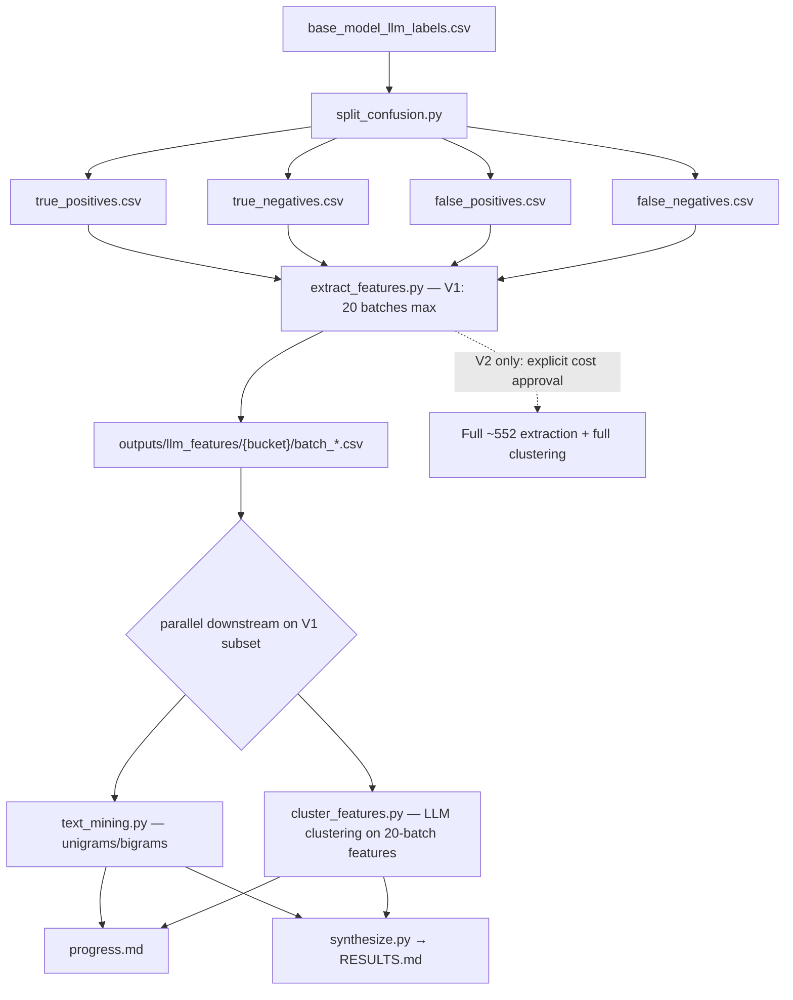

# Spec: Follow-up Model Error Analysis — LLM Feature Extraction (2026-07-15)

**Experiment dir:** `experiments/followup_model_error_analysis_2026_07_15/`  
**Builds on:** `experiments/model_errors_analysis_2026_07_15/`  
**Primary question:** What linguistic, semantic, and pragmatic features characterize posts where Bedrock Qwen3 Next 80B is right vs wrong — especially false positives (predicted remove when humans said keep)?

This document is an implementation spec only. Do **not** run the pipeline until this plan is accepted.

**Default scope = V1 (20 extraction calls).** The full-corpus run (V2, ~552 extraction calls) is **out of scope** unless the user gives **explicit cost approval** quoting the V2 estimate in § LLM cost tracking.

---

## Purpose

The July 2026 model-errors analysis showed that Qwen3 Next 80B is wrong on ~36% of Study 2 posts and that those errors are **diffuse** in Titan embedding space (test ROC-AUC ≈ 0.60; no high-lift clusters). This follow-up asks a complementary question: can an OpenAI LLM **read the post texts** and surface interpretable features that distinguish confusion-matrix buckets (TP / TN / FP / FN)?

We focus on **human remove = positive class** (`is_remove=1`) and treat Qwen false positives (predicted remove, actual keep) as a first-class slice for qualitative and quantitative follow-up.

**Phased scope:**

| Phase | Name | Extraction calls | Clustering | Status |
| --- | --- | ---: | --- | --- |
| **V1** | Pilot (this phase) | **exactly 20** | On the **20-batch feature subset only** | **In scope** — default for all scripts |
| **V2** | Full corpus | **~552** + clustering on full features | Full feature corpus | **Out of scope for V1** — must **not** run without **explicit cost approval** |

---

## Hard constraints

| Constraint | Rule |
| --- | --- |
| **V1 call cap (default)** | Phase 2 extraction defaults to **at most 20** LLM API calls. Scripts must be **V1-safe** unless `--full` / `--max-calls` is raised **and** V2 cost approval is recorded. |
| **No V2 without cost approval** | Do **not** start V2 / full extraction (~552 calls, est. **~$140** on `gpt-5.5` — see § LLM cost tracking) unless the user has given **explicit cost approval** quoting that estimate. |
| **No Bedrock re-run** | Do **not** call Bedrock, AWS Converse, or any `api_baselines/*/train.py`. Reuse only artifacts already on disk. |
| **No Titan re-embed** | Not required for this experiment; optional joins only. |
| **One CSV per LLM call** | After **each** OpenAI request completes, append/write that call's rows to its **own** CSV (never batch-write multiple calls into one file). |
| **Idempotent resume** | Before each API call, skip any batch whose output already exists (see § Deduplication / resume). Cost logs must not double-count skipped batches. |
| **Confidence gating** | Only persist features the LLM marks `confidence >= threshold` (default **0.85**). |
| **Spec-first** | Implement scripts only after this spec is accepted. |

---

## Dependencies on prior experiment

| Artifact | Path (repo-relative) | Role |
| --- | --- | --- |
| Labels + texts | `experiments/model_errors_analysis_2026_07_15/outputs/base_model_llm_labels.csv` | Sole input for confusion splits and feature extraction |
| Prior results | `experiments/model_errors_analysis_2026_07_15/RESULTS.md` | Context: 8,791 posts; accuracy 64.1%; diffuse errors |
| Prior spec | `experiments/model_errors_analysis_2026_07_15/spec.md` | Label conventions (`0=keep`, `1=remove`) |
| Env wiring | `lib/load_env_vars.py` | `OPENAI_API_KEY` via `EnvVarsContainer.get_env_var(..., required=True)` |
| LLM client pattern | `experiments/predict_keep_remove_2026_07_01/models/llm_api/client.py` | `ChatOpenAI` factory |
| Structured output pattern | `experiments/mirrors_content_analysis_2026_04_24/analysis/*/classifier.py` | `llm.with_structured_output(PydanticModel)` |

**Do not depend on** re-running anything under `experiments/predict_keep_remove_2026_07_01/models/llm_finetuning/api_baselines/`.

---

## Input schema (`base_model_llm_labels.csv`)

Inspected on main after PR #23 merge (8,791 rows).

| Column | Type | Definition |
| --- | --- | --- |
| `post_id` | str | Study `message_id` |
| `original_text` | str | Canonical original post |
| `mirrored_text` | str | Canonical mirror post |
| `label` | int | Human modal label: `0=keep`, `1=remove` |
| `classifier_id` | str | Always `bedrock/qwen3-next-80b-a3b` |
| `family` | str | `bedrock` |
| `ablation` | str | Pipe-delimited run metadata |
| `is_correct` | int | `1` iff Qwen `predicted_label == label` |

There is **no explicit `predicted_label` column** in the compiled CSV. Recover Qwen's prediction from `label` and `is_correct`:

```python
human_is_remove = label                          # 0=keep, 1=remove
qwen_is_remove = label if is_correct == 1 else 1 - label
```

Empirical distribution (full 8,791 rows):

| Metric | Count |
| --- | ---: |
| Human keep (`label=0`) | 5,978 |
| Human remove (`label=1`) | 2,813 |
| Qwen correct (`is_correct=1`) | 5,639 |
| Qwen wrong (`is_correct=0`) | 3,152 |

---

## Confusion-matrix label definitions (locked)

**Positive class = remove** → `is_remove = 1` when `label == 1`.

Let:

- `y = human_is_remove` (ground truth)
- `ŷ = qwen_is_remove` (model prediction, derived above)

| Bucket | Definition | Rows (expected) |
| --- | --- | ---: |
| **TP** (`true_positives.csv`) | `y=1` and `ŷ=1` — human remove, Qwen remove | 2,067 |
| **TN** (`true_negatives.csv`) | `y=0` and `ŷ=0` — human keep, Qwen keep | 3,572 |
| **FP** (`false_positives.csv`) | `y=0` and `ŷ=1` — human keep, Qwen remove (**Qwen false positive for remove**) | 2,406 |
| **FN** (`false_negatives.csv`) | `y=1` and `ŷ=0` — human remove, Qwen keep | 746 |

Sanity checks when splitting:

- Union of four buckets = full input; pairwise disjoint.
- `FP + FN = 3,152` (all Qwen errors).
- `TP + FN = 2,813` (all human removes).
- `TN + FP = 5,978` (all human keeps).

Each split file retains all source columns plus derived `human_is_remove`, `qwen_is_remove`, `confusion_bucket`.

---

## Proposed OpenAI model

**Primary model: `gpt-5.5`**

| Criterion | Choice |
| --- | --- |
| Performance | Strong structured-output and multi-attribute extraction on long social posts; handles unified multi-category extraction in a single call |
| Repo fit | Same LangChain `ChatOpenAI` + `with_structured_output` path as `mirrors_content_analysis` classifiers |
| Primary tier | Uses `gpt-5.5` (not `DEFAULT_LLM_MODEL` / `gpt-5.4-nano` in `lib/constants.py`) for extraction and clustering quality |
| Unified extraction | One call must return all six fixed categories plus open-ended features — requires a capable model with reliable structured output |

**Fallback (only if `gpt-5.5` unavailable in account):** `gpt-5.4-nano` — same API surface; use **only** when `gpt-5.5` is not accessible. Log the fallback in `run_manifest.json` and per-call metadata. Do **not** use `gpt-4.1`, `gpt-4o`, or any other model.

**Settings:** `temperature=0.0` (match `llm_api/client.py`); no streaming required.

**Client config (`extract/client.py`):**

```python
PRIMARY_MODEL = "gpt-5.5"
FALLBACK_MODEL = "gpt-5.4-nano"  # only if primary unavailable

def get_llm(model: str | None = None) -> ChatOpenAI:
    return ChatOpenAI(model=model or PRIMARY_MODEL, temperature=0.0)
```

Clustering pass (Phase 3b) uses the same primary/fallback pair. Under V1, clustering runs only on features from the **20 completed extraction batches**.

---

## Pipeline architecture



### Execution order

| Phase | Step | Parallelism | Progress file |
| --- | --- | --- | --- |
| 0 | Validate input CSV + counts | serial | `progress.md` |
| 1 | Emit 4 confusion CSVs | serial | `progress.md` |
| 2 | LLM feature extraction — **V1 default: 20 planned batches**; skip completed; `tqdm` + per-call cost log | **parallel across buckets** among the V1 plan; serial within bucket | `progress.md` |
| 3a | Naive text mining on **extracted** feature CSVs (V1 subset) | parallel with 3b | `progress.md` |
| 3b | LLM clustering on aggregated features from **V1 subset** (`tqdm` + cost log) | parallel with 3a | `progress.md` |
| 4 | Synthesis agent → `RESULTS.md` | serial (after 3a+3b) | `progress.md` |
| **V2** | Full extraction (~552) + clustering on full corpus | **Blocked** until explicit cost approval | `progress.md` |

**Parallelism notes:**

- Phase 2 (V1): process only the **20-batch selection plan** (see § V1 batch selection). Up to 4 bucket workers may run concurrently among buckets that have remaining planned calls. Each worker processes its planned chunks sequentially so each LLM response maps to exactly one output CSV. **No per-category parallelism** — all six categories plus open-ended features are extracted in a single call per chunk. Each worker shows a `tqdm` bar that distinguishes **skipped** vs **new** calls and appends to `cost_log.json` only after **new** API calls.
- Phase 3: `text_mining` and `cluster_features` are independent — launch as two parallel sub-paths after Phase 2 completes. **V1 clustering / text mining use only features from the 20-batch subset** (whatever batch CSVs exist under `outputs/llm_features/`).
- Phase 4: a single synthesis pass reads Phase 3 artifacts; no new LLM calls unless clustering was sharded (then one optional merge call — see § Clustering).
- **V2:** do not enlarge `--max-calls` or pass `--full` without recording explicit user cost approval (quote ~$140 extraction / ~$145–$150 full pipeline).

---

## V1 batch selection (exactly 20 calls)

**Unit:** one call = one deterministic batch ID = up to **16** posts (`CHUNK_SIZE=16`), unified multi-category extraction.

### Default allocation (error-weighted stratification)

Prefer covering **error-relevant** buckets when the budget is tight. Default plan for **exactly 20** extraction calls:

| Bucket | Planned batches | Chunk indices | Rationale |
| --- | ---: | --- | --- |
| **FP** | **8** | `0000`–`0007` | Priority slice (Qwen over-predicts remove) |
| **FN** | **4** | `0000`–`0003` | Other error type |
| **TP** | **4** | `0000`–`0003` | Correct remove baseline |
| **TN** | **4** | `0000`–`0003` | Correct keep baseline |
| **Total** | **20** | | |

Within each bucket, take the **first** `n` chunks in stable sort order of `post_id` (same ordering used for full-corpus chunking). That yields deterministic batch IDs:

```text
batch_id = "{bucket}/batch_{chunk_idx:04d}"
# examples: fp/batch_0000, fn/batch_0002, tp/batch_0001, tn/batch_0003
```

Persist the frozen plan to `outputs/llm_features/v1_batch_plan.json` (list of `batch_id`, bucket, `chunk_idx`, post_ids) before the first V1 API call so re-runs select the same 20.

### Posts per V1 plan (approx.)

| Bucket | Batches × 16 | Posts (≤) |
| --- | ---: | ---: |
| FP | 8 × 16 | 128 |
| FN | 4 × 16 | 64 |
| TP | 4 × 16 | 64 |
| TN | 4 × 16 | 64 |
| **Total** | **20** | **≤ 320** |

(Last chunk of a bucket may be shorter if fewer than 16 posts remain in that slice — not applicable for early indices on these large buckets.)

### V2 (full run) — out of scope without approval

Full corpus chunk counts (for reference / V2 only):

| Bucket | Rows | Chunks @ 16 |
| --- | ---: | ---: |
| TP | 2,067 | 130 |
| TN | 3,572 | 224 |
| FP | 2,406 | 151 |
| FN | 746 | 47 |
| **Total calls** | | **552** |

**HARD CONSTRAINT:** Do not start V2 / full extraction unless the user has given **explicit cost approval** quoting the V2 estimate (~**$140** extraction / ~**$145–$150** pipeline on `gpt-5.5`). Default CLI behavior must remain V1-safe (`--max-calls 20`).

---

## File layout

```text
experiments/followup_model_error_analysis_2026_07_15/
  spec.md                              # this file
  README.md                            # short how-to (after implement)
  progress.md                          # human-readable run log (all phases)
  RESULTS.md                           # final synthesis (written last)
  split/
    split_confusion.py                 # Phase 1
  extract/
    schemas.py                         # Pydantic models
    prompts.py                         # prompt templates (user may override)
    client.py                          # OpenAI factory (wraps lib/load_env_vars)
    pricing.py                         # per-1M token rates + cost helpers
    extract_features.py                # Phase 2 orchestrator (V1-safe, tqdm + resume + cost)
  analyze/
    text_mining.py                     # Phase 3a (V1 subset by default)
    cluster_features.py                # Phase 3b (V1 subset by default)
    synthesize.py                      # Phase 4
  outputs/
    confusion_splits/
      true_positives.csv
      true_negatives.csv
      false_positives.csv
      false_negatives.csv
      split_summary.json               # row counts + checksums
    llm_features/
      v1_batch_plan.json               # frozen list of 20 batch_ids + post_ids
      {tp|tn|fp|fn}/
        batch_{chunk_idx:04d}.csv      # one file per LLM call (all categories in one response)
        batch_{chunk_idx:04d}.meta.json  # tokens + cost_usd per call (written only for completed calls)
      cost_log.json                    # append-only per-call cost records (new calls only)
      cost_summary.json                # cumulative totals after Phase 2 completes
    text_mining/
      unigram_counts_{bucket}.csv
      bigram_counts_{bucket}.csv
      top_terms_{bucket}.png
      progress_snippet.md
    clustering/
      feature_corpus.parquet           # denormalized confident features (V1 subset or V2 full)
      cluster_batch_{i}.json           # per-shard LLM clustering output
      clusters_merged.json             # optional merge pass
      cluster_summary.md
      cost_log.json                    # per-shard / merge call costs
      cost_summary.json                # cumulative clustering totals
    run_manifest.json                  # model, scope (v1|v2), thresholds, costs, approval flag
```

---

## Feature categories (6 fixed + open-ended)

All six fixed categories **and** open-ended features are extracted in **one LLM call per chunk**. Each feature in the response carries its `category` tag.

| ID | Slug | Description |
| --- | --- | --- |
| 1 | `surface_lexical` | Surface and lexical features (length, register, slang, punctuation, named entities, etc.) |
| 2 | `topic_subject` | Topic and subject matter (policy domain, entities, events) |
| 3 | `semantic_content` | Semantic content (claims, framing, moral language, fact vs opinion) |
| 4 | `pragmatics_intent` | Pragmatics and communicative intent (sarcasm, persuasion, ridicule, call-to-action) |
| 5 | `target_directionality` | Target and directionality (who is criticized/praised; in-group vs out-group) |
| 6 | `compositional_syntax` | Compositional and syntactic structure (conditionals, contrasts, rhetorical questions, list patterns) |

**Open-ended rule:** Within the unified extraction call, the LLM may propose **additional** features beyond the fixed checklists (tagged `category=open_ended`, `is_open_ended=true`), but they must still pass confidence gating and use the same `ExtractedFeature` schema.

---

## Pydantic schema sketches

Implement in `extract/schemas.py`. Use Pydantic v2 (repo: `pydantic>=2.12`).

```python
from enum import Enum
from typing import Literal

from pydantic import BaseModel, Field


class FeatureCategory(str, Enum):
    SURFACE_LEXICAL = "surface_lexical"
    TOPIC_SUBJECT = "topic_subject"
    SEMANTIC_CONTENT = "semantic_content"
    PRAGMATICS_INTENT = "pragmatics_intent"
    TARGET_DIRECTIONALITY = "target_directionality"
    COMPOSITIONAL_SYNTAX = "compositional_syntax"
    OPEN_ENDED = "open_ended"  # LLM-proposed, not in fixed enum above


class ConfidenceLevel(str, Enum):
    HIGH = "high"      # >= 0.85 — persist
    MEDIUM = "medium"  # 0.60–0.84 — drop by default
    LOW = "low"        # < 0.60 — drop


class ExtractedFeature(BaseModel):
    """One feature assertion for one post."""
    feature_name: str = Field(description="Short snake_case feature name, e.g. 'second_amendment_framing'")
    feature_value: str = Field(description="Human-readable value or short description")
    category: FeatureCategory
    is_open_ended: bool = Field(description="True if not from the fixed category checklist")
    confidence: float = Field(ge=0.0, le=1.0, description="Model confidence this feature is present")
    evidence_span: str = Field(description="Short quoted substring from original or mirror supporting the feature")
    rationale: str = Field(description="One sentence explaining why the feature applies")


class PostFeatureExtraction(BaseModel):
    """Structured LLM response for one post — all categories in a single pass."""
    post_id: str
    features: list[ExtractedFeature] = Field(
        default_factory=list,
        description="All confident features across all six fixed categories plus any open-ended features",
    )


class BatchFeatureExtraction(BaseModel):
    """Structured LLM response for a chunk of posts (one API call, all categories)."""
    bucket: Literal["tp", "tn", "fp", "fn"]
    chunk_idx: int
    posts: list[PostFeatureExtraction]
```

**Persistence filter (application code, not schema):**

```python
CONFIDENCE_THRESHOLD = 0.85

def keep_feature(f: ExtractedFeature) -> bool:
    return f.confidence >= CONFIDENCE_THRESHOLD
```

**Per-call output CSV columns** (`batch_*.csv`):

`post_id`, `confusion_bucket`, `category`, `feature_name`, `feature_value`, `is_open_ended`, `confidence`, `evidence_span`, `rationale`, `llm_model`, `chunk_idx`, `batch_id`, `call_timestamp`

Per-call token/cost metadata lives in `batch_{chunk_idx:04d}.meta.json` and `cost_log.json` (not duplicated on every feature row).

---

## LLM feature extraction design

### Unit of work

- **One OpenAI API call** = one deterministic `batch_id` = `{bucket}/batch_{chunk_idx:04d}`.
- Each call receives up to **`CHUNK_SIZE` posts** (default **16**) from that bucket, including `post_id`, `original_text`, `mirrored_text`, `human_is_remove`, `qwen_is_remove`.
- The model extracts features for **all six fixed categories plus open-ended features** for every post in the chunk, in a single structured response.
- Response parsed via `llm.with_structured_output(BatchFeatureExtraction)`.
- Immediately write **one** `batch_{chunk_idx:04d}.csv` (+ optional `.meta.json`) under the matching bucket folder (one row per confident feature).

### Scope defaults

| Flag / setting | Default | Behavior |
| --- | --- | --- |
| `--max-calls` | **20** | Hard cap on **new** API calls this invocation (V1-safe) |
| `--scope` | `v1` | Use `v1_batch_plan.json` (20 batches) |
| `--full` / `--scope v2` | off | Expand to all ~552 chunks — **requires** `--i-approve-v2-cost` (or env) after explicit user approval quoting ~$140 |

Default behavior of scripts: **V1-safe** (cap at 20 calls / V1 plan). Re-running under V1 is safe and idempotent (see § Deduplication / resume).

### Text shown to the LLM

Send **both** `original_text` and `mirrored_text` plus confusion context so the model can compare framing shifts. The prior Qwen classifier used `original_plus_mirror`; mirroring that context is intentional.

---

## Deduplication / resume

Re-running `extract_features.py` must be **safe and idempotent** up to the V1 20-call plan (and, after V2 approval, up to the full corpus). Rules:

### Deterministic batch IDs

```text
batch_id = f"{bucket}/batch_{chunk_idx:04d}"
# paths:
#   outputs/llm_features/{bucket}/batch_{chunk_idx:04d}.csv
#   outputs/llm_features/{bucket}/batch_{chunk_idx:04d}.meta.json
```

Chunk indices are assigned by stable `post_id` sort within each bucket, then contiguous groups of 16 — identical for V1 and V2 so V1 batches are a prefix of the V2 schedule.

### Skip completed batches before calling the API

For each planned `batch_id` in the current scope (V1 plan or V2 full list):

1. If `batch_{chunk_idx:04d}.csv` **exists** (and optionally `.meta.json` if the run requires meta completeness), **skip** — do **not** call the API.
2. Only call the API for **missing** batches.
3. After a successful call, write CSV then meta, then append one cost record.

Incomplete writes: if CSV is missing or empty / corrupt, treat as incomplete and re-call (prefer deleting a partial CSV before retry). Prefer atomic write (temp file + rename).

### Within-run post deduplication

If the same `post_id` would appear in more than one planned chunk (should not happen under stable chunking; guard anyway): keep the first occurrence in plan order and drop later duplicates from the request payload. Log dropped duplicates to `progress.md`.

### Progress / tqdm

Bars and logs must reflect **skipped vs new**:

| Metric | Example |
| --- | --- |
| tqdm description | `FP extraction: 3 new / 5 skipped / 8 planned` |
| postfix | `cost=$0.18 cum=$1.40 new=3` |
| `progress.md` | `FP: planned=8 skipped=5 new=3 cum_cost=$1.40` |

Overall V1 banner: `V1 plan: 20 batches | already done: N | remaining API calls: 20-N (cap max_calls)`.

### Cost log must not double-count

- Append to `cost_log.json` **only** for batches that actually invoked the API in this (or a prior) successful completion.
- On resume, rebuild `cost_summary.json` by **summing unique `batch_id`s** in the cost log (or from existing `.meta.json` files) — never re-add skipped batches.
- Skipped batches contribute **$0** to this run's incremental spend; their historical cost remains in the log once.

### Idempotency summary

| Action | Safe? |
| --- | --- |
| Re-run V1 after partial completion | Yes — skips existing CSVs; only fills missing batches up to 20 |
| Re-run V1 when all 20 CSVs exist | Yes — **0** new API calls; refreshes summary from existing meta/log |
| Raise to V2 without approval flag | **Forbidden** — scripts refuse |
| V2 after explicit cost approval | Yes — same skip-if-exists rules over remaining ~532 batches |

---

## Progress bars (`tqdm`)

All LLM query loops **must** use [`tqdm`](https://github.com/tqdm/tqdm) progress bars:

| Loop | Location | Bar description |
| --- | --- | --- |
| Per-bucket planned chunks | `extract/extract_features.py` | One bar per bucket worker; show skipped vs new, e.g. `FP: 3 new / 5 skipped` |
| Overall extraction (optional outer bar) | `extract/extract_features.py` | Over V1's 20 planned batches (or V2 full list when approved) |
| Clustering shard loop | `analyze/cluster_features.py` | `Clustering shards: 3/7` |
| Merge call | `analyze/cluster_features.py` | Single-step bar if merge pass runs |

Configure `tqdm` with `leave=True`, `unit="call"` (or `unit="chunk"`), and write completed counts to `progress.md` at bucket boundaries. Do **not** rely on tqdm alone — still append structured entries to `progress.md` per § Progress tracking conventions.

---

## LLM cost tracking

### Pricing source and formula

Read token counts from each API response `usage` metadata (`prompt_tokens`, `completion_tokens`; use `cached_tokens` when present). Compute cost in USD:

```python
# Rates per 1M tokens — refresh from https://openai.com/api/pricing before each run
PRICING_USD_PER_1M = {
    "gpt-5.5": {"input": 5.00, "cached_input": 0.50, "output": 30.00},
    "gpt-5.4-nano": {"input": 0.20, "cached_input": 0.02, "output": 1.25},
}

def estimate_call_cost_usd(model: str, usage: dict) -> float:
    rates = PRICING_USD_PER_1M[model]
    prompt = usage.get("prompt_tokens", 0)
    cached = usage.get("cached_tokens", 0) or usage.get("prompt_tokens_details", {}).get("cached_tokens", 0)
    completion = usage.get("completion_tokens", 0)
    billable_input = max(prompt - cached, 0)
    return (
        billable_input * rates["input"] / 1_000_000
        + cached * rates["cached_input"] / 1_000_000
        + completion * rates["output"] / 1_000_000
    )
```

Store rates in `extract/pricing.py` (or inline constants with a `PRICING_AS_OF` date comment). Re-fetch from the OpenAI pricing page when starting a new run; do not hard-code stale rates without a refresh note.

### Per-query logging

After **each new** LLM call (extraction chunk or clustering shard) — **not** for skipped batches:

1. Compute `cost_usd` from usage + model actually used (primary or fallback).
2. Append one record to `outputs/llm_features/cost_log.json` (extraction) or `outputs/clustering/cost_log.json` (clustering) with: `phase`, `batch_id` or `shard_id`, `bucket`, `chunk_idx`, `model`, `prompt_tokens`, `completion_tokens`, `cached_tokens`, `cost_usd`, `call_timestamp`, `scope` (`v1`|`v2`).
3. Log to stdout / tqdm postfix: e.g. `cost=$0.18 cum=$1.40`.
4. Embed `cost_usd` and token counts in per-batch metadata (`batch_{chunk_idx:04d}.meta.json`).

Cost tracking (per-query + cumulative) **applies fully to the 20-call V1**.

### Cumulative and final summary

When a phase's query loop completes, write `outputs/llm_features/cost_summary.json` (and `outputs/clustering/cost_summary.json` if clustering ran):

```json
{
  "scope": "v1",
  "model_primary": "gpt-5.5",
  "model_fallback": "gpt-5.4-nano",
  "pricing_as_of": "2026-07-15",
  "planned_calls": 20,
  "skipped_existing": 0,
  "new_calls": 20,
  "total_prompt_tokens": 0,
  "total_completion_tokens": 0,
  "total_cost_usd": 0.0,
  "by_bucket": {"tp": {}, "tn": {}, "fp": {}, "fn": {}},
  "by_model": {"gpt-5.5": {}, "gpt-5.4-nano": {}}
}
```

Include extraction + clustering totals in root `run_manifest.json` under `llm_cost_summary`, plus `scope` and (for V2) `v2_cost_approval: true` only when approval was given.

### Pre-run cost estimates

Assumptions (same formula for V1 and V2):

| Assumption | Value |
| --- | ---: |
| Avg input tokens / call | ~15,000 (system prompt + 16 posts × original + mirror) |
| Avg output tokens / call | ~6,000 (structured features for 16 posts) |
| Model | `gpt-5.5` @ $5/1M in, $30/1M out |

**Formula:** `(calls × 15_000 × 5.00 + calls × 6_000 × 30.00) / 1_000_000`

#### V1 cost estimate (in scope — default)

| Run scope | Calls | Rough `gpt-5.5` estimate |
| --- | ---: | ---: |
| **V1 extraction (exactly 20)** | **20** | **~$5.10** ≈ **$5 USD** (±30%) |
| V1 clustering (typically 1–2 small shards on ≤320 posts' features) | 1–2 | ~$0.50–$2 |
| **V1 pipeline (extraction + clustering)** | | **~$5.50–$7** |

`(20 × 15_000 × 5.00 + 20 × 6_000 × 30.00) / 1_000_000` = **$5.10**.

Print this V1 estimate on every default Phase 2 startup / `--dry-run`.

#### V2 cost estimate (requires explicit approval — do not run by default)

| Run scope | Calls | Rough `gpt-5.5` estimate |
| --- | ---: | ---: |
| V2 full extraction (all buckets) | 552 | **~$140** |
| Clustering on full corpus (typical 4–8 shards) | 4–8 | ~$2–$10 |
| **V2 full pipeline (extraction + clustering)** | | **~$145–$150** |

**Approval gate:** quote **~$140** (extraction) / **~$145–$150** (full pipeline) and obtain **explicit user cost approval** before any V2 / `--full` run. Scripts must refuse V2 without an approval flag.

If fallback `gpt-5.4-nano` is used, scale by ~12× lower (same token assumptions). Recompute pre-run estimate in CLI `--dry-run` or startup banner using live pricing constants.

---

## Proposed prompts (DRAFT — user review required)

> **Note on missing user prompts:** The user indicated they intended to supply custom prompts ("I want to use these prompts: ---") but **no prompt text was included** in the request. The prompts below are **drafts for review**. Replace or edit the `extract/prompts.py` section before implementation.

### Unified extraction prompt (one call per chunk — all categories)

```text
You are a computational linguistics analyst studying social-media posts from a keep/remove moderation task.

Each item includes:
- original_text and mirrored_text (a political "mirror" rewrite)
- human_is_remove: ground-truth human label (0=keep, 1=remove)
- qwen_is_remove: Bedrock Qwen3 Next 80B prediction (0=keep, 1=remove)
- confusion_bucket: tp | tn | fp | fn

Your job is to extract features across ALL of the following categories in a single pass for each post. Be conservative:
- Include a feature ONLY if you are highly confident it is present.
- Set confidence in [0,1]; features below 0.85 will be discarded downstream.
- Provide a short evidence_span quoted from the texts.
- Tag each feature with its category (one of the six fixed categories below, or open_ended).
- You MAY propose additional open-ended features (category=open_ended, is_open_ended=true) if they are salient and high-confidence.
- Do NOT predict keep/remove labels. Do NOT explain Qwen's reasoning. Only describe observable linguistic/content features.
- Return structured JSON matching the BatchFeatureExtraction schema.

## Category 1: Surface and lexical (`surface_lexical`)

Fixed checklist (use when clearly present):
- approximate_token_length_band (short/medium/long)
- informal_register_or_slang
- high_punctuation_intensity
- all_caps_emphasis
- profanity_or_taboo_language
- hashtag_or_mention_pattern
- named_proper_nouns_density

## Category 2: Topic and subject matter (`topic_subject`)

Fixed checklist:
- primary_policy_domain (e.g., guns, climate, immigration, abortion, elections)
- specific_event_or_bill_reference
- geographic_scope (US_state, national, international)
- historical_analogy_reference
- culture_war_topic_salience

## Category 3: Semantic content (`semantic_content`)

Fixed checklist:
- causal_claim_present
- normative_moral_language
- factual_assertion_vs_speculation
- conspiratorial_framing
- victimhood_or_persecution_framing
- policy_prescription_present
- economic_cost_benefit_framing

## Category 4: Pragmatics and communicative intent (`pragmatics_intent`)

Fixed checklist:
- sarcasm_or_irony
- ridicule_or_mockery
- call_to_action
- persuasion_or_argumentation
- venting_or_expressive
- hedging_or_qualification
- emphatic_outrage

Only tag sarcasm if cues are strong (not speculative).

## Category 5: Target and directionality (`target_directionality`)

Fixed checklist:
- criticized_actor_type (politician, party, media, corporation, outgroup, ingroup, etc.)
- praised_actor_type
- left_right_directional_cue
- us_vs_them_framing
- elite_vs_populist_framing
- mirror_shift_direction (how the mirror re-targets blame or praise vs original)

Note directional shifts between original and mirror when confident.

## Category 6: Compositional and syntactic structure (`compositional_syntax`)

Fixed checklist:
- conditional_if_then_structure
- contrastive_but_however_structure
- rhetorical_question
- anaphora_or_parallelism
- list_or_enumeration
- quote_or_attribution_embedding
- second_person_direct_address

Tag structure patterns, not just single tokens.

## Open-ended features

Beyond the checklists above, you may add salient features with category=open_ended and is_open_ended=true.

For each post in this chunk, return all high-confidence features across all categories.

Bucket: {bucket}
Chunk: {chunk_idx}
Posts:
{posts_json}
```

---

## Phase 3a — Naive text mining (parallel path)

**Script:** `analyze/text_mining.py`

**Input (V1):** All confident features in existing `outputs/llm_features/**/batch_*.csv` from the **V1 20-batch subset** (concatenate `feature_name`, `feature_value`, `evidence_span` into a text field per row). Do not wait for full-corpus files.

**Per confusion bucket that has features:**

1. Tokenize (lowercase; simple alnum regex; English stopword list optional).
2. Count **unigrams** and **bigrams** over feature text fields.
3. Write `unigram_counts_{bucket}.csv`, `bigram_counts_{bucket}.csv` (columns: `term`, `count`, `bucket`).
4. Plot top-20 bar charts → `top_terms_{bucket}.png`.
5. Append a short summary section to `outputs/text_mining/progress_snippet.md`.

**Cross-bucket comparison:** produce a small table of terms enriched in FP vs TN (log-odds or simple ratio) — FP is the priority slice.

Log milestones in root `progress.md` under `## Text mining`. Note `scope=v1` and feature row counts.

---

## Phase 3b — Follow-up LLM clustering (parallel path)

**Script:** `analyze/cluster_features.py`

**Model:** `gpt-5.5` primary; `gpt-5.4-nano` fallback only (same as extraction). Record model per shard in `cost_log.json`.

**Input (V1):** Denormalized feature table built **only** from the 20-batch (or fewer, if partial) feature CSVs → `outputs/clustering/feature_corpus.parquet`. **V1 clustering runs on the 20-batch feature subset only** — not the full corpus.

Columns: `post_id`, `confusion_bucket`, `category`, `feature_name`, `feature_value`, `confidence`, `evidence_span`

**V2 clustering** (full feature corpus) is out of scope until V2 extraction is approved and complete.

### Context-limit strategy

1. **Serialize** the corpus to a compact JSON lines format: one line per post with deduped feature names/values.
2. **Estimate tokens** (~4 chars/token heuristic). OpenAI context budget for clustering pass: target **≤ 100k tokens** input per call (safe margin under 128k for `gpt-5.5`).
3. **Shard** by confusion bucket first; if a bucket still exceeds budget, shard by chunk-index ranges; if still too large, sample stratified by `feature_name` frequency (preserve rare features). Under V1, the subset will often fit in **1–2** shards.
4. **Per shard:** one LLM call → `cluster_batch_{i}.json` using schema below.
5. **If multiple shards:** optional **merge call** (`cluster_merge`) that reads cluster summaries (not full corpus) and emits `clusters_merged.json`.

### Clustering output schema

```python
class FeatureCluster(BaseModel):
    cluster_id: int
    cluster_label: str
    defining_features: list[str]
    example_post_ids: list[str] = Field(max_length=10)
    bucket_mix: dict[str, int]  # tp/tn/fp/fn counts
    interpretation: str


class ClusteringResult(BaseModel):
    shard_id: str
    clusters: list[FeatureCluster]
    cross_cutting_themes: list[str]
    fp_specific_themes: list[str]  # prioritize Qwen false-positive patterns
```

### Proposed clustering prompt (DRAFT)

```text
You are synthesizing LLM-extracted linguistic features from social-media posts grouped by Qwen3 keep/remove confusion buckets.

Input: JSONL of posts with their high-confidence extracted features (multiple categories).

Tasks:
1. Identify 5–12 clusters of posts/features that recur together.
2. For each cluster: name it, list defining features, give up to 10 example post_ids, report bucket_mix (tp/tn/fp/fn).
3. List cross-cutting themes across clusters.
4. Explicitly call out themes that are **over-represented among FP (false positive remove)** vs TN.

Do not invent features not present in the input. Prefer interpretable, moderation-relevant themes.

Return structured JSON matching ClusteringResult.

Feature corpus shard:
{corpus_jsonl}
```

### Proposed merge prompt (DRAFT, only if sharded)

```text
You are merging multiple partial clustering results from shards of the same feature-extraction experiment.

Input: list of ClusteringResult objects from shards.

Tasks:
1. Merge semantically duplicate clusters.
2. Produce a final consolidated list of 6–15 clusters.
3. Highlight FP-enriched themes with supporting cluster_ids.

Return structured JSON matching ClusteringResult with shard_id="merged".
```

Log milestones in root `progress.md` under `## Clustering`. Use `tqdm` over shard loop; log per-shard cost to `outputs/clustering/cost_log.json`. State clearly that results are **V1 pilot** (20-batch subset) unless V2 was approved.

---

## Phase 4 — Final synthesis

**Script:** `analyze/synthesize.py` (or manual agent step)

**Output:** `RESULTS.md` (consistent with prior experiment naming)

**Sections:**

1. Executive summary (3–5 bullets) — label findings as **V1 pilot** unless V2 completed
2. Confusion split counts (reconcile with `split_summary.json`)
3. V1 coverage: which 20 batches / ~posts were extracted
4. Top surface/semantic patterns per bucket (from text mining on V1 subset)
5. LLM cluster interpretations (from clustering JSON on V1 subset)
6. FP-focused findings — what features co-occur when Qwen over-predicts remove?
7. Limitations (confidence threshold, **20-call pilot**, no Bedrock re-run, API cost — cite `cost_summary.json` totals; note V2 not run without approval)
8. Artifact index

---

## Progress tracking conventions

**File:** `progress.md` at experiment root (prior experiment used `progress_updates.md` in subfolders; this follow-up uses a **single** root file for simplicity).

**Entry format:**

```markdown
## [ISO-8601 timestamp] Phase name

- Status: started | completed | failed
- Scope: v1 | v2
- Details: ...
- Artifacts: ...
- Cost (if LLM phase): cumulative_usd=... new_calls=... skipped=... planned=...
```

Update after each phase (and optionally after each bucket in Phase 2). Sub-paths (`text_mining/progress_snippet.md`, `clustering/cluster_summary.md`) hold detail; root `progress.md` links to them.

**Phase 2 progress granularity:** log per bucket (e.g., "FP: planned=8 skipped=2 new=6; cum cost $1.40") — not per category, since each chunk covers all categories in one call. Mirror tqdm postfix values (new vs skipped + cumulative cost) into `progress.md` at bucket completion.

**CLI / live output:** Phase 2 and 3b scripts print **V1** (or approved V2) pre-run cost estimate on startup, `tqdm` bars during execution (skipped vs new), and final `cost_summary.json` path on completion. Refuse V2 without approval.

---

## Implementation package sketch (post-acceptance)

| Module | Responsibility |
| --- | --- |
| `split/split_confusion.py` | Read labels CSV → 4 splits + `split_summary.json` |
| `extract/client.py` | `get_llm(model="gpt-5.5")` via `EnvVarsContainer`; fallback to `gpt-5.4-nano` only |
| `extract/pricing.py` | Token-rate table, `estimate_call_cost_usd`, V1/V2 pre-run budget helpers |
| `extract/prompts.py` | Unified extraction template (user-overridable) |
| `extract/schemas.py` | Pydantic models |
| `extract/extract_features.py` | V1-safe chunk loop (`--max-calls 20`), resume/skip, `tqdm`, unified call per chunk, per-call CSV, cost log without double-count |
| `analyze/text_mining.py` | Unigram/bigram counts + plots on available feature CSVs |
| `analyze/cluster_features.py` | Shard/cluster on **V1 subset** by default (`tqdm` + cost log); full corpus only after V2 |
| `analyze/synthesize.py` | Assemble `RESULTS.md` (label V1 vs V2) |

**CLI entrypoints (proposed):**

```bash
# Phase 1
PYTHONPATH=. uv run python experiments/followup_model_error_analysis_2026_07_15/split/split_confusion.py

# Phase 2 — V1 default (exactly 20 planned batches; skips completed; prints ~$5 estimate)
PYTHONPATH=. uv run python experiments/followup_model_error_analysis_2026_07_15/extract/extract_features.py

# Phase 2 dry-run budget (no API calls; shows V1 plan + estimate)
PYTHONPATH=. uv run python experiments/followup_model_error_analysis_2026_07_15/extract/extract_features.py --dry-run

# Phase 2 V2 — FORBIDDEN unless user gave explicit cost approval (~$140 / ~$145–$150)
# PYTHONPATH=. uv run python .../extract/extract_features.py --scope v2 --i-approve-v2-cost

# Phase 3 (parallel; operate on whatever feature CSVs exist — V1 subset)
PYTHONPATH=. uv run python experiments/followup_model_error_analysis_2026_07_15/analyze/text_mining.py
PYTHONPATH=. uv run python experiments/followup_model_error_analysis_2026_07_15/analyze/cluster_features.py

# Phase 4
PYTHONPATH=. uv run python experiments/followup_model_error_analysis_2026_07_15/analyze/synthesize.py
```

---

## Open questions for user before implementation

1. **Prompts:** Replace draft prompts with user-supplied versions (were missing from the request).
2. **Confidence threshold:** 0.85 default — adjust?
3. **V1 allocation tweak:** Default is FP=8 / FN=4 / TP=4 / TN=4. Prefer even more FP weight (e.g. FP=10 / FN=4 / TP=3 / TN=3)?
4. **V2:** Not in scope until explicit cost approval of ~$140 extraction / ~$145–$150 full pipeline.

---

## Acceptance checklist

- [ ] User reviews and approves this spec (V1 = 20 calls default)
- [ ] User supplies or edits prompt templates
- [ ] `OPENAI_API_KEY` present in repo `.env`
- [ ] Phase 1 split counts match table above
- [ ] No Bedrock / Titan API calls in this experiment
- [ ] Phase 2 defaults to V1: max 20 calls; `v1_batch_plan.json` frozen; resume skips existing batch CSVs
- [ ] Phase 2 prints **V1** pre-run cost estimate (~$5); `tqdm` shows skipped vs new; `cost_summary.json` present; skipped batches not double-counted
- [ ] Phase 3a/3b run on the **20-batch feature subset** only (unless V2 approved later)
- [ ] V2 / full ~552-call extraction is **not** started without **explicit cost approval** quoting ~$140 / ~$145–$150
- [ ] Scripts refuse `--scope v2` / `--full` without an approval flag
