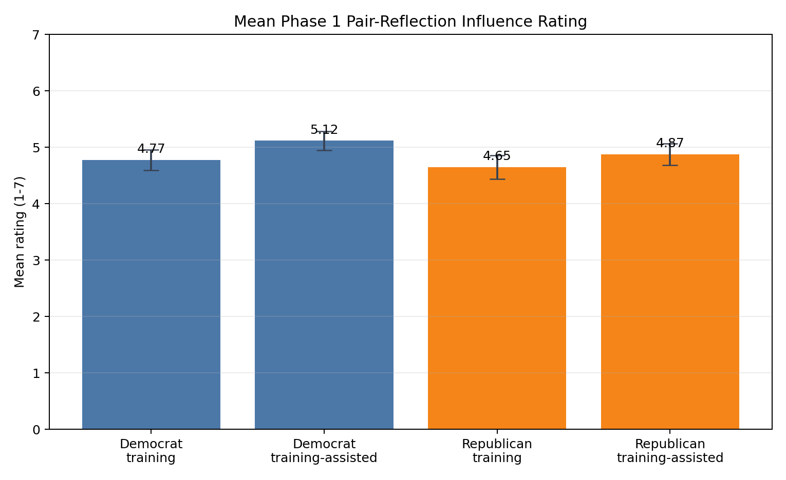
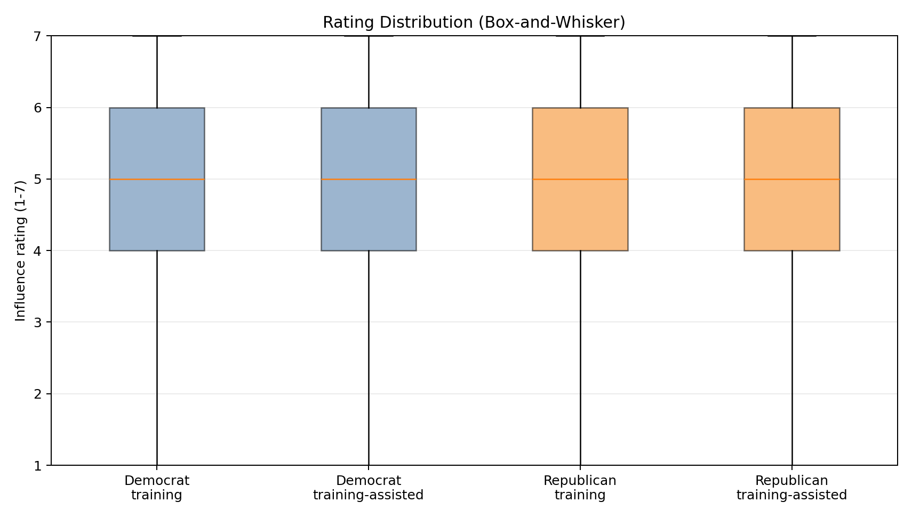
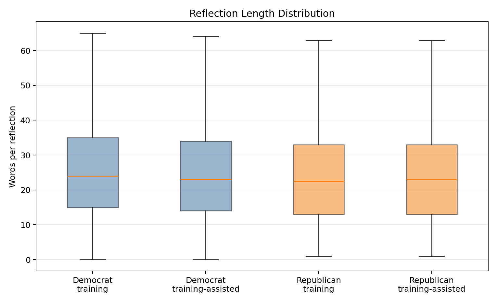
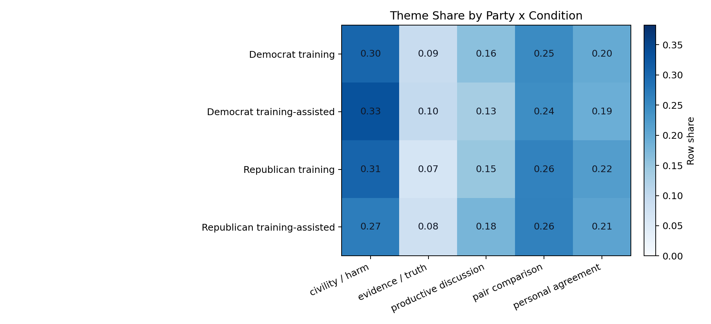

# Phase 1 Free-Response Analysis

This experiment analyzes the Phase 1 free-response reflection item and the paired influence
rating from the latest pilot export:

`scripts/mirrorview_pilot_data_2026_04_28-16:31:47.csv`

Run command:

```bash
PYTHONPATH=. uv run python experiments/free_response_analysis_2026_04_28/main.py
```

The script first creates a cached filtered dataset at:

`experiments/free_response_analysis_2026_04_28/phase1_free_response_filtered.csv`

On later runs, `main.py` reads that cached CSV if it exists. If it does not exist, the script
recreates it from the raw pilot export.

The script also writes Matplotlib figures to:

`experiments/free_response_analysis_2026_04_28/plots/`

## Filtering Rule

The filtered dataset keeps only rows where:

- `phase == 1`
- `phase1_pair_reflection_text` is present and non-empty
- `phase1_pair_influence_rating` is present and numeric

This produces `1,320` rows from `1,316` distinct users. All retained rows are in the two
conditions where Phase 1 pair reflection is relevant: `training` and `training_assisted`.

## Overall Summary

The average influence rating is moderately high:

- Mean influence rating: `4.855`
- Median influence rating: `5.000`
- Mean reflection length: `26.974` words

This suggests most users reported that the Phase 1 pair-reflection exercise had at least some
influence on how they made their judgments. The distribution is not uniformly high, however:
there is a meaningful lower-rating tail, especially in the Republican training cell.

## Plots

The plots below are generated by `main.py` and saved as stable PNG artifacts.



The mean-rating plot makes the main descriptive treatment pattern easy to see:
`training_assisted` is higher than `training` for both party groups. Democrats in
`training_assisted` have the highest mean influence rating, while Republicans in `training`
have the lowest. Error bars show approximate 95% confidence intervals around each cell mean.



This rating-distribution box-and-whisker plot shows the median and spread of ratings in each
party x condition cell. It helps compare distribution shape directly (center, IQR, whiskers)
without collapsing everything to a single mean.



The word-count boxplot suggests reflection length is broadly comparable across cells. This is
important because the influence-rating differences do not appear to be paired with a large
difference in response verbosity or completion quality.



Keyword categories used in the heatmap:

| Category | Example keywords / stems matched |
| --- | --- |
| Civility / harm | `civility`, `civil`, `curse`, `cuss`, `hate`, `hateful`, `harm`, `insult`, `mean`, `offensive`, `profane`, `profanity`, `rude`, `threat`, `toxic`, `violence`, `violent` |
| Evidence / truth | `accurate`, `accuracy`, `evidence`, `fact`, `facts`, `false`, `lie`, `lies`, `misinformation`, `misleading`, `truth`, `true`, `untrue` |
| Productive discussion | `conversation`, `debate`, `discuss`, `discussion`, `productive`, `respect`, `respectful`, `viewpoint`, `viewpoints` |
| Pair comparison | `both`, `compare`, `compared`, `comparable`, `counterpart`, `mirror`, `pair`, `same`, `similar` |
| Personal agreement | `agree`, `agreed`, `disagree`, `disagreed`, `belief`, `believe`, `opinion`, `opinions` |

The heatmap is row-normalized: within each party x condition row, the five theme shares sum to
`1.0`. This makes the figure comparative within each subgroup, so you can see which theme is
most prominent relative to that subgroup's own total theme mentions. Under this normalization,
civility / harm remains the largest share in every row.

## Top Terms

| Party | Condition | Top terms |
| --- | --- | --- |
| democrat | training | posts, post, speech, one, allowed, language, people, think |
| democrat | training-assisted | posts, one, post, language, political, speech, allowed, remove |
| republican | training | free, speach, posts, post, language, speech, political, people |
| republican | training-assisted | posts, language, post, speech, one, think, like, removed |

The Republican training cell stands out for the frequency of `free` and the misspelled
`speach`, suggesting that free-speech framing was especially salient in that subgroup. Across
all cells, common terms emphasize posts, speech, language, allowing/removing, and political
content.

## Interpretation

The assisted version of the training appears descriptively more influential than the unassisted
training version for both Democrats and Republicans. The difference is not enormous, but it is
directionally consistent, and the assisted condition has fewer low ratings in both party groups.

Qualitatively, users mostly report applying moderation criteria tied to civility, harmfulness,
profanity, productive discussion, and whether the two paired posts should be treated
symmetrically. This is broadly aligned with the MirrorView design goal: getting users to judge
the form and conversational value of political speech rather than simply reacting to ideological
agreement or disagreement.

The current analysis should be treated as descriptive. It does not test statistical significance,
does not model participant-level covariates, and uses simple keyword matching for the theme
EDA. A next pass should add inference around the rating differences and a stronger qualitative
coding procedure for reflection themes.
