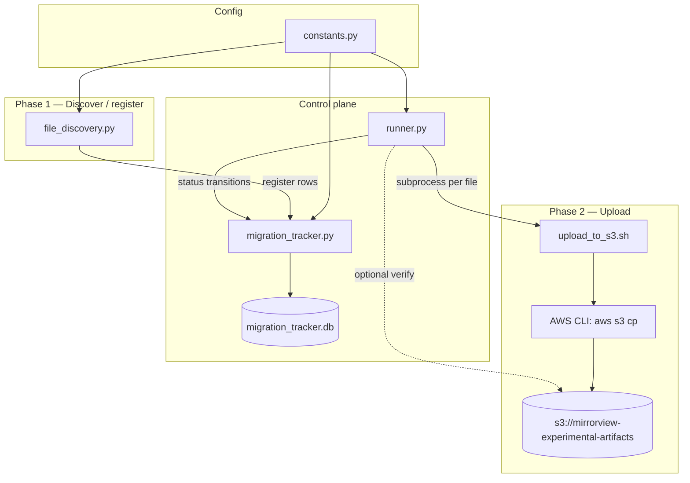
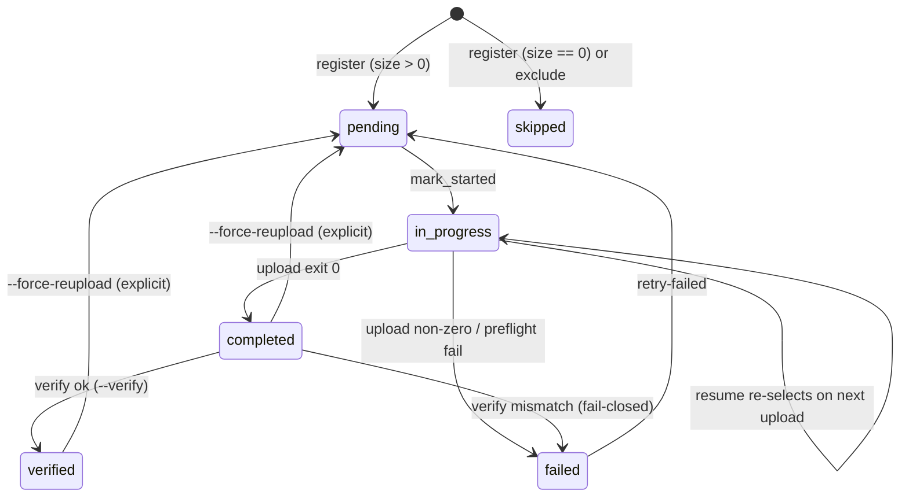

# Spec: Migrate local experiment artifacts to S3

**Date:** 2026-07-20  
**Status:** Implementation spec (v1 tooling)  
**Source of design intent:** `v2_migration_work_plan.md`  
**Inventory grounding:** `AFFECTED_FILES.md` (~239 csv/json, 9 folders, ~86 MB)  
**Pattern notes:** `EXSITING_MIGRATION_PATTERN.md` (Bluesky two-phase + SQLite; upload stack intentionally differs)

This document freezes interfaces for implementers. Prefer these contracts over the work plans when they conflict. Deviations from v2 are called out in [§17](#17-deviations-from-v2).

---

## 1. Goal

Upload allowlisted `*.csv` and `*.json` under `experiments/{folder}/` into
`s3://mirrorview-experimental-artifacts/` with **path-preserving keys**, tracked in a
**local SQLite DB**, with resume, explicit failed-retry, dry-run, and optional post-upload verify.

---

## 2. Overall architecture

### 2.1 Component diagram



### 2.2 Responsibility split

| Component | Language | Owns | Does not own |
| --- | --- | --- | --- |
| `constants.py` | Python | Bucket, region default, allowlist, excludes, DB path, script paths | I/O |
| `migration_tracker.py` | Python | Schema, status API, queries | Discovery, AWS |
| `file_discovery.py` | Python | Glob allowlisted roots, compute metadata + `s3_key`, register into DB | Uploads |
| `runner.py` | Python | CLI orchestrator: init / upload / status / retry-failed / verify / export; invokes bash; updates status | Bytes to S3 |
| `upload_to_s3.sh` | Bash | Single-object `aws s3 cp`; dry-run print | DB, discovery, multi-file loops |

Same process model as Bluesky: **no queue workers / daemons**. Sequential uploads are the v1 default.

### 2.3 Recommended layout (experiment-scoped)

```text
experiments/migrate_local_artifacts_to_s3_2026_07_20/
├── spec.md                          # this document
├── v2_migration_work_plan.md
├── AFFECTED_FILES.md
├── EXSITING_MIGRATION_PATTERN.md
├── init_migration_work_plan.md
├── constants.py
├── migration_tracker.py
├── file_discovery.py
├── runner.py
├── upload_to_s3.sh                  # executable
├── migration_tracker.db             # gitignored
├── inventory/                       # optional discovery dumps
├── manifests/                       # optional completed exports
├── notes/
│   └── aws_setup.md
└── tests/
```

---

## 3. S3 bucket and key convention

### 3.1 Bucket

| Setting | Value |
| --- | --- |
| Bucket name | `mirrorview-experimental-artifacts` |
| Default region | `us-east-2` (matches `scripts/upload_to_s3/constants.py`; override with `--region` / `AWS_DEFAULT_REGION`) |
| Access | Private; block public access; SSE on (infra, not this tooling) |
| Keyspace | Do **not** share with study/release buckets (`scripts/upload_to_s3/`) without an explicit prefix policy |

### 3.2 Key mapping

```text
s3_key = Path(local_path).relative_to(repo_root).as_posix()
s3_uri = f"s3://{bucket}/{s3_key}"
```

Rules:

- 1:1 mirror of **repo-relative** path (POSIX `/` separators).
- No flattening, no content-hash renaming, no `latest/` aliases, no env prefixes in v1.
- Hard-fail at registration if two distinct `local_path` values map to the same `s3_key` (UNIQUE on `s3_key`).
- Paths with `:` in timestamp dirs (e.g. `2026_06_17-14:50:48`) are valid S3 keys; **always quote** in bash.

### 3.3 Examples

| Local path (repo-relative) | S3 URI |
| --- | --- |
| `experiments/followup_model_error_analysis_2026_07_15/outputs/confusion_splits/false_positives.csv` | `s3://mirrorview-experimental-artifacts/experiments/followup_model_error_analysis_2026_07_15/outputs/confusion_splits/false_positives.csv` |
| `experiments/scaled_mirrors_generation_2026_06_02/generated_flips/combined_flips/flips.csv` | `s3://mirrorview-experimental-artifacts/experiments/scaled_mirrors_generation_2026_06_02/generated_flips/combined_flips/flips.csv` |
| `experiments/predict_keep_remove_2026_07_01/keep_remove_results_2026_06_23.csv` | `s3://mirrorview-experimental-artifacts/experiments/predict_keep_remove_2026_07_01/keep_remove_results_2026_06_23.csv` |
| `experiments/mirrors_content_analysis_2026_04_24/analysis/valence_classifier/outputs/2026_05_07-02:33:53/analysis_mirrors.csv` | same path as key under the bucket |

---

## 4. Constants (`constants.py`)

Freeze these names and defaults:

```python
from pathlib import Path

EXPERIMENT_DIR = Path(__file__).resolve().parent
REPO_ROOT = EXPERIMENT_DIR.parents[1]  # .../mirrorView-task

BUCKET = "mirrorview-experimental-artifacts"
DEFAULT_REGION = "us-east-2"

DB_PATH = EXPERIMENT_DIR / "migration_tracker.db"
UPLOAD_SCRIPT = EXPERIMENT_DIR / "upload_to_s3.sh"
INVENTORY_DIR = EXPERIMENT_DIR / "inventory"
MANIFESTS_DIR = EXPERIMENT_DIR / "manifests"

# Default allowlist: the 9 folders with csv/json in AFFECTED_FILES.md
EXPERIMENT_ALLOWLIST: tuple[str, ...] = (
    "experiments/fetch_reddit_pushshift_dump_2026_06_15",
    "experiments/followup_model_error_analysis_2026_07_15",
    "experiments/mirrors_content_analysis_2026_04_24",
    "experiments/model_errors_analysis_2026_07_15",
    "experiments/predict_keep_remove_2026_05_07",
    "experiments/predict_keep_remove_2026_07_01",
    "experiments/scaled_mirrors_generation_2026_06_02",
    "experiments/simplified_predict_remove_2026_05_13",
    "experiments/truncate_posts_2026_06_19",
)

# Always skip these path fragments (matched against repo-relative POSIX path)
EXCLUDE_PATH_SUBSTRINGS: tuple[str, ...] = (
    "experiments/migrate_local_artifacts_to_s3_2026_07_20/",
    "/__pycache__/",
    "/.git/",
)

INCLUDE_SUFFIXES: tuple[str, ...] = (".csv", ".json")

# Empty files (size == 0) register as skipped
SKIP_EMPTY_FILES: bool = True
```

Optional later: `EXCLUDE_GLOBS` / exclude file. v1 uses substring excludes only.

---

## 5. SQLite schema

**DB path:** `experiments/migrate_local_artifacts_to_s3_2026_07_20/migration_tracker.db`  
**Must be gitignored.**

### 5.1 DDL

```sql
CREATE TABLE IF NOT EXISTS migration_files (
  id INTEGER PRIMARY KEY AUTOINCREMENT,
  local_path TEXT NOT NULL UNIQUE,          -- repo-relative, POSIX separators
  s3_key TEXT NOT NULL,                    -- same as local_path for v1 1:1 mirror
  file_size_bytes INTEGER NOT NULL,
  sha256 TEXT,                             -- hex digest at register time
  mtime_ns INTEGER,                        -- os.stat().st_mtime_ns at register
  experiment_prefix TEXT NOT NULL,         -- matching allowlist entry, e.g.
                                           -- experiments/followup_model_error_analysis_2026_07_15
  status TEXT NOT NULL DEFAULT 'pending'
    CHECK(status IN (
      'pending','in_progress','completed','failed','skipped','verified'
    )),
  started_at TEXT,                         -- ISO-8601 UTC when mark_started
  completed_at TEXT,                       -- ISO-8601 UTC when completed/failed/verified
  verified_at TEXT,                        -- ISO-8601 UTC when verified
  error_message TEXT,
  created_at TEXT NOT NULL DEFAULT (strftime('%Y-%m-%dT%H:%M:%SZ', 'now')),
  updated_at TEXT NOT NULL DEFAULT (strftime('%Y-%m-%dT%H:%M:%SZ', 'now'))
);

CREATE INDEX IF NOT EXISTS idx_migration_status
  ON migration_files(status);
CREATE INDEX IF NOT EXISTS idx_migration_prefix
  ON migration_files(experiment_prefix);
CREATE INDEX IF NOT EXISTS idx_migration_status_prefix
  ON migration_files(status, experiment_prefix);
CREATE UNIQUE INDEX IF NOT EXISTS idx_migration_s3_key
  ON migration_files(s3_key);
```

### 5.2 Constraints summary

| Constraint | Purpose |
| --- | --- |
| `UNIQUE(local_path)` | Idempotent registration |
| `UNIQUE(s3_key)` | Collision hard-fail |
| `CHECK(status IN (...))` | Closed status set |
| Indexes on `status`, `experiment_prefix`, `(status, experiment_prefix)` | Upload + status queries |

### 5.3 Timestamp convention

Store UTC ISO-8601 with `Z` suffix (e.g. `2026-07-20T19:00:00Z`). Use Python `datetime.now(timezone.utc).strftime("%Y-%m-%dT%H:%M:%SZ")` for status updates; SQLite `strftime` defaults are fine for `created_at` / `updated_at` on insert. Every status mutation must bump `updated_at`.

---

## 6. Status lifecycle



### 6.1 Status meanings

| Status | Meaning | Default upload selects? |
| --- | --- | --- |
| `pending` | Registered, not uploaded | Yes |
| `in_progress` | Upload started; crash may leave this | Yes (resume) |
| `completed` | Bash upload exited 0 | No |
| `failed` | Bash non-zero, preflight, or verify fail | No (use `retry-failed`) |
| `skipped` | Empty file and/or exclude at register | No |
| `verified` | Remote matched local (size + sha256) | No |

**Computed (not a DB status):** `stale` — a `completed`/`verified` row whose on-disk size or sha256 no longer matches DB metadata. Report in `status`; require `--force-reupload` to reset to `pending`.

### 6.2 Failed-retry policy (explicit; fixes Bluesky README/code gap)

- Default upload query: `status IN ('pending', 'in_progress')`.
- **Do not** silently include `failed`.
- `runner.py retry-failed` → set `failed` → `pending`, clear `error_message`, clear `started_at`/`completed_at`, then operator re-runs `upload`.

### 6.3 Resume

Re-running `upload` after crash picks up remaining `pending` and stuck `in_progress` rows. `mark_started` on an already-`in_progress` row is allowed (refresh `started_at`).

---

## 7. `migration_tracker.py` API

Thin module; all DB access goes through this class.

```python
from enum import StrEnum
from pathlib import Path
from typing import Any

class MigrationStatus(StrEnum):
    PENDING = "pending"
    IN_PROGRESS = "in_progress"
    COMPLETED = "completed"
    FAILED = "failed"
    SKIPPED = "skipped"
    VERIFIED = "verified"

class MigrationTracker:
    def __init__(self, db_path: Path) -> None: ...

    def init_schema(self) -> None:
        """Create tables/indexes if missing."""

    def register_files(
        self,
        rows: list[dict[str, Any]],
        *,
        refresh_metadata: bool = False,
    ) -> dict[str, int]:
        """
        Insert rows idempotently.
        Each row keys: local_path, s3_key, file_size_bytes, sha256, mtime_ns,
                       experiment_prefix, status ('pending'|'skipped').
        Returns counts: {"inserted": n, "already_present": n, "refreshed": n, "skipped_empty": n}.
        On UNIQUE(s3_key) conflict with a *different* local_path: raise ValueError.
        ON CONFLICT(local_path) DO NOTHING unless refresh_metadata=True, in which case
        UPDATE size/sha/mtime for rows whose status NOT IN ('completed','verified')
        (never auto-demote completed/verified).
        """

    def mark_started(self, local_path: str) -> None: ...
    def mark_completed(self, local_path: str) -> None: ...
    def mark_failed(self, local_path: str, error_message: str) -> None: ...
    def mark_verified(self, local_path: str) -> None: ...

    def get_files_to_upload(
        self,
        *,
        prefix: str | None = None,
        limit: int | None = None,
    ) -> list[dict[str, Any]]:
        """status IN ('pending','in_progress'); optional prefix filter (exact experiment_prefix);
        ORDER BY local_path; optional LIMIT."""

    def reset_failed_to_pending(self, *, prefix: str | None = None) -> int:
        """Returns number of rows reset."""

    def force_reupload(self, local_paths: list[str]) -> int:
        """Reset completed/verified/failed → pending for given paths. Returns count."""

    def summary_counts(self, *, prefix: str | None = None) -> dict[str, int]:
        """status → count."""

    def list_rows(
        self,
        *,
        status: str | None = None,
        prefix: str | None = None,
    ) -> list[dict[str, Any]]: ...

    def export_completed(self) -> list[dict[str, Any]]:
        """Rows with status IN ('completed','verified') for JSON export."""

    def close(self) -> None: ...
```

Use `sqlite3` stdlib with `check_same_thread=False` only if needed; v1 is single-threaded so default is fine. Commit after each status mutation (or after each file in the upload loop) so crash resume is accurate.

---

## 8. `file_discovery.py`

### 8.1 Discovery rules

1. Resolve `repo_root` from `constants.REPO_ROOT`.
2. For each prefix in `EXPERIMENT_ALLOWLIST` (or CLI override):
   - Require the directory exists under repo root; if missing, print warning and continue (do not abort entire run).
   - Recursively collect files ending in `.csv` or `.json` (case-sensitive suffixes).
3. Convert each absolute path to repo-relative POSIX (`local_path`).
4. Drop any path containing an `EXCLUDE_PATH_SUBSTRINGS` entry.
5. Compute:
   - `s3_key = local_path`
   - `file_size_bytes`, `mtime_ns`, `sha256` (hex, hashlib.sha256 over file bytes)
   - `experiment_prefix` = the allowlist entry that is a path prefix of `local_path`
6. Status at register: `skipped` if `file_size_bytes == 0` and `SKIP_EMPTY_FILES`; else `pending`.
7. Before write: detect `s3_key` collisions within the batch; hard-fail with a clear error listing both paths.

Expected scale under default allowlist: **~239** files (see `AFFECTED_FILES.md`).

### 8.2 Public functions

```python
from dataclasses import dataclass
from pathlib import Path

@dataclass(frozen=True)
class DiscoveredFile:
    local_path: str
    s3_key: str
    file_size_bytes: int
    sha256: str
    mtime_ns: int
    experiment_prefix: str
    status: str  # 'pending' | 'skipped'

def discover_files(
    *,
    repo_root: Path,
    allowlist: tuple[str, ...] | list[str],
    exclude_substrings: tuple[str, ...] | list[str] = (),
    compute_sha256: bool = True,
) -> list[DiscoveredFile]:
    """Pure discovery; no DB writes."""

def register_discovered(
    tracker: MigrationTracker,
    files: list[DiscoveredFile],
    *,
    refresh_metadata: bool = False,
) -> dict[str, int]:
    """Convert dataclasses → register_files()."""

def write_inventory_json(files: list[DiscoveredFile], out_path: Path) -> None:
    """Write list of dicts (same fields) for human review."""
```

### 8.3 CLI

```text
usage: file_discovery.py [-h]
                         [--repo-root PATH]
                         [--db PATH]
                         [--prefix PREFIX]          # repeatable; default = full allowlist
                         [--dry-run]                # discover + print summary; no DB writes
                         [--write-db]               # register into SQLite (default when not --dry-run
                                                    # if invoked via runner init; when standalone,
                                                    # require --write-db OR --dry-run)
                         [--refresh-metadata]       # update size/sha/mtime for non-completed rows
                         [--export-inventory PATH]  # default: inventory/artifacts_inventory.json when writing
                         [--no-sha256]              # skip hashing (faster inventory; sha256 NULL)
```

**Standalone behavior:**

| Flags | Behavior |
| --- | --- |
| `--dry-run` | Walk + print per-prefix counts + total; **no DB**; optional `--export-inventory` still allowed |
| `--write-db` | `init_schema` + `register_discovered` |
| neither | Exit 2 with message requiring `--dry-run` or `--write-db` |

Print summary to stdout:

```text
prefix=experiments/followup_...  pending=60 skipped=0
...
TOTAL pending=N skipped=M already_present=K inserted=I
```

Exit codes: `0` success; `2` usage/config; `1` discovery/collision/IO error.

`runner.py init` is the preferred front door and calls the same functions.

---

## 9. `upload_to_s3.sh`

Bash-only; **no DB awareness**. Align flag style with `scripts/upload_to_s3/verify_s3_object_matches_local.sh`.

### 9.1 Shebang and safety

```bash
#!/usr/bin/env bash
set -euo pipefail
```

### 9.2 Usage

```text
upload_to_s3.sh --bucket NAME --key S3_KEY --local LOCAL_PATH [--region R] [--profile P] [--dry-run]

Upload a single local file to s3://BUCKET/KEY via AWS CLI.

Required:
  --bucket   S3 bucket name
  --key      Object key (repo-relative path; may contain ':')
  --local    Path to local file (absolute or relative to CWD)

Optional:
  --region   AWS region (default: us-east-2, or AWS_DEFAULT_REGION / AWS_REGION if set
             before default — implement as: CLI flag > AWS_DEFAULT_REGION > AWS_REGION > us-east-2)
  --profile  AWS shared-credentials profile (passed as --profile to aws)
  --dry-run  Print the aws s3 cp command that would run; exit 0; no network
  -h|--help  Print usage; exit 0
```

### 9.3 Implementation contract

1. Parse flags; unknown args → exit `2`.
2. Validate `--bucket`, `--key`, `--local` non-empty; else exit `2`.
3. If local path is not a regular file → stderr `"Local file not found: …"` → exit `2`.
4. **Dry-run:** print exactly one line to stdout:

   ```text
   DRY-RUN: aws s3 cp '<local>' 's3://<bucket>/<key>' --region '<region>' [--profile '<profile>']
   ```

   Exit `0`. Do not call AWS.
5. **Real upload:**

   ```bash
   aws s3 cp "$local_path" "s3://$bucket/$key" \
     --region "$region" \
     ${profile:+--profile "$profile"} \
     --only-show-errors
   ```

   - Always quote `"$local_path"`, `"$bucket"`, `"$key"`.
   - Do **not** pass `--acl public-read`.
   - Multipart is AWS CLI’s responsibility for larger CSVs.
6. On AWS CLI success → exit `0`.
7. On AWS CLI failure → propagate non-zero exit (typically `1`); leave stderr as-is for the runner to capture.

### 9.4 Exit codes

| Code | Meaning |
| --- | --- |
| `0` | Success or successful dry-run |
| `2` | Usage / missing args / local file missing |
| `1` (or other aws non-zero) | AWS CLI / transfer failure |

### 9.5 Error handling notes

- Script must not swallow aws stderr.
- Do not retry inside the script (runner + aws retries are enough for v1).
- Do not write logs to files; stdout/stderr only.

---

## 10. `runner.py`

Front-door CLI. Owns status transitions and shells out to `upload_to_s3.sh`.

### 10.1 Concurrency

**Sequential** for v1 (one subprocess at a time). Do not add thread/process pools in v1. Volume (~239 files, ~86 MB) does not require concurrency.

### 10.2 Subcommands

```text
runner.py <command> [options]

commands:
  init            Discover + register into SQLite (calls file_discovery)
  upload          Upload pending/in_progress via upload_to_s3.sh
  status          Print summary (+ optional stale detection)
  retry-failed    Reset failed → pending
  verify          Re-check completed (and optionally verified) rows against S3
  export          Dump completed/verified rows to JSON
```

### 10.3 Global / shared flags

| Flag | Applies to | Default | Meaning |
| --- | --- | --- | --- |
| `--db PATH` | all | `constants.DB_PATH` | SQLite path |
| `--repo-root PATH` | init, upload, verify, status | `constants.REPO_ROOT` | Repo root for path resolution |
| `--bucket NAME` | upload, verify | `constants.BUCKET` | S3 bucket |
| `--region R` | upload, verify | `constants.DEFAULT_REGION` | Region passed to bash / aws |
| `--profile P` | upload, verify | unset | AWS profile |
| `--prefix PREFIX` | init, upload, status, retry-failed, verify, export | unset | Filter to one allowlisted experiment prefix |
| `--dry-run` | init, upload | off | See dry-run table below |
| `-h/--help` | all | — | Help |

### 10.4 `init`

```text
runner.py init [--dry-run] [--refresh-metadata] [--export-inventory PATH]
               [--prefix PREFIX ...] [--no-sha256]
```

Behavior:

1. Ensure schema exists (`init_schema`) unless `--dry-run`.
2. `discover_files(...)` with allowlist (intersected with `--prefix` if given).
3. If `--dry-run`: print summary; optionally write inventory JSON; **no DB writes**.
4. Else: `register_discovered`; print insert counts; optionally write `inventory/artifacts_inventory.json`.

Exit: `0` ok; `1` discovery error; `2` bad args.

### 10.5 `upload`

```text
runner.py upload [--dry-run] [--verify] [--limit N] [--prefix PREFIX]
                 [--force-reupload LOCAL_PATH ...]
                 [--upload-script PATH]
```

**Per-file loop (real run):**

1. Optionally apply `--force-reupload` paths via tracker.
2. `rows = tracker.get_files_to_upload(prefix=..., limit=...)`.
3. For each row (sequential):
   1. `mark_started(local_path)`.
   2. **Preflight:** resolve `repo_root / local_path`; must exist as a file; `st_size` must equal `file_size_bytes`. On failure → `mark_failed` with message; continue to next file (do not abort the whole batch).
   3. Resolve absolute local path for bash.
   4. `subprocess.run([str(upload_script), "--bucket", bucket, "--key", s3_key, "--local", abs_local, "--region", region, ...], capture_output=True, text=True)`.
   5. If returncode `0` → `mark_completed`.
   6. Else → `mark_failed` with `stderr.strip()` (truncate to e.g. 2000 chars) or `"upload_to_s3.sh exited N"`.
   7. If `--verify` and just completed: run verify for that object; on success → `mark_verified`; on mismatch → `mark_failed` with verify error (**fail-closed**).
4. Print final `summary_counts`.
5. Exit `0` if no failures in this run; exit `1` if any file failed (partial success still persisted in DB).

**Dry-run upload:**

- Select same rows as real upload.
- Print planned commands (one per line), e.g. the same `DRY-RUN: aws s3 cp …` line the script would print.
- **No** status changes, **no** AWS calls, **no** invoking real upload (may invoke `upload_to_s3.sh --dry-run` or print equivalently).
- Exit `0`.

### 10.6 `status`

```text
runner.py status [--prefix PREFIX] [--show-failed] [--check-stale]
```

Print:

- Overall counts by status.
- Per-`experiment_prefix` counts.
- If `--show-failed`: list `local_path` + `error_message`.
- If `--check-stale`: for `completed`/`verified`, re-stat local file; print paths where size/sha differ (computed stale).

Exit `0` always unless DB missing → `1`.

### 10.7 `retry-failed`

```text
runner.py retry-failed [--prefix PREFIX]
```

Call `reset_failed_to_pending`; print how many rows reset. Exit `0`.

### 10.8 `verify`

```text
runner.py verify [--prefix PREFIX] [--limit N] [--download-hash]
```

For rows with `status IN ('completed', 'verified')` (or only `completed` if simpler—**prefer both**, skipping already verified only when `--skip-verified`):

**v1 verify method (fail-closed):**

1. Prefer reusing the pattern from `scripts/upload_to_s3/verify_s3_object_matches_local.sh`: download object to a temp file and compare sha256 (+ optional size via `head-object`).
2. Implementation may either:
   - shell out to a copy/adapt of that script under this experiment folder, or
   - call `aws s3api head-object` for size + `aws s3 cp` download for sha256 from Python/bash helper.
3. On match → `mark_verified`.
4. On mismatch / missing remote → `mark_failed` with reason.

`--download-hash` is the default behavior (document flag as explicit for clarity). Do **not** trust ETag alone for multipart objects.

### 10.9 `export`

```text
runner.py export --out PATH [--prefix PREFIX]
```

Write JSON array of completed/verified rows (fields: `local_path`, `s3_key`, `file_size_bytes`, `sha256`, `status`, `completed_at`, `verified_at`). Create parent dirs as needed.

---

## 11. Verify semantics (shared)

| Check | Required in v1 |
| --- | --- |
| Remote object exists (`head-object`) | Yes |
| `ContentLength` == local size | Yes |
| sha256(local) == sha256(downloaded object) | Yes when `--verify` / `verify` |

On verify failure after a successful upload in the same `upload --verify` pass: status becomes `failed` (not left as `completed`). Operator uses `retry-failed` after fixing root cause (or investigates overwrite policy—see open questions).

**Overwrite policy (v1 default):** `aws s3 cp` overwrites an existing key. No skip-if-remote-matches in v1 unless implemented behind an optional `--skip-if-remote-matches` flag (non-goal for MVP; list as follow-on).

---

## 12. Ops runbook

Run from **repo root**. Prefer:

```bash
PYTHONPATH=. uv run python experiments/migrate_local_artifacts_to_s3_2026_07_20/runner.py <cmd>
```

### 12.1 Prerequisites

1. AWS credentials configured (`aws sts get-caller-identity` works).
2. Bucket `mirrorview-experimental-artifacts` exists (private, SSE, block public access)—document in `notes/aws_setup.md`.
3. Sensitivity review of csv/json content complete for the prefixes you will upload.
4. `chmod +x experiments/migrate_local_artifacts_to_s3_2026_07_20/upload_to_s3.sh`.

### 12.2 Init DB + discover/register

```bash
# Dry-run discovery (no DB)
PYTHONPATH=. uv run python experiments/migrate_local_artifacts_to_s3_2026_07_20/runner.py init --dry-run

# Create/register into SQLite
PYTHONPATH=. uv run python experiments/migrate_local_artifacts_to_s3_2026_07_20/runner.py init \
  --export-inventory experiments/migrate_local_artifacts_to_s3_2026_07_20/inventory/artifacts_inventory.json

# Inspect
PYTHONPATH=. uv run python experiments/migrate_local_artifacts_to_s3_2026_07_20/runner.py status
```

### 12.3 Dry-run upload

```bash
PYTHONPATH=. uv run python experiments/migrate_local_artifacts_to_s3_2026_07_20/runner.py upload --dry-run

# Pilot prefix only
PYTHONPATH=. uv run python experiments/migrate_local_artifacts_to_s3_2026_07_20/runner.py upload \
  --dry-run \
  --prefix experiments/followup_model_error_analysis_2026_07_15
```

### 12.4 Real upload (pilot → full)

```bash
# Pilot with verify
PYTHONPATH=. uv run python experiments/migrate_local_artifacts_to_s3_2026_07_20/runner.py upload \
  --prefix experiments/followup_model_error_analysis_2026_07_15 \
  --verify

# Spot-check
aws s3 ls s3://mirrorview-experimental-artifacts/experiments/followup_model_error_analysis_2026_07_15/ --recursive | head

# Full upload
PYTHONPATH=. uv run python experiments/migrate_local_artifacts_to_s3_2026_07_20/runner.py upload --verify
```

### 12.5 Retry failures

```bash
PYTHONPATH=. uv run python experiments/migrate_local_artifacts_to_s3_2026_07_20/runner.py status --show-failed
# fix root cause (creds, missing file, etc.)
PYTHONPATH=. uv run python experiments/migrate_local_artifacts_to_s3_2026_07_20/runner.py retry-failed
PYTHONPATH=. uv run python experiments/migrate_local_artifacts_to_s3_2026_07_20/runner.py upload --verify
```

### 12.6 Export audit manifest

```bash
PYTHONPATH=. uv run python experiments/migrate_local_artifacts_to_s3_2026_07_20/runner.py export \
  --out experiments/migrate_local_artifacts_to_s3_2026_07_20/manifests/full_upload_manifest.json
```

### 12.7 Suggested rollout order

1. Lock AWS account/region/IAM + sensitivity rules.
2. Create bucket.
3. Dry-run init → review inventory.
4. Pilot one mid-size prefix (`followup_model_error_analysis_2026_07_15` or `scaled_mirrors_generation_2026_06_02`).
5. Verify hashes/keys.
6. Full upload + export manifest.
7. Document consume path (`aws s3 cp` / sync folder back).
8. Separate decision: local retention / gitignore hygiene (not auto-delete).

---

## 13. Pattern alignment (Bluesky → this tooling)

| Bluesky pattern | This spec |
| --- | --- |
| Explicit prefix allowlist | Yes — 9 folders in `constants.py` |
| Two-phase discover then upload | Yes |
| SQLite status machine | Yes (+ `verified`, sha256, mtime, experiment_prefix) |
| Resume `pending` + `in_progress` | Yes |
| Failed retries | **Explicit `retry-failed`** (do not copy Bluesky README/code mismatch) |
| boto3 `upload_file` in Python | **No** — bash `aws s3 cp` per v2 |
| No dry-run | **Required** discover + upload dry-run |
| Upload success = done | Optional/required `--verify` with fail-closed |
| Collapse/remap keys | **No** — 1:1 repo-relative keys only |

---

## 14. Out of scope / non-goals (v1)

- Other file types (`.png`, `.pkl`, `.parquet`, `.joblib`, `.npy`, models, …).
- Rewriting notebooks/scripts to read from S3 by default.
- Auto-deleting local copies after upload.
- Concurrent / parallel uploads.
- Queue workers, daemons, cloud orchestration.
- Sharing keyspace with study/release upload tooling without an explicit policy.
- Skip-if-remote-matches / ETag-only verify as the primary check.
- Storing sha256 as S3 object metadata (nice-to-have follow-on).
- Promoting this package into `scripts/upload_to_s3/` (wait until proven).
- Bucket creation / IAM provisioning inside these scripts (document in `notes/aws_setup.md`).

---

## 15. Tests (required for acceptance)

| Area | Cases |
| --- | --- |
| Tracker | Schema create; UNIQUE insert idempotency; s3_key collision raises; status transitions; `get_files_to_upload` excludes failed/completed; `reset_failed_to_pending`; prefix filter |
| Discovery | Allowlist + suffix filter; exclude migration folder; empty → skipped; `s3_key == local_path`; colon paths preserved |
| Runner | Mock `subprocess.run` / stub script: started→completed; started→failed on non-zero; dry-run does not mutate DB; preflight missing file → failed |
| Shell | `--dry-run` prints and exits 0; missing `--local` exits 2; help exits 0 |

Use temp dirs + temp SQLite files. Do not hit real S3 in unit tests.

---

## 16. Acceptance criteria

1. **Discovery:** Running `runner.py init` against the default allowlist registers ~239 rows (modulo empty/skipped) matching `AFFECTED_FILES.md` inventory, with `s3_key == local_path`.
2. **Idempotent init:** Second `init` inserts 0 new rows (`already_present` covers existing).
3. **Dry-run:** `init --dry-run` and `upload --dry-run` perform no DB status mutations and no S3 writes.
4. **Upload:** `upload` invokes `upload_to_s3.sh` once per selected file; on exit 0 marks `completed`; on non-zero marks `failed` with captured stderr.
5. **Resume:** Killing mid-upload leaves some `in_progress`; re-run uploads those plus remaining `pending` without re-uploading `completed`.
6. **Failed retry:** Failed rows are not selected until `retry-failed`.
7. **Verify:** `upload --verify` or `verify` marks matching objects `verified`; mismatch → `failed`.
8. **Colon paths:** At least one fixture/path containing `:` uploads successfully via quoted bash.
9. **Pilot:** Full prefix `experiments/followup_model_error_analysis_2026_07_15` uploads and verifies.
10. **Export:** `export` produces JSON listing all completed/verified keys.
11. **Isolation:** Tooling lives under this experiment folder; does not modify `scripts/upload_to_s3/` release flow.
12. **Git hygiene:** `migration_tracker.db` is gitignored.

---

## 17. Deviations from v2

None material. This spec freezes v2 decisions:

- Bash upload + Python control plane.
- SQLite as source of truth; optional JSON inventory/export.
- Allowlist of 9 folders.
- Explicit `retry-failed`.
- Required dry-run modes.
- Sequential uploads.

Clarifications added (compatible with v2):

- Default region `us-east-2` aligned with existing repo S3 scripts.
- Fail-closed verify demotes to `failed` rather than leaving `completed`.
- Standalone `file_discovery.py` requires explicit `--dry-run` or `--write-db`.
- Overwrite-on-cp is the default; skip-if-remote-matches deferred.

---

## 18. Open questions (do not block implementing tooling)

Still required before **first real upload** to a shared account:

- Exact AWS account, IAM principal / profile name, sensitivity sign-off.
- Bucket versioning / lifecycle rules.
- Whether any allowlisted csv/json must be exclude-listed post-review.

Policy defaults if unset: private bucket, overwrite on `cp`, keep local files after verify, no auto-exclude of tiny committed JSON.

---

## 19. Implementation order

1. `constants.py`
2. `migration_tracker.py` + unit tests
3. `file_discovery.py` + unit tests
4. `upload_to_s3.sh` + dry-run smoke test
5. `runner.py` (init / upload / status / retry-failed / verify / export) + mocked tests
6. Operator dry-run → pilot → full upload → export
7. `README.md` (operator how-to; after tooling exists)

**Do not implement in this task**—this file is the frozen spec only.
