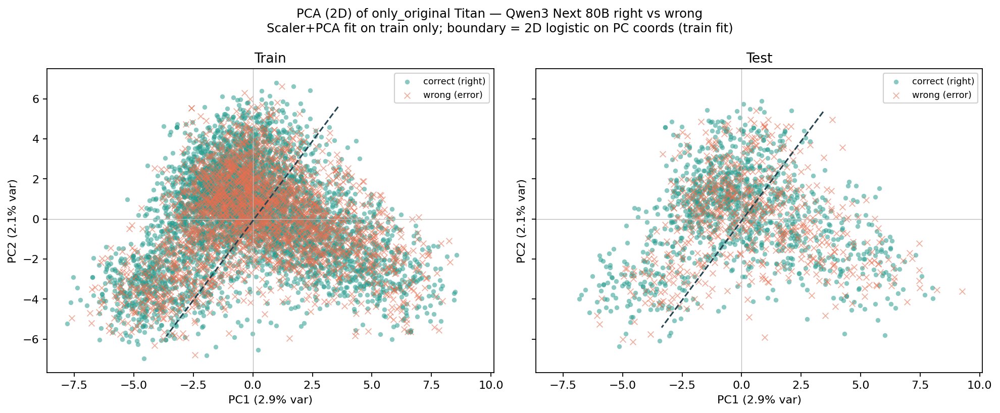
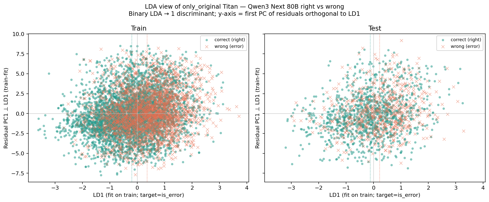
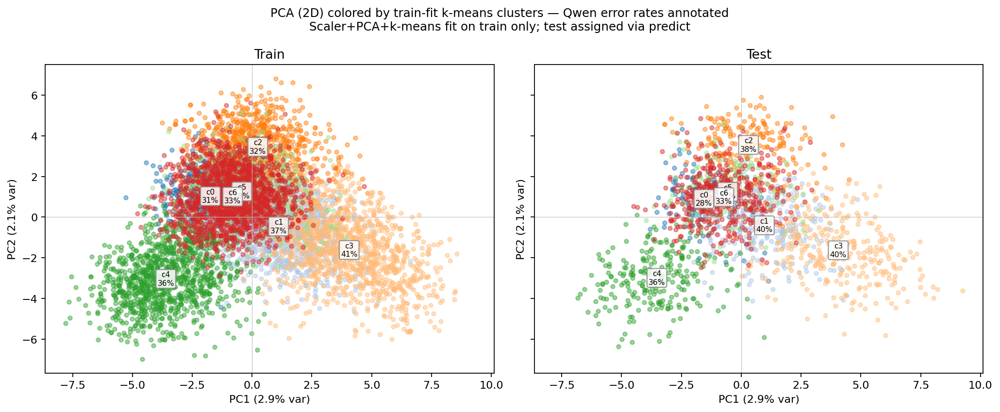

# RESULTS — Model Errors Analysis (2026-07-15)

**Classifier:** Bedrock Qwen3 Next 80B (`bedrock/qwen3-next-80b-a3b`)  
**Features:** original-post Titan embeddings only (`only_original`, 256-d)  
**Artifacts:** `outputs/analysis/`

---

## 1. Executive summary

Qwen3 Next 80B is wrong on about **36%** of Study 2 posts (accuracy ≈ **64.1%** on 8,791 pairs). A balanced logistic probe on original-post Titan embeddings predicts those errors only weakly out of sample (**test ROC-AUC ≈ 0.60**, accuracy ≈ **0.57**). PCA of the same features shows almost no right/wrong structure in 2D; LDA shows mild supervised separation that shrinks on the held-out set. A follow-on **reduced-space clustering** pass (train-fit PCA-20 → k-means, k=7 by silhouette) finds **no stable high-lift or near-zero-error clusters** on test (best test lift ≈ **1.12**, well below the 1.25 gate). **Conclusion:** Qwen right-vs-wrong is not a strong linear half-space in original Titan space, and errors are **diffuse** across local neighborhoods — weak global signal, no actionable local concentration.

---

## 2. Key findings

1. **Base model error rate is substantial.** Of 8,791 posts, 3,152 are errors (`is_error` rate **0.3585**); 5,639 are correct (accuracy **0.6415**).
2. **Linear probe beats chance only modestly.** Test ROC-AUC **0.5995** (train **0.6543**); test accuracy **0.5713** vs stratified error base rate ~0.36.
3. **2D PCA does not reveal error clusters.** PC1+PC2 explain only **~5.05%** of Titan variance; a 2D logistic overlay in the PC plane has test accuracy **0.562**.
4. **Supervised LDA is weak but real.** Test LD1 Cohen’s *d* (wrong − correct) **0.329** (train **0.558**); midpoint-threshold accuracy **0.567** on test.
5. **Shared split was respected.** One stratified 80/20 split (`seed=42`) drives logistic, 2D, and clustering branches; no re-split; no Bedrock re-run.
6. **Local clusters do not concentrate errors.** PCA-20 + k-means (k=7) yields at most **~1.12×** test lift vs the 36% base rate; decision gate → **diffuse**.

---

## 3. Results

### 3.1 Data and split

| Item | Value |
| --- | --- |
| Labels source | `outputs/base_model_llm_labels.csv` (`bedrock/qwen3-next-80b-a3b` only) |
| N posts | 8,791 |
| Correct / error | 5,639 / 3,152 |
| Qwen accuracy / error rate | 0.6415 / 0.3585 |
| Features | `only_original` Titan `amazon.titan-embed-text-v2:0`, dim 256, normalized |
| Embedding cache | 8,791/8,791 local hits; AWS not called |
| Split | `seed=42`, `train_split=0.8`, stratify on `is_error` |
| Train / test | 7,032 / 1,759 (disjoint; union = full set) |
| Train / test error rate | 0.3585 / 0.3587 |

Artifacts: `analysis_table.parquet`, `X_only_original.npy` `(8791, 256)`, `split_ids.json`.

### 3.2 Linear separator

Pipeline: `StandardScaler` → `LogisticRegression(class_weight='balanced', solver=lbfgs)`, positive class = `is_error`. Fit on train IDs only; evaluate on test IDs from `split_ids.json`.

| Split | N | Accuracy | ROC-AUC | PR-AUC | Precision (error) | Recall (error) | F1 (error) |
| --- | ---: | ---: | ---: | ---: | ---: | ---: | ---: |
| Train | 7,032 | 0.6027 | 0.6543 | 0.4884 | 0.4591 | 0.6081 | 0.5232 |
| **Test** | **1,759** | **0.5713** | **0.5995** | **0.4308** | **0.4276** | **0.5753** | **0.4905** |

**Test confusion** (rows = true correct/error; cols = pred correct/error; error = 1):

|  | Pred correct (0) | Pred error (1) |
| --- | ---: | ---: |
| True correct (0) | TN 642 | FP 486 |
| True error (1) | FN 268 | TP 363 |

Largest |coefficients| are small in magnitude (top |coef| ≈ 0.106 on dim 38) — no single Titan dimension dominates.

Source: `linear_separator_metrics.json` (alias `logistic_metrics.json`).

### 3.3 2D reduction

Leakage-safe: scaler / PCA / LDA fit on **train only**, then transform train+test.

**PCA (2D)**

| Metric | Value |
| --- | --- |
| PC1 / PC2 explained variance | 2.90% / 2.15% |
| Cumsum (2 PCs) | 5.05% |
| 2D logistic overlay (PC1/PC2) train / test accuracy | 0.562 / 0.562 |

Right and wrong clouds heavily overlap; no clear linear partition in the PC plane.

**LDA (1 discriminant; y-axis = residual PC1 ⊥ LD1)**

| Metric | Train | Test |
| --- | ---: | ---: |
| Mean LD1 (correct) | −0.200 | −0.117 |
| Mean LD1 (wrong) | 0.358 | 0.224 |
| Cohen’s *d* (wrong − correct) | 0.558 | 0.329 |
| Midpoint-threshold accuracy | 0.605 | 0.567 |

Mild shift along LD1 on train that attenuates on test — consistent with the ~0.60 test ROC-AUC of the full 256-d logistic.

Source: `reduction_summary.json`, `pca_variance_explained.json`, `embeddings_2d.csv`.

---

## 4. Method (brief)

1. **Labels:** reuse existing Bedrock Qwen3 Next 80B predictions (`2026_07_06-16:57:43`); `is_error = 1 − is_correct`. **Do not** re-call Bedrock.
2. **Features:** join original-post Titan vectors via `only_original` (no mirror / concat / cosine features).
3. **Split once:** stratified post-level 80/20 → `split_ids.json`.
4. **Parallel branches on the same IDs:**
   - **Linear separator** — balanced logistic on 256-d Titan → metrics / coefs / predictions.
   - **2D reduction** — PCA + LDA viz (fit-on-train) → plots + 2D coords.
5. **Clustering** — train-fit PCA → k-means; per-cluster lift vs ~36% base; decision gate for diffuse vs local structure.

Scripts: `analyze/build_table.py`, `split.py`, `linear_separator.py`, `embed_2d.py`, `cluster.py`.

---

## 5. Caveats

- **Weak linear signal.** Test ROC-AUC ≈ 0.60 is above chance but far from a strong separator; hard pairs are not a single half-space of original Titan features.
- **PCA is not the right lens here.** Two PCs capture ~5% variance; visual non-separation in PCA does not by itself prove absence of higher-dimensional linear structure (the 256-d probe is the better summary).
- **LDA overfits the train axis somewhat.** Train Cohen’s *d* 0.56 → test 0.33; report test metrics as primary.
- **No Bedrock re-run.** Results depend on the copied `predictions.csv` and the local Titan embedding cache already present for this study.
- **Feature scope is narrow by design.** Mirror embeddings, concat/cosine, and nonlinear probes are out of scope here — a stronger separator might exist under other feature sets, but that is a later question.
- **Hard-pair tables** (`post_error_rates.csv`, etc.) from the labels checklist were not required for this separability pass.
- **Clustering silhouette is low (~0.10).** Partition stability across seeds is high (ARI ≈ 0.97), but that only means k-means finds the same weak partition — not that clusters are semantically sharp.

---

## 6. Reduced-space clustering

**Question:** Even if Qwen errors are not a global linear half-space, do local neighborhoods in Titan PCA space concentrate or spare errors?

### 6.1 Method

- Reused shared `split_ids.json` (no re-split; no Bedrock).
- Train-fit `StandardScaler` → PCA (`n_components=20`, clipped to [10, 20]; 50% variance target unreachable — 20 PCs explain only **25.8%** of train variance).
- k-means on train PCA coords; k selected by train silhouette over **k ∈ [5, 15]** → **k=7** (silhouette **0.095** — weak structure).
- Test assigned via `predict`. Stability: pairwise ARI across 5 seeds ≈ **0.97** (assignments stable; structure itself is weak).
- Decision thresholds: high lift ≥ **1.25**, low-error island ≤ **0.70**, stable if |train−test rate| ≤ **0.08** and test n ≥ **15**.
- Sanity: same k=7 k-means in scaled full 256-d.

Script: `analyze/cluster.py`. Artifacts: `outputs/analysis/clusters/`.

### 6.2 Per-cluster error rates (PCA-20 + k-means)

Global base error rate ≈ **0.3585**.

| Cluster | n_train | train rate | train lift | n_test | test rate | test lift | \|Δrate\| | flags |
| ---: | ---: | ---: | ---: | ---: | ---: | ---: | ---: | --- |
| 0 | 464 | 0.310 | 0.87 | 119 | 0.277 | 0.77 | 0.033 | none |
| 1 | 1167 | 0.373 | 1.04 | 267 | 0.401 | 1.12 | 0.028 | none |
| 2 | 782 | 0.322 | 0.90 | 196 | 0.378 | 1.05 | 0.055 | none |
| 3 | 1193 | 0.406 | 1.13 | 306 | 0.402 | **1.12** | 0.004 | none |
| 4 | 1075 | 0.360 | 1.00 | 253 | 0.364 | 1.01 | 0.004 | none |
| 5 | 699 | 0.382 | 1.07 | 166 | 0.313 | 0.87 | 0.069 | none |
| 6 | 1652 | 0.334 | 0.93 | 452 | 0.332 | 0.93 | 0.002 | none |

- **Best test lift:** cluster 3 at **1.12** (error rate ≈ 0.40 vs 0.36 base) — mild, stable, but below the 1.25 gate.
- **Lowest test lift:** cluster 0 at **0.77** — mild under-enrichment, above the 0.70 “island” gate.
- **No** `high_lift_stable` or `low_error_island_stable` flags.

### 6.3 Full-256d sanity

Same k=7 on scaled 256-d: train silhouette **0.026** (weaker than PCA path). Max/min test lift **1.14 / 0.80** — same story, no strong enrichment or sparse islands.

### 6.4 Decision gate

**Verdict: diffuse.** No cluster clears the stable high-lift (≥1.25) or stable low-error (≤0.70) criteria on test. Mild local rate variation (~27–40% error) exists but is not actionable error concentration. This is consistent with the linear separator’s weak global signal (test ROC-AUC ≈ 0.60): Qwen right/wrong is spread through Titan `only_original` space rather than localized in a few neighborhoods.

Exemplar spot-checks (`cluster_exemplars.md`) for extreme clusters (esp. c3) show mixed political content without a crisp thematic failure mode — as expected when rates sit near the global base.

Source: `clusters/cluster_metrics.json`, `cluster_lift_table.csv`, `k_selection.json`.

---

## Artifact index

| Path | Role |
| --- | --- |
| `outputs/base_model_llm_labels.csv` | Qwen right/wrong labels |
| `outputs/analysis/analysis_table.parquet` | Joined labels + embeddings |
| `outputs/analysis/split_ids.json` | Shared train/test IDs |
| `outputs/analysis/linear_separator_metrics.json` | Logistic metrics |
| `outputs/analysis/pca_right_vs_wrong.png` | PCA scatter |
| `outputs/analysis/lda_right_vs_wrong.png` | LDA scatter |
| `outputs/analysis/reduction_summary.json` | PCA/LDA numeric summary |
| `outputs/analysis/clusters/cluster_metrics.json` | Clustering lift table + decision gate |
| `outputs/analysis/clusters/cluster_lift_table.csv` | Per-cluster rates / lifts |
| `outputs/analysis/clusters/cluster_assignments.csv` | post_id → cluster |
| `outputs/analysis/clusters/pca2d_by_cluster.png` | PCA 2D colored by cluster |
| `outputs/analysis/clusters/cluster_exemplars.md` | Spot-check texts |
| `outputs/analysis/progress_updates*.md` | Pipeline progress notes |
