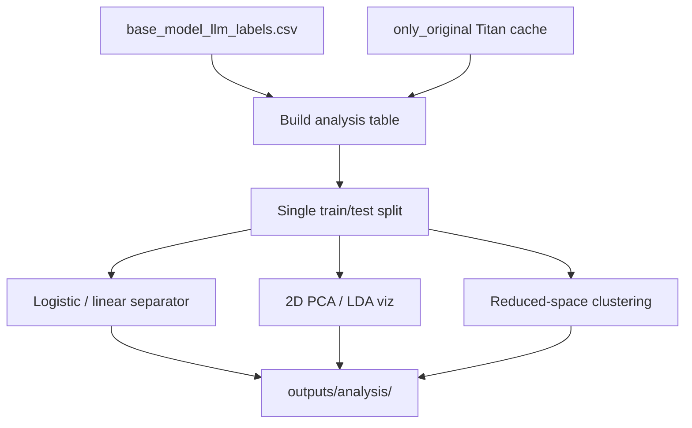

# Spec: Model Errors Analysis (Hard Post Pairs)

**Experiment dir:** `experiments/model_errors_analysis_2026_07_15/`  
**Parent study / modeling ladder:** `experiments/predict_keep_remove_2026_07_01/`  
**Primary question:** Which original/mirror post pairs does Bedrock Qwen3 Next 80B get wrong, and is that right/wrong signal linearly separable in Titan embedding space?

This document is an implementation spec only. Do **not** run the analysis until this plan is accepted.

---

## Purpose

After the July 2026 keep/remove ladder, we want a single table of per-post correctness for **Bedrock Qwen3 Next 80B**, then analysis of that model’s right vs wrong (and whether that signal is linearly separable in Titan embedding space).

---

## Primary correctness signal

For any analysis that needs **one** right-vs-wrong label per post , use **only** this run:

### Why Qwen3 Next 80B

Among complete eligible Bedrock / LLM-API keep/remove runs in the parent study (canonical study texts, full-dataset predictions, no smoke/`--limit`), this run is the **largest by named parameter scale** (**80B** MoE total; A3B ≈ 3B activated). Complete full-dataset `predictions.csv` is already present in this worktree — no Bedrock re-run required.

### Chosen primary run (this worktree)

| Field | Value |
| --- | --- |
| **Family** | `bedrock` |
| **Model** | Qwen3 Next 80B A3B (`qwen3-next-80b-a3b`) |
| **Bedrock model ID** | `qwen.qwen3-next-80b-a3b` |
| **`classifier_id`** | `bedrock/qwen3-next-80b-a3b` |
| **Condition** | `provider=bedrock\|model=qwen3-next-80b-a3b\|bedrock_model_id=qwen.qwen3-next-80b-a3b\|prompt=linked_fate_both_posts\|input_mode=original_plus_mirror` |
| **Run dir** | `experiments/predict_keep_remove_2026_07_01/models/llm_finetuning/api_baselines/qwen3-next-80b-a3b/outputs/2026_07_06-16:57:43/` |
| **Predictions** | `.../predictions.csv` (~8,791 posts; 8,792 lines with header) |
| **Right/wrong signal** | Rows in `base_model_llm_labels.csv` → use each row’s `is_correct` (vs ground-truth `label`) |

**How to use it:** `base_model_llm_labels.csv` **is** this run only. Take each row’s `is_correct` / `1 - is_correct` as the single right-vs-wrong signal. Ground-truth keep/remove labels remain the study `label` column already joined in that CSV.

---

## Scope

### In scope (labels CSV)

Collect labels + predictions into `base_model_llm_labels.csv` from the **Qwen3 Next 80B Bedrock run** (`qwen3-next-80b-a3b` @ `2026_07_06-16:57:43/`) under `experiments/predict_keep_remove_2026_07_01/`. That run:

1. Scores the Study 2 training unit (one row per `message_id` / post pair with modal keep/remove label).
2. Uses the **canonical study texts** (`original_text`, `mirror_text` from `keep_remove_results_2026_06_23.csv`).
3. Has `family=bedrock` and `classifier_id=bedrock/qwen3-next-80b-a3b`.

### In scope (error-separability analysis)

**Primary:** right-vs-wrong for `bedrock/qwen3-next-80b-a3b` — see § Primary correctness signal. That run uses the study linked-fate prompt with both posts (blinded Post 1/Post 2 shuffle), matching what participants saw.

Analysis loads **original-post** Titan embeddings via `embeddings/features/only_original.py` (cache: `embeddings/cache_loader.py`) as **analysis features** for a logistic right/wrong probe and 2D viz. Those embeddings are **not** a label source. Do **not** use `concat_cosine` or other combined embedding features for this analysis.

### Out of scope (for now)

- Other Bedrock / LLM-API classifier runs as label sources for this experiment.
- Length-matching / truncation experiments as classification sources.
- Implementing explainability / clustering writeups beyond what this experiment needs (see `HOW_TO_DO_CLUSTERING.md`, `HOW_TO_DO_EXPLAINABILITY.md` for later).

---

## Background: data contract

### Source labels

| Artifact | Path |
| --- | --- |
| Raw trial CSV | `experiments/predict_keep_remove_2026_07_01/keep_remove_results_2026_06_23.csv` |
| Columns (raw) | `prolific_id`, `message_id`, `original_text`, `mirror_text`, `decision` |
| Training dataframe | `experiments/predict_keep_remove_2026_07_01/data/dataloader.py` → `Dataloader().load_training_dataframe()` |

Training unit:

- One row per `message_id` (alias of `post_id`).
- Modal `decision` across raters; **ties → remove**.
- Label: `keep_remove_label` with `0=keep`, `1=remove`.
- ~8,791 unique post pairs.

Join keys for predictions: use `message_id` everywhere. Align `post_id == message_id` in the collector when needed.

Preferred labels-CSV field name for the mirror column is `mirrored_text` (copy of `mirror_text`).

---

## Source paths

Paths are repo-relative from the worktree root.

### Labels / study texts

| Role | Path |
| --- | --- |
| Raw trials | `experiments/predict_keep_remove_2026_07_01/keep_remove_results_2026_06_23.csv` |
| Dataloader | `experiments/predict_keep_remove_2026_07_01/data/dataloader.py` |

### Bedrock Qwen3 Next 80B (`family=bedrock`)

> **HARD CONSTRAINT — DO NOT RERUN BEDROCK.**  
> We **cannot** and **must not** call Bedrock / AWS Converse / `api_baselines/*/train.py` for this experiment. Use only the existing `predictions.csv` already present in this worktree. Do **not** regenerate, resume, or re-invoke any Bedrock baseline.

| Role | Path |
| --- | --- |
| Run dir | `experiments/predict_keep_remove_2026_07_01/models/llm_finetuning/api_baselines/qwen3-next-80b-a3b/outputs/2026_07_06-16:57:43/` |
| Predictions | `.../predictions.csv` (8791 rows + header) |
| Metadata / metrics | `.../metadata.json`, `.../metrics.json` |

Stimulus: Study prompt + original **and** mirror texts; deterministic Post 1/Post 2 shuffle (`prompts.py`). Pred columns: `message_id`, `keep_remove_label`, `predicted_label` (no probability).

**Status in this worktree:** `predictions.csv` is present at the timestamp path above. **Do not** call Bedrock again.

### Analysis inputs (embeddings — not label sources)

| Role | Path |
| --- | --- |
| Embedding cache loader | `experiments/predict_keep_remove_2026_07_01/embeddings/cache_loader.py` |
| Feature helper (locked) | `experiments/predict_keep_remove_2026_07_01/embeddings/features/only_original.py` |

Use these **only** when building the right-vs-wrong separator. Features are **original-post Titan embeddings only** (`only_original` → shape `(256,)`). Do **not** use `concat_cosine`, difference, mirrored-only, or other combined embedding feature builders for this analysis.

---

## Target labels CSV schema

**Path:** `experiments/model_errors_analysis_2026_07_15/outputs/base_model_llm_labels.csv`

The CSV uses **only** the columns below (no extra audit columns).

| Column | Type | Definition |
| --- | --- | --- |
| `post_id` | str | Same as `message_id` from the study dataframe |
| `original_text` | str | Canonical original |
| `mirrored_text` | str | Canonical mirror (`mirror_text`) |
| `label` | int | `keep_remove_label` (`0=keep`, `1=remove`) |
| `classifier_id` | str | `bedrock/qwen3-next-80b-a3b` |
| `family` | str | `bedrock` |
| `ablation` | str | Condition encoding (see below) |
| `is_correct` | bool/int | `1` iff `predicted_label == label` |

One row = one `(post_id, classifier_id)` evaluation. Bedrock scored all posts (no train/test cut). Dedupe on `(post_id, classifier_id)`.

### Populating `ablation`

Encode the experimental condition as a single pipe-delimited string of `key=value` pairs:

`provider=bedrock|model=qwen3-next-80b-a3b|bedrock_model_id=qwen.qwen3-next-80b-a3b|prompt=linked_fate_both_posts|input_mode=original_plus_mirror`

### Sole `classifier_id`

| `classifier_id` | `family` | Source run |
| --- | --- | --- |
| `bedrock/qwen3-next-80b-a3b` | `bedrock` | `.../api_baselines/qwen3-next-80b-a3b/outputs/2026_07_06-16:57:43/` |

---

## Aggregation pipeline (implementation steps)

Suggested package layout (implement later):

```text
experiments/model_errors_analysis_2026_07_15/
  spec.md                          # this file
  README.md                        # short how-to (after implement)
  collect/
    manifest.py                    # enumerate primary run → run_manifest.json
    load_predictions.py            # bedrock adapter
    build_long_csv.py              # join texts + labels → base_model_llm_labels.csv
  analyze/
    hard_pairs.py                  # error-rate tables
    build_table.py              # labels + only_original embeddings
    split.py                    # single post-level train/test split → split_ids.json
    linear_separator.py         # branch A: logistic on shared split
    embed_2d.py                 # branch B: PCA/LDA viz on shared split
    cluster.py                  # reduced-space clustering (add-on)
  outputs/                         # gitignore bulk artifacts if large
```

### Step 0 — Confirm existing prediction artifact (no Bedrock re-run)

Use **only** the Qwen3 Next 80B timestamp folder listed above. Read its existing `predictions.csv`. **Do not** call Bedrock, AWS Converse, or any `api_baselines/*/train.py`. **Do not** regenerate or resume Bedrock baselines.

### Step 1 — Build run manifest

Write `outputs/run_manifest.json` listing the included `classifier_id`, `family`, `ablation`, run_dir, row counts, and source prediction filename(s).

### Step 2 — Normalize predictions

Bedrock adapter: read `predictions.csv`; all rows scored (no train/test cut in current runner).

Compute `is_correct = (predicted_label == keep_remove_label)`. Set `family` and `ablation` per the schema rules above.

### Step 3 — Join texts

Left-join canonical texts from `Dataloader().load_training_dataframe()` on `message_id` / `post_id`. Fail loudly on missing IDs or text mismatch.

### Step 4 — Emit labels CSV + sanity checks

Assert:

- Columns are exactly the target schema (no extras).
- `family` is exactly `bedrock`; `classifier_id` is exactly `bedrock/qwen3-next-80b-a3b`.
- No duplicate `(post_id, classifier_id)`.
- `label` distribution matches training dataframe.
- Accuracy recomputed from the labels CSV matches that run’s `metrics.json` within rounding tolerance.

### Step 5 — Hard-pair slicing helpers (optional)

From the labels CSV, produce at least:

| Artifact | Description |
| --- | --- |
| `outputs/post_error_rates.csv` | Per `post_id`: whether wrong, `label`, texts |
| `outputs/hard_pairs_top_k.csv` | Posts this model got wrong (and any secondary ranking) |
| `outputs/family_slice_summary.md` | Error rates for this `classifier_id` |

“Hardest” default definition for this single-model CSV: posts with `is_correct == 0`.

---

## Analysis plan — right vs wrong separator

**Goal:** Using the **primary correctness signal** (§ Primary correctness signal), ask whether **original-post** Titan embeddings (`only_original`, shape `(256,)`) linearly separate posts that Qwen3 Next 80B got right vs wrong, and whether that structure is visible in 2D.

### Classifier filter (locked)

- **`classifier_id = bedrock/qwen3-next-80b-a3b` only** for the right-vs-wrong target.
- Source: `base_model_llm_labels.csv` rows (equivalently the run dir above).
- `y` / correctness comes from that row’s `is_correct` vs ground-truth `label`.

### Embeddings source (analysis input only)

The labels CSV is correctness from Qwen3 Next 80B. The analysis asks whether those right/wrong outcomes are linearly organized in embedding space, so it needs a numeric feature matrix joined on `post_id`. Titan embeddings from the existing cache supply that matrix. They are **not** another label source.

Reuse existing Titan embeddings as **features for the right-vs-wrong linear probe**, **do not** re-embed unless cache miss:

```bash
# Analysis-only feature path:
experiments/predict_keep_remove_2026_07_01/embeddings/cache_loader.py
# model: amazon.titan-embed-text-v2:0, dims=256, normalize=True
# S3: jspsych-mirror-view-3
# DDB: jspsych-mirror-view-embedding-cache
```

**Feature vector (locked — original post only):**

| Field | Value |
| --- | --- |
| Feature set | `only_original` / original-post embedding only |
| Helper | `experiments/predict_keep_remove_2026_07_01/embeddings/features/only_original.py` |
| Shape | `(256,)` — `orig_emb` from Titan `amazon.titan-embed-text-v2:0` |
| Builder API | `OnlyOriginalEmbeddingFeatureBuilder` / `build_xy_from_joined` |

**Out of scope for this analysis (do not use as features):**

- `concat_cosine` (`[orig_emb, mirror_emb, cosine]` → `(513,)`)
- Difference / Hadamard / abs-diff of orig vs mirror
- Mirrored-post embeddings alone or any concat of orig+mirror
- Stance/toxicity OHE or other non-embedding side features

Clarification: fitting a logistic regression **on original-post Titan features to predict Qwen `is_error`** is part of this analysis (a probe on the correctness signal). It is **not** a competing keep/remove classifier family.

### Pipeline topology (single split → parallel branches)

Both the linear separator and the 2D visualization **must** consume the **same** train/test post IDs. Split once; never re-split independently inside either branch.



| Step | Name | Consumes | Produces | Parallel? |
| --- | --- | --- | --- | --- |
| 1 | Build analysis table | Labels CSV + `only_original` embeddings | `outputs/analysis/analysis_table.parquet` (or `.csv`) | sequential |
| 2 | Single train/test split | Analysis table | `outputs/analysis/split_ids.json` | sequential (gate) |
| 3A | Linear / logistic separator | Analysis table + `split_ids.json` | metrics, coefs, pred CSV | **parallel with 3B** |
| 3B | 2D reduction + visualization | Analysis table + `split_ids.json` | PCA/LDA plots, `embeddings_2d.csv` | **parallel with 3A** |
| 4 | Reduced-space clustering | Analysis table + `split_ids.json` + labels CSV | cluster assignments, lift table, plots, exemplars | after shared split (add-on) |

### Build analysis table

Target: from labels-CSV rows with `classifier_id == bedrock/qwen3-next-80b-a3b`, set `y = 1` if that prediction is **wrong** (`is_correct == 0`), `y = 0` if **correct** (prefer `is_error` as positive class so precision/recall speak about hard cases).

1. Load `base_model_llm_labels.csv` (already primary-only).
2. Join **original-post** Titan embeddings on `post_id` via `only_original` (no mirror / concat / cosine features).
3. Emit one row per `post_id` with: `post_id`, `label`, `is_correct`, `is_error`, and the `(256,)` embedding (stored as columns or a fixed-width vector field).

Artifact: `outputs/analysis/analysis_table.parquet` (CSV acceptable if preferred).

### Single train/test split (shared by both branches)

**One** post-level split; both the linear separator and 2D reduction load these IDs and must not call `train_test_split` again.

| Field | Value |
| --- | --- |
| Unit | `post_id` (one row per post; never leak the same post across splits) |
| Stratify on | `is_error` (right vs wrong balance in train and test) |
| `train_split` | `0.8` |
| `seed` | `42` |
| Artifact | `outputs/analysis/split_ids.json` |

Suggested `split_ids.json` schema:

```json
{
  "seed": 42,
  "train_split": 0.8,
  "stratify_on": "is_error",
  "classifier_id": "bedrock/qwen3-next-80b-a3b",
  "feature_set": "only_original",
  "train_post_ids": ["...", "..."],
  "test_post_ids": ["...", "..."]
}
```

Assert `train_post_ids ∩ test_post_ids = ∅` and that every analysis-table `post_id` appears in exactly one list.

### Train linear / logistic separator (parallel branch)

Uses **only** posts listed in `split_ids.json` (`train_post_ids` for fit, `test_post_ids` for eval).

1. Fit **logistic regression** (`class_weight='balanced'`) predicting `is_error` from the `(256,)` original-post Titan vector on the train set.
2. Evaluate on the test set: accuracy, ROC-AUC, PR-AUC, confusion matrix for the error class (also report train metrics for diagnostics).
3. Save `outputs/analysis/linear_separator_metrics.json`, coefficients or top-|coef| dims, and predictions CSV.

Interpretation guardrail: high AUC means errors are linearly organized in embedding space; low AUC means hard pairs are not a single half-space of Titan features.

### 2D reduction + visualization (parallel branch)

Uses the **same** `split_ids.json` as the linear separator. **Leakage-safe reduction:** fit scalers / PCA / LDA on **train only**, then transform train and test (prefer fit-on-train, transform-all for plots that show both partitions; evaluate / claim separation on the transformed test points).

1. Standardize features (**fit on train**, transform train+test).
2. Run **PCA (2D)** and **linear discriminant / LDA projected to 1–2D** (LDA is the linear separator view) — again **fit on train**, transform all. Optionally t-SNE/UMAP as secondary *nonlinear* viz (do not claim linear separation from them; if used, still restrict fit to train or treat as exploratory only).
3. Scatter plots colored by correct vs wrong (and optionally by `label` keep/remove as small multiples); mark train vs test if useful.
4. Overlay the logistic decision boundary in the 2D PCA plane (project the hyperplane approx / show predicted region) — boundary comes from the linear separator model or a 2D refit on PCA train coords; do not re-split.

Artifacts:

- `outputs/analysis/pca_right_vs_wrong.png`
- `outputs/analysis/lda_right_vs_wrong.png`
- `outputs/analysis/embeddings_2d.csv` (`post_id`, `pc1`, `pc2`, `split`, `is_correct`, `label`, …)

### Success criteria

- Pipeline order is **build analysis table → shared split → (linear separator ∥ 2D reduction)** with a single shared `split_ids.json`; neither branch invents its own split.
- End-to-end from `base_model_llm_labels.csv` (`bedrock/qwen3-next-80b-a3b`) + **original-post** Titan embedding cache (`only_original`).
- PCA/LDA fit is train-only then transform (no fit on full data before reporting test separation).
- Metrics + plots written under `outputs/analysis/`.
- Short markdown note there stating whether a linear separator appears strong (e.g. test AUC ≫ 0.5) and pointing at posts this model missed.

### Reduced-space clustering investigation (add-on)

**Goal:** Given weak global linear separation of Qwen right/wrong in Titan `only_original` space (linear separator / 2D reduction), ask whether **local clusters** in reduced dimensionality are enriched or sparse for Qwen errors — i.e., whether hard cases concentrate in neighborhoods rather than forming a single half-space.

This is an **add-on** after the linear separator / 2D branches; it does **not** replace the logistic or 2D viz branches. **Do not** re-split; **do not** call Bedrock.

#### Method outline

1. **Reuse shared split** — load existing `outputs/analysis/split_ids.json` (`seed=42`, 80/20, stratify on `is_error`). Never re-split.
2. **Primary space** — StandardScaler + PCA fit on **train only**, transform train+test. Choose `n_components` by cumulative explained variance (target ≈ 50–80%) or a fixed sensible default in **10–20** PCs for clustering; also keep 2D PCA for viz continuity with the 2D reduction plots.
3. **Optional spaces (secondary)** —
   - LDA axis + residual PCs (supervised 1D + unsupervised residuals).
   - Sanity: k-means / GMM in full **256-d** (scaled, train-fit) if cheap.
4. **Clusterer** — prefer **k-means** on train-fit PCA coords as the main path. Fit on **train only**; assign test via `predict`. Range `k ≈ 5–15`.
5. **Model selection** — choose `k` via silhouette and/or BIC on **train**; note sensitivity / stability across multiple seeds (e.g. re-fit k-means with several `random_state` values and compare assignment agreement or per-cluster error rates).
6. **Per-cluster metrics** — size (n_train / n_test), error rate, **lift vs global base rate ≈ 36%**, train vs test rate stability (absolute Δ or ratio).
7. **Interesting clusters** — flag high-lift clusters that remain elevated on test, and near-zero-error “islands” that stay sparse on test.
8. **Content spot-check** — for top interesting clusters, pull exemplar `original_text` / `mirrored_text` from `base_model_llm_labels.csv`.
9. **Decision gate** — if **no** cluster shows stable test lift (or stable near-zero error), conclude Qwen errors are **diffuse** in Titan space (consistent with weak global linear separation). If stable enrichment/sparsity appears, document themes and keep those clusters as candidates for later qualitative / modeling work.

#### Artifacts (under `outputs/analysis/clusters/` or `outputs/analysis/`)

| Artifact | Description |
| --- | --- |
| Cluster assignments CSV | `post_id`, `split`, `cluster_id`, `is_error`, PCA coords, … |
| Metrics / lift table | JSON + CSV: per-cluster size, error rates, lift, train/test Δ |
| Plots | PCA 2D colored by cluster + error-rate annotations |
| Exemplars | Sample posts for top interesting clusters |
| Progress notes | Short markdown run log |

Script: `analyze/cluster.py`. Leakage-safe: scaler / PCA / clusterer fit on train only.

---

## Outputs / artifacts checklist

| Path | Producer |
| --- | --- |
| `outputs/run_manifest.json` | collect |
| `outputs/base_model_llm_labels.csv` | collect |
| `outputs/post_error_rates.csv` | analyze |
| `outputs/hard_pairs_top_k.csv` | analyze |
| `outputs/analysis/analysis_table.parquet` | Build analysis table |
| `outputs/analysis/split_ids.json` | Shared split (linear separator + 2D) |
| `outputs/analysis/linear_separator_metrics.json` | Linear separator |
| `outputs/analysis/pca_right_vs_wrong.png` | 2D reduction |
| `outputs/analysis/lda_right_vs_wrong.png` | 2D reduction |
| `outputs/analysis/embeddings_2d.csv` | 2D reduction |
| `outputs/analysis/clusters/` | Clustering assignments, lift metrics, plots, exemplars |
| `outputs/analysis/README.md` | Analysis folder README |

---

## Open questions / assumptions

1. **Bedrock predictions are present — do not re-run**  
   Resolved: `predictions.csv` for Qwen3 Next 80B is in this worktree at the path above. **Must not** call Bedrock / `api_baselines/*/train.py`. Analysis consumes that CSV only.

2. **`mirrored_text` vs `mirror_text`**  
   Source column is `mirror_text`. Spec uses `mirrored_text` in the labels CSV as requested; map explicitly in the builder.

3. **Primary right-vs-wrong classifier (resolved)**  
   **Chosen:** `bedrock/qwen3-next-80b-a3b` @ `.../qwen3-next-80b-a3b/outputs/2026_07_06-16:57:43/` — largest complete eligible Bedrock/LLM-API run by named parameter scale, with full-dataset predictions present. Labels CSV includes **only** this classifier (~8,791 rows).

4. **Positive class for linear separator**  
   Assumption: predict `is_error` (wrong=1) so metrics emphasize hard cases.

5. **Train/test split (resolved)**  
   One shared post-level stratified split (`seed=42`, `train_split=0.8`, stratify on `is_error`) written to `outputs/analysis/split_ids.json`. Linear separator and 2D reduction both load that artifact; neither re-splits. Dimensionality reduction fits on train only, then transforms train+test.

6. **Embedding feature set (resolved)**  
   Use `only_original` / original-post Titan vectors only. Mirror embeddings, cosine similarity, difference features, and multi-embedding concatenations are deferred / out of scope for this analysis.

---

## Implementation order (when executing)

1. Confirm the Qwen3 Next 80B timestamp folder exists (read-only). **Do not** call Bedrock.
2. `collect/manifest.py` + `collect/load_predictions.py` + `collect/build_long_csv.py` + sanity checks vs `metrics.json`.
3. Hard-pair rate tables.
4. **Build analysis table** (`bedrock/qwen3-next-80b-a3b` + `only_original` embeddings).
5. **Shared split** — write **one** `outputs/analysis/split_ids.json` (stratified post-level split, `seed=42`, `train_split=0.8`).
6. **In parallel:**
   - **Linear separator** — logistic regressor fit on train IDs / eval on test IDs from `split_ids.json`.
   - **2D reduction** — PCA/LDA fit-on-train, transform-all; plots under `outputs/analysis/` using the same IDs.
7. **Clustering** — reduced-space clustering on train-fit PCA (`analyze/cluster.py`); write under `outputs/analysis/clusters/`.
8. Short README / `RESULTS.md` in this experiment dir documenting commands, artifact paths, and decision-gate verdict.

### Labels CSV (implemented)

```bash
cd experiments/model_errors_analysis_2026_07_15
uv run python collect/build_long_csv.py
# → outputs/run_manifest.json
# → outputs/base_model_llm_labels.csv  (8791 rows; bedrock/qwen3-next-80b-a3b only)
```

### Commands / policy for later (do not run inference)

```bash
# DO NOT run any api_baselines/*/train.py or otherwise call Bedrock/AWS.
# Use the copied predictions.csv artifact only:
#   .../qwen3-next-80b-a3b/outputs/2026_07_06-16:57:43/predictions.csv
```

---

## References

- `experiments/predict_keep_remove_2026_07_01/PROPOSAL.md`
- `experiments/predict_keep_remove_2026_07_01/README.md`
- `experiments/predict_keep_remove_2026_07_01/HOW_TO_TRAIN_LANGUAGE_MODELS.md` (Exp 1–3 results)
- `experiments/predict_keep_remove_2026_07_01/models/llm_finetuning/api_baselines/README.md`
- `docs/plans/2026-07-06_exp3_bedrock_zero_shot_baselines_628401/IMPLEMENTATION_PLAN.md`
- `experiments/predict_keep_remove_2026_07_01/embeddings/README.md` (feature cache for analysis only)
- `experiments/predict_keep_remove_2026_05_07/PLAN_BUILD_DEEP_MODEL.md` (doc style reference)
