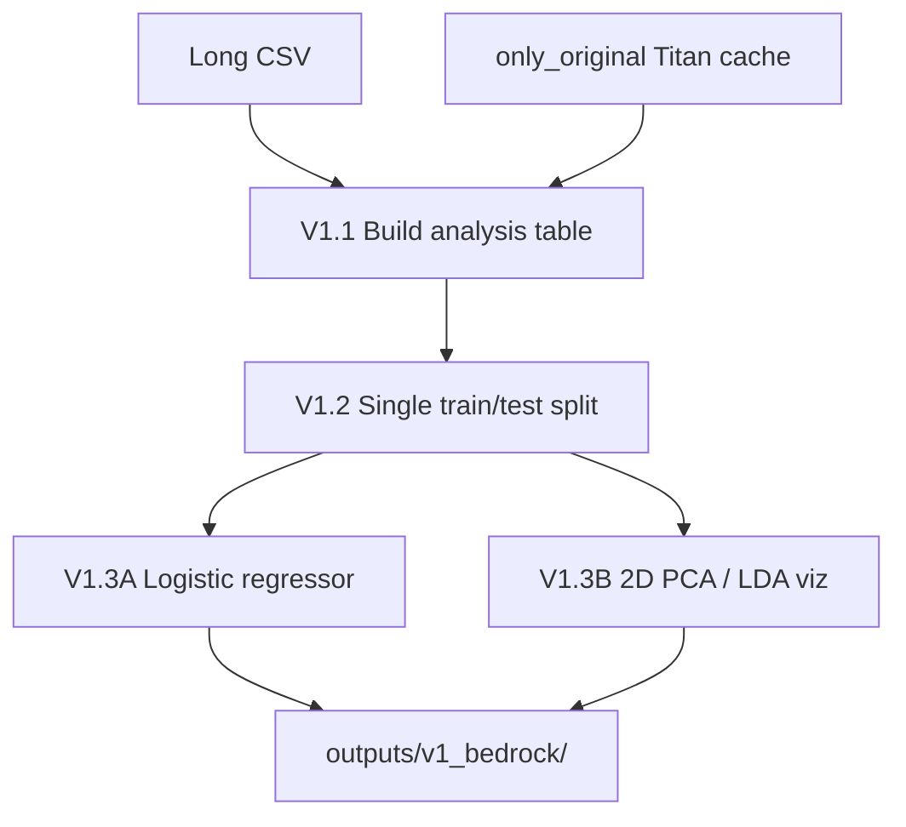

# Spec: Model Errors Analysis (Hard Post Pairs)

**Experiment dir:** `experiments/model_errors_analysis_2026_07_15/`  
**Parent study / modeling ladder:** `experiments/predict_keep_remove_2026_07_01/`  
**Primary question:** Which original/mirror post pairs are routinely hardest for our LLM API classifiers to get right?

This document is an implementation spec only. Do **not** run the analysis until this plan is accepted.

---

## Purpose

After the July 2026 keep/remove ladder, we want a single long table of per-post correctness for the **primary classifier** (Bedrock Qwen3 Next 80B), then analysis of that model’s right vs wrong (and, for V1, whether that signal is linearly separable in Titan embedding space).

**V0 does not collect classical ML or encoder classifiers** (no logistic regression, XGBoost, ModernBERT, or other embedding-as-classifier families). Titan embeddings appear only later as **feature inputs for V1 right-vs-wrong analysis**, not as a long-CSV classifier family.

---

## Primary correctness signal (single right-vs-wrong)

For any analysis that needs **one** right-vs-wrong label per post (especially **V1**, and any “use its labels and whether it was right or wrong” cut), apply this selection rule and use **only** the chosen run:

### Selection rule

Among complete runs with `family ∈ {bedrock, llm_api}` that also meet the inclusion criteria below (canonical study texts, full completed run, no smoke/`--limit`, etc.):

1. Prefer the **largest** model by advertised parameter scale in the model name / variant slug (e.g. `80b` > `32b` > `14b` > `8b` > `nano` / `small`).
2. Completeness and inclusion criteria are **filters first**; size ranking applies only among survivors.
3. If two survivors are close in size, prefer **Bedrock** (user-matching linked-fate / both-posts stimulus) unless the LLM API model is clearly larger.

### Chosen primary run (this worktree)

| Field | Value |
| --- | --- |
| **Family** | `bedrock` |
| **Model** | Qwen3 Next 80B A3B (`qwen3-next-80b-a3b`) |
| **Bedrock model ID** | `qwen.qwen3-next-80b-a3b` |
| **`classifier_id`** | `bedrock/qwen3-next-80b-a3b` |
| **Ablation** | `provider=bedrock\|model=qwen3-next-80b-a3b\|bedrock_model_id=qwen.qwen3-next-80b-a3b\|prompt=linked_fate_both_posts\|input_mode=original_plus_mirror` |
| **Run dir** | `experiments/predict_keep_remove_2026_07_01/models/llm_finetuning/api_baselines/qwen3-next-80b-a3b/outputs/2026_07_06-16:57:43/` |
| **Predictions** | `.../predictions.csv` (~8,791 posts; 8,792 lines with header) |
| **Right/wrong signal** | Long-CSV rows where `classifier_id == bedrock/qwen3-next-80b-a3b` → use that row’s `is_correct` (vs ground-truth `label`) |

**Size rationale:** Among eligible complete runs, this is the largest by named parameter scale (**80B** MoE total; A3B ≈ 3B activated). Next-largest complete Bedrock is dense **Qwen3 32B**. Complete OpenAI runs are only `gpt-5.4-nano` (`model_size=small`); `gpt-5.5` (`large`) has no full-dataset artifact here.

**How to use it:** The long CSV **is** this run only. Take each row’s `is_correct` / `1 - is_correct` as the single right-vs-wrong signal. Do **not** majority-vote across other Bedrock models. Ground-truth keep/remove labels remain the study `label` column already joined in the long CSV.

### Long CSV contents (locked)

| Role | What |
| --- | --- |
| **Long CSV** | **Only** `bedrock/qwen3-next-80b-a3b` (~8,791 rows). Other complete Bedrock / `llm_api` runs exist in the worktree but are **not** collected into this CSV. |
| **Primary right/wrong / V1** | Every long-CSV row — one correctness bit per post from that run. |

---

## Scope

### In scope (V0 data product)

Collect labels + predictions into one long CSV from the **primary Bedrock run only** (`qwen3-next-80b-a3b` @ `2026_07_06-16:57:43/`) under `experiments/predict_keep_remove_2026_07_01/`. That run:

1. Scores the Study 2 training unit (one row per `message_id` / post pair with modal keep/remove label).
2. Uses the **canonical study texts** (`original_text`, `mirror_text` from `keep_remove_results_2026_06_23.csv`) — no truncated / length-rewritten / regenerated stimulus ablations.
3. Has `family=bedrock` and `classifier_id=bedrock/qwen3-next-80b-a3b`.

### In scope (V1 analysis)

**Primary:** right-vs-wrong for the chosen primary classifier (`bedrock/qwen3-next-80b-a3b`) — see § Primary correctness signal. That run uses the study linked-fate prompt with both posts (blinded Post 1/Post 2 shuffle), matching what participants saw.

V1 may load **original-post** Titan embeddings via `embeddings/features/only_original.py` (cache: `embeddings/cache_loader.py`) as **analysis features** for that right-vs-wrong separator. Those embeddings are **not** a V0 classifier source and must not appear as long-CSV `family` values. Do **not** use `concat_cosine` or other combined embedding features for V1.

### Out of scope (for now)

- **Classical ML / embeddings classifiers:** `models/logistic_regression/`, `models/xgboost/`, and any `emb_ml/*` style long-CSV rows.
- **Encoder fine-tunes:** `models/modernbert/` (and similar).
- Length-matching / truncation experiments (`experiments/match_lengths_original_mirrors_2026_06_19/`, `experiments/truncate_posts_2026_06_19/`) as classification sources.
- May 2025 / May 2026 earlier keep/remove dirs except as embedding infra references for V1 (`experiments/simplified_predict_remove_2026_05_13/` if needed for cache docs).
- Implementing explainability / clustering writeups beyond what V1 needs (see `HOW_TO_DO_CLUSTERING.md`, `HOW_TO_DO_EXPLAINABILITY.md` for later).

---

## Background: data contract

### Source labels

| Artifact | Path |
| --- | --- |
| Raw trial CSV | `experiments/predict_keep_remove_2026_07_01/keep_remove_results_2026_06_23.csv` |
| Columns (raw) | `prolific_id`, `message_id`, `original_text`, `mirror_text`, `decision` |
| Training dataframe | `experiments/predict_keep_remove_2026_07_01/data/dataloader.py` → `Dataloader().load_training_dataframe()` |

Training unit:

- One row per `message_id` (alias of `post_id`).
- Modal `decision` across raters; **ties → remove**.
- Label: `keep_remove_label` with `0=keep`, `1=remove`.
- ~8,791 unique post pairs.

Join keys for predictions: use `message_id` everywhere. Align `post_id == message_id` in the aggregator when needed.

Preferred long-CSV field name for the mirror column is `mirrored_text` (copy of `mirror_text`).

---

## Included data folders (concrete paths)

Paths are repo-relative from the worktree root. Only these trees feed the long CSV (plus labels above).

### Labels / study texts (always)

| Role | Path |
| --- | --- |
| Raw trials | `experiments/predict_keep_remove_2026_07_01/keep_remove_results_2026_06_23.csv` |
| Dataloader | `experiments/predict_keep_remove_2026_07_01/data/dataloader.py` |

### A. Bedrock zero-shot LLM API (`family=bedrock`)

> **HARD CONSTRAINT — DO NOT RERUN BEDROCK.**  
> We **cannot** and **must not** call Bedrock / AWS Converse / `api_baselines/*/train.py` for this experiment. Use only the existing `predictions.csv` artifacts already present in this worktree (copied from the machine that originally ran Exp 3). Do **not** regenerate, resume, or re-invoke any Bedrock baseline.

| Role | Path |
| --- | --- |
| Root | `experiments/predict_keep_remove_2026_07_01/models/llm_finetuning/api_baselines/` |
| Aggregate metrics | `.../api_baselines/aggregate_outputs/aggregate_results.csv` |
| Aggregate narrative | `.../api_baselines/aggregate_outputs/aggregate_results.md` |
| Plots | `.../api_baselines/outputs/plot_results/2026_07_06-17:48:29/` |

**Completed full-dataset runs present (reference inventory). Long CSV includes only the primary row:**

| Variant | Run dir (this worktree) | Rows | In long CSV? |
| --- | --- | --- | --- |
| Ministral 8B | `.../api_baselines/ministral-3-8b-instruct/outputs/2026_07_06-15:52:37/` | 8791 (+ header → 8792 lines) | no (artifact only) |
| Ministral 14B | `.../api_baselines/ministral-3-14b-instruct/outputs/2026_07_06-16:12:54/` | 8791 (+ header → 8792 lines) | no (artifact only) |
| Qwen3 32B | `.../api_baselines/qwen3-32b/outputs/2026_07_06-16:35:49/` | 8791 (+ header → 8792 lines) | no (artifact only) |
| **Qwen3 Next 80B** | `.../api_baselines/qwen3-next-80b-a3b/outputs/2026_07_06-16:57:43/` | 8791 (+ header → 8792 lines) | **yes — sole long-CSV classifier** |

Each included run dir has `predictions.csv`, `metadata.json`, `metrics.json` (plus companion `prompt_template.txt` / `run_command.txt`).

**Do not use** incomplete Ministral-8B smoke/partial runs if present elsewhere: `2026_07_06-15:40:13`, `2026_07_06-15:40:33`.

Bedrock IDs: `mistral.ministral-3-8b-instruct`, `mistral.ministral-3-14b-instruct`, `qwen.qwen3-32b-v1:0`, `qwen.qwen3-next-80b-a3b`.

Stimulus: Study prompt + original **and** mirror texts; deterministic Post 1/Post 2 shuffle (`prompts.py`). Pred columns: `message_id`, `keep_remove_label`, `predicted_label` (no probability).

**Status in this worktree:** all four complete `predictions.csv` artifacts are present at the timestamp paths above. **Long CSV collects only** `qwen3-next-80b-a3b` @ `2026_07_06-16:57:43/`. **Do not** call Bedrock again.

### B. OpenAI LLM API prompting (`family=llm_api`)

| Role | Path |
| --- | --- |
| Root | `experiments/predict_keep_remove_2026_07_01/models/llm_api/` |
| Aggregate (reference only) | `.../llm_api/aggregate_outputs/aggregate_results.csv` |

**Completed full-dataset runs present (not included in the long CSV; inventory / size-ranking only):**

| Run dir | Rows | Notes |
| --- | --- | --- |
| `experiments/predict_keep_remove_2026_07_01/models/llm_api/one_shot/original/small/outputs/2026_07_03-18:30:51/` | train 7032 + test 1759 | `limit: null`; model `gpt-5.4-nano`; `input_mode=original` |
| `experiments/predict_keep_remove_2026_07_01/models/llm_api/one_shot/original_plus_mirror/small/outputs/2026_07_03-18:30:14/` | train 7032 + test 1759 | `limit: null`; model `gpt-5.4-nano`; `input_mode=original_plus_mirror` |

Each included run dir has `train_predictions.csv`, `test_predictions.csv`, `metadata.json`, `metrics.json`.

Pred columns: `message_id`, `keep_remove_label`, `predicted_label`, `predicted_remove_probability`. Models: `small` → `gpt-5.4-nano`; `large` → `gpt-5.5` (`constants.py`) — only `small` full runs exist here.

**Exclude (present but incomplete / smoke / cost-skipped):**

- Other timestamp dirs under `one_shot/...` and all of `few_shot/...` (smoke `--limit`, partial CSVs, or incomplete resume fragments). Example smoke: `.../one_shot/original/small/outputs/2026_07_03-18:20:16/` (`limit: 8`).
- Documented cost-skipped variants (few-shot / large) — no complete full-dataset artifacts suitable for inclusion.

**Stimulus note:** both `original` and `original_plus_mirror` use canonical study text; `original` simply omits the mirror from the prompt (input ablation, not text rewrite). They are **not** included in the long CSV (primary Bedrock only). For “matches what users saw,” prefer `original_plus_mirror` (and Bedrock) if re-expanded later.

### C. V1-only analysis inputs (not long-CSV classifier sources)

| Role | Path |
| --- | --- |
| Embedding cache loader | `experiments/predict_keep_remove_2026_07_01/embeddings/cache_loader.py` |
| Feature helper (V1 locked) | `experiments/predict_keep_remove_2026_07_01/embeddings/features/only_original.py` |

Use these **only** when building the V1 right-vs-wrong separator for the primary classifier. V1 features are **original-post Titan embeddings only** (`only_original` → shape `(256,)`). Do **not** treat logistic/XGBoost train trees as V0 sources. Do **not** use `concat_cosine`, difference, mirrored-only, or other combined embedding feature builders for V1.

---

## Inclusion / exclusion rules

### Include a run if all of the following hold

1. Predictions file(s) exist with `message_id` (or `post_id`) and `predicted_label`.
2. Labels match `keep_remove_label` from `load_training_dataframe()` (or are identical when joined).
3. Stimulus texts are the Study 2 canonical texts (no truncate / length-match rewrites).
4. `family` is `bedrock` or `llm_api`.
5. Run is complete for the unit being analyzed:
   - Bedrock: full `predictions.csv` with ~8,791 rows (or documented subset with `metadata.json` clarifying intent).
   - LLM API: prefer runs where `limit is null` and `|train|+|test| = 8791`.

### Exclude

| Pattern | Why |
| --- | --- |
| Logistic / XGBoost / ModernBERT / any non-LLM-API family | Out of V0 scope |
| LLM API / Bedrock smoke (`--limit N`) | Not comparable |
| Incomplete resume fragments | Partial coverage biases hard-pair rates |
| Feature runs on non-canonical text | Stimulus changed |
| Aggregate-only CSV/MD without row preds | Cannot compute `is_correct` |

### Canonical run selection when multiple timestamps exist

Pick the newest run under each variant folder where:

- `metadata.json` has no `limit` (or `limit: null`), and
- prediction row count matches expected `n_train` / `n_test` / `n_total`, and
- `metrics.json` exists.

Record chosen paths in `outputs/run_manifest.json`. For the two full `llm_api` runs above, those timestamps are already the complete ones to record.

---

## Target long CSV schema

**Path:** `experiments/model_errors_analysis_2026_07_15/outputs/classifier_post_results_long.csv`

The long CSV uses **only** the columns below (no extra audit columns).

| Column | Type | Definition |
| --- | --- | --- |
| `post_id` | str | Same as `message_id` from the study dataframe |
| `original_text` | str | Canonical original |
| `mirrored_text` | str | Canonical mirror (`mirror_text`) |
| `label` | int | `keep_remove_label` (`0=keep`, `1=remove`) |
| `classifier_id` | str | Stable slug (see families above) |
| `family` | str | **`bedrock`** (this CSV: primary Qwen3 Next 80B only) |
| `ablation` | str | Ablation / condition encoding (see below) |
| `is_correct` | bool/int | `1` iff `predicted_label == label` |

One row = one `(post_id, classifier_id)` evaluation. If a classifier only predicted on test, only test rows appear for that `classifier_id`. Prefer including train+test for `llm_api` (hard-pair rates can later filter conceptually if needed; with this schema there is no `split` column — include all scored rows from the chosen run, deduped on `(post_id, classifier_id)` after concat so train and test do not collide).

### Populating `ablation`

Encode the experimental condition as a single pipe-delimited string of `key=value` pairs (stable order). Required keys:

| Family | `ablation` contents |
| --- | --- |
| `bedrock` | `provider=bedrock\|model=<variant_folder>\|bedrock_model_id=<id>\|prompt=linked_fate_both_posts\|input_mode=original_plus_mirror` |
| `llm_api` | `provider=openai\|model=<model_name>\|model_size=<small\|large>\|prompt_type=<one_shot\|few_shot>\|input_mode=<original\|original_plus_mirror>` |

Examples:

- Bedrock Qwen3 32B: `provider=bedrock|model=qwen3-32b|bedrock_model_id=qwen.qwen3-32b-v1:0|prompt=linked_fate_both_posts|input_mode=original_plus_mirror`
- LLM API original-only small: `provider=openai|model=gpt-5.4-nano|model_size=small|prompt_type=one_shot|input_mode=original`
- LLM API original+mirror small: `provider=openai|model=gpt-5.4-nano|model_size=small|prompt_type=one_shot|input_mode=original_plus_mirror`

### Long-CSV `classifier_id` (sole entry)

| `classifier_id` | `family` | Source run |
| --- | --- | --- |
| `bedrock/qwen3-next-80b-a3b` | `bedrock` | `.../api_baselines/qwen3-next-80b-a3b/outputs/2026_07_06-16:57:43/` |

Other complete runs (Ministral 8B/14B, Qwen3 32B, both `llm_api` nano) remain available as artifacts for size ranking / optional diagnostics but are **not** written into the long CSV.

---

## Aggregation pipeline (implementation steps)

Suggested package layout (implement later):

```text
experiments/model_errors_analysis_2026_07_15/
  spec.md                          # this file
  README.md                        # short how-to (after implement)
  collect/
    manifest.py                    # enumerate eligible runs → run_manifest.json
    load_predictions.py            # bedrock + llm_api adapters only
    build_long_csv.py              # join texts + labels → long CSV
  analyze/
    hard_pairs.py                  # error-rate / co-miss tables
    v1_build_table.py              # primary rows + only_original embeddings
    v1_split.py                    # single post-level train/test split → split_ids.json
    v1_linear_separator.py         # branch A: logistic on shared split
    v1_embed_2d.py                 # branch B: PCA/LDA viz on shared split
  outputs/                         # gitignore bulk artifacts if large
```

### Step 0 — Confirm existing prediction artifacts (no Bedrock re-run)

1. **Bedrock (REQUIRED POLICY):** Use **only** the four copied timestamp folders listed in §A. Read their existing `predictions.csv` files. **Do not** call Bedrock, AWS Converse, or any `api_baselines/*/train.py`. **Do not** regenerate or resume Bedrock baselines. Incomplete Ministral-8B timestamps `2026_07_06-15:40:13` / `2026_07_06-15:40:33` must stay excluded.
2. **LLM API:** The two full `one_shot/.../small` runs listed above are already present — no regeneration needed for V0 of those classifiers.

Do **not** regenerate logistic / XGBoost / ModernBERT predictions for this experiment. Do **not** regenerate Bedrock predictions.

### Step 1 — Build run manifest

Write `outputs/run_manifest.json` listing each included `classifier_id`, `family`, `ablation`, run_dir, row counts, and source prediction filename(s).

### Step 2 — Normalize predictions

Per family adapter (**only** these two):

- Bedrock: read `predictions.csv`; all rows scored (no train/test cut in current runner).
- LLM API: concat `train_predictions.csv` + `test_predictions.csv`, then keep unique `(post_id, classifier_id)` (train and test partitions are disjoint by construction).

Compute `is_correct = (predicted_label == keep_remove_label)`. Set `family` and `ablation` per the schema rules above.

### Step 3 — Join texts

Left-join canonical texts from `Dataloader().load_training_dataframe()` on `message_id` / `post_id`. Fail loudly on missing IDs or text mismatch.

### Step 4 — Emit long CSV + sanity checks

Assert:

- Columns are exactly the target schema (no extras).
- `family` is exactly `bedrock`; `classifier_id` is exactly `bedrock/qwen3-next-80b-a3b`.
- No duplicate `(post_id, classifier_id)`.
- `label` distribution matches training dataframe.
- Accuracy recomputed from the long CSV matches that run’s `metrics.json` within rounding tolerance.

### Step 5 — Hard-pair slicing helpers (V0 analysis product)

From the long CSV, produce at least:

| Artifact | Description |
| --- | --- |
| `outputs/post_error_rates.csv` | Per `post_id`: `n_classifiers`, `n_wrong`, `error_rate`, `label`, texts |
| `outputs/hard_pairs_top_k.csv` | Top-K by `error_rate` (and ties by `n_wrong`) |
| `outputs/co_miss_matrix.csv` | Optional: pairwise classifier agreement on errors |
| `outputs/family_slice_summary.md` | Error rates by `family` / `classifier_id` / notable `ablation` dims |

“Routinely hardest” default definition: posts with `error_rate == 1.0` across all included classifiers that scored that post; secondary: highest `n_wrong` among posts scored by ≥ N classifiers (default N = number of V0-included complete classifiers).

---

## V1 analysis plan — primary classifier right vs wrong separator

**Goal:** Using the **primary correctness signal** (§ Primary correctness signal), ask whether **original-post** Titan embeddings (`only_original`, shape `(256,)`) linearly separate posts that classifier got right vs wrong, and whether that structure is visible in 2D.

### V1 classifier filter (locked)

- **`classifier_id = bedrock/qwen3-next-80b-a3b` only** for the primary right-vs-wrong target.
- Source: long CSV rows for that `classifier_id` (equivalently the run dir in §A / the Primary table).
- `y` / correctness comes from that row’s `is_correct` vs ground-truth `label` — **not** a majority vote across Bedrock models, and **not** pooled multi-classifier rows.

**Optional diagnostics only (not the primary V1 target):** per-model separators for other complete Bedrock runs (e.g. Qwen3 32B, Ministral 14B), or OpenAI `llm_api/one_shot/original_plus_mirror/small`, may be reported as secondary checks. Do not substitute them for the primary signal unless the selection rule is re-run and this spec is updated.

### Size inventory used for selection (eligible complete runs)

| Rank (size) | Family | Model | `classifier_id` | Complete N | Eligible? | Notes |
| --- | --- | --- | --- | --- | --- | --- |
| 1 (chosen) | `bedrock` | Qwen3 Next 80B A3B | `bedrock/qwen3-next-80b-a3b` | 8791 | yes | Largest named scale; MoE ~80B total / ~3B active |
| 2 | `bedrock` | Qwen3 32B | `bedrock/qwen3-32b` | 8791 | yes | Dense 32B; smaller than 80B by name |
| 3 | `bedrock` | Ministral 14B | `bedrock/ministral-3-14b-instruct` | 8791 | yes | Smaller |
| 4 | `bedrock` | Ministral 8B | `bedrock/ministral-3-8b-instruct` | 8791 | yes | Smaller; extreme remove-conservative |
| — | `llm_api` | gpt-5.4-nano (`small`) | `llm_api/one_shot/original_plus_mirror/small` | 8791 | yes but smaller | User-matching input mode; nano ≪ 80B |
| — | `llm_api` | gpt-5.4-nano (`small`) | `llm_api/one_shot/original/small` | 8791 | yes but smaller | Original-only prompt ablation |
| — | `llm_api` | gpt-5.5 (`large`) | *(none)* | — | **no** | No complete full-dataset run in this worktree |

**Excluded from primary (and why):** smaller Bedrock models (8B/14B/32B); both `llm_api` nano runs (smaller); incomplete Bedrock smoke timestamps; few-shot / large OpenAI variants; classical ML / encoder families.

**MoE note:** If stakeholders later redefine “largest” as **activated** parameters rather than named total, dense Qwen3 32B (~32B active) would outrank 80B-A3B (~3B active). Until then, follow named scale literally → **80B A3B remains primary**.

### Embeddings source (analysis input only)

**Why this section exists:** V0’s long CSV is correctness labels from LLM API classifiers only. V1 asks a *different* question — whether those right/wrong outcomes are linearly organized in embedding space — so it needs a numeric feature matrix joined on `post_id`. Titan embeddings from the existing cache supply that matrix. They are **not** another classifier family, do **not** appear as long-CSV `family` rows, and are **not** the keep/remove logistic/XGBoost models under `models/logistic_regression/` or `models/xgboost/`. This section pins the cache location and the **single** feature construction V1 is allowed to use.

Reuse existing Titan embeddings as **features for the right-vs-wrong linear probe**, **do not** re-embed unless cache miss, and **do not** add embedding/ML classifiers to the long CSV:

```bash
# Analysis-only feature path (not a V0 classifier family):
experiments/predict_keep_remove_2026_07_01/embeddings/cache_loader.py
# model: amazon.titan-embed-text-v2:0, dims=256, normalize=True
# S3: jspsych-mirror-view-3
# DDB: jspsych-mirror-view-embedding-cache
```

**V1 feature vector (locked — original post only):**

| Field | Value |
| --- | --- |
| Feature set | `only_original` / original-post embedding only |
| Helper | `experiments/predict_keep_remove_2026_07_01/embeddings/features/only_original.py` |
| Shape | `(256,)` — `orig_emb` from Titan `amazon.titan-embed-text-v2:0` |
| Builder API | `OnlyOriginalEmbeddingFeatureBuilder` / `build_xy_from_joined` |

**Out of scope for V1 (do not use as features):**

- `concat_cosine` (`[orig_emb, mirror_emb, cosine]` → `(513,)`)
- Difference / Hadamard / abs-diff of orig vs mirror
- Mirrored-post embeddings alone or any concat of orig+mirror
- Stance/toxicity OHE or other non-embedding side features from classical ML training

Clarification: fitting a logistic regression **on original-post Titan features to predict primary-classifier `is_error`** is part of V1 analysis. It is **not** the keep/remove logistic models under `models/logistic_regression/` and must not be confused with V0 long-CSV collection.

### V1 pipeline topology (single split → parallel branches)

Both the linear separator and the 2D visualization **must** consume the **same** train/test post IDs. Split once; never re-split independently inside either branch.



| Step | Name | Consumes | Produces | Parallel? |
| --- | --- | --- | --- | --- |
| **V1.1** | Build analysis table | Long CSV (primary rows) + `only_original` embeddings | `outputs/v1_bedrock/analysis_table.parquet` (or `.csv`) | sequential |
| **V1.2** | **Single train/test split** | Analysis table | `outputs/v1_bedrock/split_ids.json` | sequential (gate) |
| **V1.3A** | Train linear / logistic separator | Analysis table + `split_ids.json` | metrics, coefs, pred CSV | **parallel with B** |
| **V1.3B** | 2D reduction + visualization | Analysis table + `split_ids.json` | PCA/LDA plots, `embeddings_2d.csv` | **parallel with A** |

### V1.1 — Build analysis table

Target: from long-CSV rows with `classifier_id == bedrock/qwen3-next-80b-a3b`, set `y = 1` if that prediction is **wrong** (`is_correct == 0`), `y = 0` if **correct** (prefer `is_error` as positive class so precision/recall speak about hard cases).

1. Filter long CSV to the primary `classifier_id`.
2. Join **original-post** Titan embeddings on `post_id` via `only_original` (no mirror / concat / cosine features).
3. Emit one row per `post_id` with: `post_id`, `label`, `is_correct`, `is_error`, and the `(256,)` embedding (stored as columns or a fixed-width vector field).

Artifact: `outputs/v1_bedrock/analysis_table.parquet` (CSV acceptable if preferred).

### V1.2 — Single train/test split (shared by both branches)

**One** post-level split; both V1.3A and V1.3B load these IDs and must not call `train_test_split` again.

| Field | Value |
| --- | --- |
| Unit | `post_id` (one row per post; never leak the same post across splits) |
| Stratify on | `is_error` (right vs wrong balance in train and test) |
| `train_split` | `0.8` |
| `seed` | `42` |
| Artifact | `outputs/v1_bedrock/split_ids.json` |

Suggested `split_ids.json` schema:

```json
{
  "seed": 42,
  "train_split": 0.8,
  "stratify_on": "is_error",
  "classifier_id": "bedrock/qwen3-next-80b-a3b",
  "feature_set": "only_original",
  "train_post_ids": ["...", "..."],
  "test_post_ids": ["...", "..."]
}
```

Assert `train_post_ids ∩ test_post_ids = ∅` and that every analysis-table `post_id` appears in exactly one list.

### V1.3A — Train linear / logistic regressor (parallel branch)

Uses **only** posts listed in `split_ids.json` (`train_post_ids` for fit, `test_post_ids` for eval).

1. Fit **logistic regression** (`class_weight='balanced'`) predicting `is_error` from the `(256,)` original-post Titan vector on the train set.
2. Evaluate on the test set: accuracy, ROC-AUC, PR-AUC, confusion matrix for the error class (also report train metrics for diagnostics).
3. Save `outputs/v1_bedrock/linear_separator_metrics.json` (alias ok: `outputs/v1_primary/`), coefficients or top-|coef| dims, and predictions CSV.

Interpretation guardrail: high AUC means errors are linearly organized in embedding space; low AUC means hard pairs are not a single half-space of Titan features.

### V1.3B — 2D reduction + visualization (parallel branch)

Uses the **same** `split_ids.json` as V1.3A. **Leakage-safe reduction:** fit scalers / PCA / LDA on **train only**, then transform train and test (prefer fit-on-train, transform-all for plots that show both partitions; evaluate / claim separation on the transformed test points).

1. Standardize features (**fit on train**, transform train+test).
2. Run **PCA (2D)** and **linear discriminant / LDA projected to 1–2D** (LDA is the linear separator view) — again **fit on train**, transform all. Optionally t-SNE/UMAP as secondary *nonlinear* viz (do not claim linear separation from them; if used, still restrict fit to train or treat as exploratory only).
3. Scatter plots colored by correct vs wrong (and optionally by `label` keep/remove as small multiples); mark train vs test if useful.
4. Overlay the logistic decision boundary in the 2D PCA plane (project the hyperplane approx / show predicted region) — boundary comes from the V1.3A model or a 2D refit on PCA train coords; do not re-split.

Artifacts:

- `outputs/v1_bedrock/pca_right_vs_wrong.png`
- `outputs/v1_bedrock/lda_right_vs_wrong.png`
- `outputs/v1_bedrock/embeddings_2d.csv` (`post_id`, `pc1`, `pc2`, `split`, `is_correct`, `label`, …)

### V1 success criteria

- Pipeline order is **V1.1 → V1.2 → (V1.3A ∥ V1.3B)** with a single shared `split_ids.json`; neither branch invents its own split.
- End-to-end from long CSV (**primary** `bedrock/qwen3-next-80b-a3b` rows only) + **original-post** Titan embedding cache (`only_original`).
- PCA/LDA fit is train-only then transform (no fit on full data before reporting test separation).
- Metrics + plots written under `outputs/v1_bedrock/` (or `outputs/v1_primary/`).
- Short markdown note there stating whether a linear separator appears strong (e.g. test AUC ≫ 0.5) and pointing at hardest posts from multi-classifier `hard_pairs_top_k.csv` that **this primary model** also missed.

---

## Outputs / artifacts checklist

| Path | Producer |
| --- | --- |
| `outputs/run_manifest.json` | collect |
| `outputs/classifier_post_results_long.csv` | collect |
| `outputs/post_error_rates.csv` | analyze |
| `outputs/hard_pairs_top_k.csv` | analyze |
| `outputs/v1_bedrock/analysis_table.parquet` | V1.1 |
| `outputs/v1_bedrock/split_ids.json` | V1.2 (shared by A and B) |
| `outputs/v1_bedrock/linear_separator_metrics.json` | V1.3A |
| `outputs/v1_bedrock/pca_right_vs_wrong.png` | V1.3B |
| `outputs/v1_bedrock/lda_right_vs_wrong.png` | V1.3B |
| `outputs/v1_bedrock/embeddings_2d.csv` | V1.3B |
| `outputs/v1_bedrock/README.md` | V1 writeup |

---

## Open questions / assumptions

1. **Bedrock predictions are present — do not re-run**  
   Resolved: all four complete `predictions.csv` files are in this worktree at the §A timestamp paths. **Must not** call Bedrock / `api_baselines/*/train.py`. Analysis consumes those CSVs only.

2. **What “original text” filter means for LLM input modes**  
   Assumption: exclude stimulus *rewrites*, **include** `original` and `original_plus_mirror` prompting ablations (canonical text). For “user-matching stimulus,” prioritize Bedrock and `original_plus_mirror`. Encode input mode in `ablation`.

3. **Train vs test rows in the long CSV**  
   Assumption: for `llm_api`, include both train and test scored posts (disjoint); Bedrock scored all rows without a train/test cut. There is no `split` column in the long CSV.

4. **`mirrored_text` vs `mirror_text`**  
   Source column is `mirror_text`. Spec uses `mirrored_text` in the long CSV as requested; map explicitly in the builder.

5. **Primary right-vs-wrong classifier (resolved)**  
   Selection rule: largest complete `bedrock` / `llm_api` run meeting inclusion criteria. **Chosen:** `bedrock/qwen3-next-80b-a3b` @ `.../qwen3-next-80b-a3b/outputs/2026_07_06-16:57:43/`. The long CSV includes **only** this classifier (~8,791 rows). MoE caveat (named 80B vs ~3B active) documented in the V1 size inventory — change only if stakeholders redefine “largest” as activated params (then Qwen3 32B).

6. **Positive class for V1 separator**  
   Assumption: predict `is_error` (wrong=1) so metrics emphasize hard cases.

7. **V1 train/test split (resolved)**  
   One shared post-level stratified split (`seed=42`, `train_split=0.8`, stratify on `is_error`) written to `outputs/v1_bedrock/split_ids.json`. Branches V1.3A and V1.3B both load that artifact; neither re-splits. Dimensionality reduction fits on train only, then transforms train+test.

8. **No classical ML in V0**  
   Assumption confirmed by scope: do not wait on or regenerate logistic/XGBoost/ModernBERT prediction CSVs for the long table. Titan embeddings remain V1 analysis input only — and for V1, **original-post embeddings only** (`only_original`), not `concat_cosine` or other combined feature sets.

9. **V1 embedding feature set (resolved)**  
   Use `only_original` / original-post Titan vectors only. Mirror embeddings, cosine similarity, difference features, and multi-embedding concatenations are deferred / out of V1 scope.

---

## Implementation order (when executing)

1. Confirm the four Bedrock timestamp folders in §A and the two full `llm_api` runs exist (read-only). **Do not** call Bedrock.
2. `collect/manifest.py` + `collect/load_predictions.py` + `collect/build_long_csv.py` + sanity checks vs `metrics.json`.
3. Hard-pair rate tables.
4. **V1.1** — build analysis table (primary `bedrock/qwen3-next-80b-a3b` + `only_original` embeddings).
5. **V1.2** — write **one** `outputs/v1_bedrock/split_ids.json` (stratified post-level split, `seed=42`, `train_split=0.8`).
6. **In parallel:**
   - **V1.3A** — logistic regressor fit on train IDs / eval on test IDs from `split_ids.json`.
   - **V1.3B** — PCA/LDA fit-on-train, transform-all; plots under `outputs/v1_bedrock/` using the same IDs.
7. Short README in this experiment dir documenting commands and artifact paths.

### V0 long CSV (implemented)

```bash
cd experiments/model_errors_analysis_2026_07_15
uv run python collect/build_long_csv.py
# → outputs/run_manifest.json
# → outputs/classifier_post_results_long.csv  (8791 rows; bedrock/qwen3-next-80b-a3b only)
```

### Commands / policy for later (do not run inference)

```bash
# DO NOT run any api_baselines/*/train.py or otherwise call Bedrock/AWS.
# Use the copied predictions.csv artifacts only, e.g.:
#   .../ministral-3-8b-instruct/outputs/2026_07_06-15:52:37/predictions.csv
#   .../ministral-3-14b-instruct/outputs/2026_07_06-16:12:54/predictions.csv
#   .../qwen3-32b/outputs/2026_07_06-16:35:49/predictions.csv
#   .../qwen3-next-80b-a3b/outputs/2026_07_06-16:57:43/predictions.csv
```

---

## References

- `experiments/predict_keep_remove_2026_07_01/PROPOSAL.md`
- `experiments/predict_keep_remove_2026_07_01/README.md`
- `experiments/predict_keep_remove_2026_07_01/HOW_TO_TRAIN_LANGUAGE_MODELS.md` (Exp 1–3 results)
- `experiments/predict_keep_remove_2026_07_01/models/llm_finetuning/api_baselines/README.md`
- `docs/plans/2026-07-06_exp3_bedrock_zero_shot_baselines_628401/IMPLEMENTATION_PLAN.md`
- `experiments/predict_keep_remove_2026_07_01/embeddings/README.md` (V1 feature cache only)
- `experiments/predict_keep_remove_2026_05_07/PLAN_BUILD_DEEP_MODEL.md` (doc style reference)
