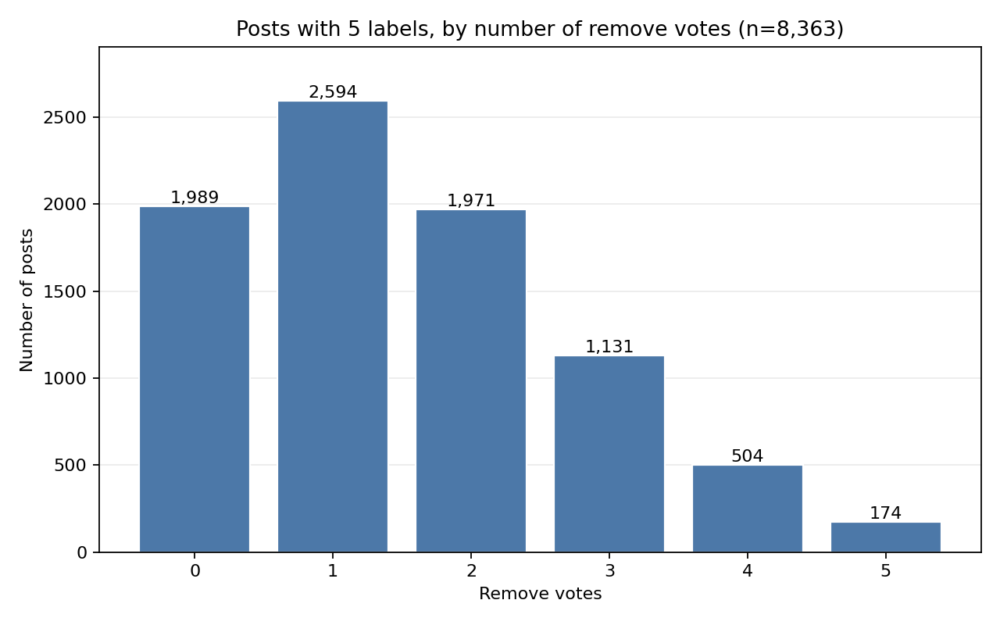

## Platform counts

| decision | Bluesky | Reddit | Twitter |
|---|---:|---:|---:|
| keep | 2750 | 8613 | 2266 |
| remove | 928 | 3677 | 628 |

## Platform proportions

| decision | Bluesky | Reddit | Twitter |
|---|---:|---:|---:|
| keep | 0.7477 | 0.7008 | 0.7830 |
| remove | 0.2523 | 0.2992 | 0.2170 |

## Platform by toxicity proportions

| decision | Bluesky low toxicity | Bluesky medium toxicity | Bluesky high toxicity | Reddit low toxicity | Reddit medium toxicity | Reddit high toxicity | Twitter low toxicity | Twitter medium toxicity | Twitter high toxicity |
|---|---:|---:|---:|---:|---:|---:|---:|---:|---:|
| keep | 0.9202 | 0.7461 | 0.4626 | 0.9191 | 0.7802 | 0.4429 | 0.8878 | 0.7233 | 0.4085 |
| remove | 0.0798 | 0.2539 | 0.5374 | 0.0809 | 0.2198 | 0.5571 | 0.1122 | 0.2767 | 0.5915 |

## Four-cell counts

| cell | count | share |
|---|---:|---:|
| unanimous_keep | 4497 | 0.3015 |
| majority_keep | 7256 | 0.4865 |
| majority_remove | 2670 | 0.1790 |
| unanimous_remove | 491 | 0.0329 |

## Vote funnel

| metric | count |
|---|---:|
| posts_after_vote_clean | 18862 |
| posts_dropped_lt_3_raters | 2979 |
| posts_dropped_ties | 969 |
| posts_remaining | 14914 |

## Remove votes on posts with 5 labels

Each post in this table has exactly five cleaned labels. The count is how many of those five labels are remove.

| remove votes | posts |
|---:|---:|
| 0 | 1989 |
| 1 | 2594 |
| 2 | 1971 |
| 3 | 1131 |
| 4 | 504 |
| 5 | 174 |

