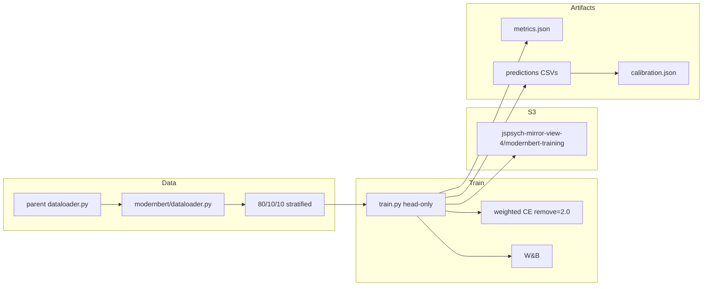

# ModernBERT Keep/Remove Classifier (Experiment 2)

## Remember
- Exact file paths always
- Exact commands with expected output
- DRY, YAGNI, TDD, frequent commits
- Maximum safely delegable parallelism
- Delegated tasks must be impossible to misread
- **No runbook changes** under `docs/runbooks/`
- **No unit tests**
- UI changes: agent captures before/after screenshots itself — **N/A** (no `ui/` work)

**Plan asset path:** [`docs/plans/2026-07-03_modernbert_keep_remove_classifier_392847/`](docs/plans/2026-07-03_modernbert_keep_remove_classifier_392847/) (create on implementation; store approved plan as `IMPLEMENTATION_PLAN.md`)

**Phase 0 paths:** ai_tools root = `/Users/mark/Documents/projects/ai_tools/`; skill refs = `~/.codex/skills/create-implementation-plan/`; workspace runbooks = [`docs/runbooks/`](docs/runbooks/) (**no edits**); experiment design = [`experiments/predict_keep_remove_2026_07_01/HOW_TO_TRAIN_LANGUAGE_MODELS.md`](experiments/predict_keep_remove_2026_07_01/HOW_TO_TRAIN_LANGUAGE_MODELS.md) § Experiment 2.

**Phase 4:** Skipped — no `ui/` or frontend changes.

**Tooling available during implementation:**
- **W&B CLI** (`wandb login` / `wandb status`) and Python SDK — API key from [`lib/load_env_vars.py`](lib/load_env_vars.py) (`WANDB_API_KEY` in `.env`)
- **AWS CLI** (`aws s3`, `aws sagemaker`) — credentials via standard AWS chain; training assets under `s3://jspsych-mirror-view-4/modernbert-training/`
- **Hugging Face MCP** — use as needed for ModernBERT model/tokenizer docs and API confirmation (`answerdotai/ModernBERT-base`)

---

## Overview

Implement Experiment 2 from [`HOW_TO_TRAIN_LANGUAGE_MODELS.md`](experiments/predict_keep_remove_2026_07_01/HOW_TO_TRAIN_LANGUAGE_MODELS.md): a **head-only** fine-tuned [`answerdotai/ModernBERT-base`](https://huggingface.co/answerdotai/ModernBERT-base) binary classifier that predicts modal keep/remove decisions from **original post text only**, using the Study 2 training dataframe (~8.8k posts) from [`experiments/predict_keep_remove_2026_07_01/dataloader.py`](experiments/predict_keep_remove_2026_07_01/dataloader.py). Training uses Hugging Face `Trainer`, **weighted cross-entropy** (remove class weight `2.0`), **W&B** logging (key via `EnvVarsContainer`), and an optional **SageMaker** launcher (`ml.g4dn.xlarge`, `us-east-2`) with data/model assets on **`s3://jspsych-mirror-view-4/modernbert-training/`**. Step 2 adds **threshold calibration** (`p=0.1..0.9`). Artifacts match the logistic/XGBoost contract so results are comparable in [`results.md`](experiments/predict_keep_remove_2026_07_01/results.md). **No runbook edits. No unit tests.**

---

## Happy Flow

1. Operator installs optional deps: `uv sync --extra modernbert-training` (and/or uses [`models/modernbert/requirements.txt`](experiments/predict_keep_remove_2026_07_01/models/modernbert/requirements.txt) on SageMaker).
2. Agent confirms W&B auth (`wandb status` or SDK init using `EnvVarsContainer.get_env_var("WANDB_API_KEY", required=True)`) and AWS access (`aws s3 ls s3://jspsych-mirror-view-4/modernbert-training/` — prefix may be empty initially).
3. [`models/modernbert/dataloader.py`](experiments/predict_keep_remove_2026_07_01/models/modernbert/dataloader.py) calls parent `Dataloader().load_training_dataframe()`, maps `original_text` → `text` and `keep_remove_label` → `label` (`remove=1`, `keep=0`), and produces a **stratified 80/10/10** train/val/test split (`seed=42`).
4. Local entrypoint:  
   `PYTHONPATH=. uv run --extra modernbert-training python experiments/predict_keep_remove_2026_07_01/models/modernbert/train.py --config experiments/predict_keep_remove_2026_07_01/models/modernbert/configs/modernbert_base.yaml`  
   (optional `--limit N` for smoke).
5. `train.py` loads config YAML, freezes all non-classifier parameters, builds HF datasets, trains with `CrossEntropyLoss(weight=[1.0, 2.0])`, logs to W&B (`WANDB_API_KEY` via [`lib/load_env_vars.py`](lib/load_env_vars.py)), and writes under `artifacts/modernbert-base/<timestamp>/` (or config `output_dir`).
6. Artifacts written: `metrics.json`, `metadata.json`, `train_predictions.csv`, `val_predictions.csv`, `test_predictions.csv`, HF model/tokenizer, `trainer_state.json`.
7. [`evaluate.py`](experiments/predict_keep_remove_2026_07_01/models/modernbert/evaluate.py) loads the run dir, sweeps thresholds `0.1..0.9` step `0.1` on val and test, writes `calibration.json` (accuracy/precision/recall/f1 per threshold).
8. Optional remote: [`launch_sagemaker.py`](experiments/predict_keep_remove_2026_07_01/models/modernbert/launch_sagemaker.py) materializes split CSVs, uploads to **`s3://jspsych-mirror-view-4/modernbert-training/<run_id>/data/`**, submits HuggingFace/PyTorch training job on `ml.g4dn.xlarge` in `us-east-2` with the same `train.py` entrypoint; model output under **`s3://jspsych-mirror-view-4/modernbert-training/<run_id>/output/`**. Use AWS CLI to verify uploads (`aws s3 ls ...`).
9. Operator records test metrics (threshold `0.5`) and calibration notes into `HOW_TO_TRAIN_LANGUAGE_MODELS.md` and the “Fine-tuning a language model” section of `results.md`.



---

## Manual Verification

- [ ] **Deps install:** From repo root, `uv sync --extra modernbert-training` exits `0`. `uv run --extra modernbert-training python -c "import transformers, torch, wandb, yaml, sagemaker; print('ok')"` prints `ok`.
- [ ] **Secrets / CLIs:** `WANDB_API_KEY` loads via `EnvVarsContainer.get_env_var("WANDB_API_KEY", required=True)`. `wandb status` (or equivalent) shows logged-in. `aws s3 ls s3://jspsych-mirror-view-4/modernbert-training/` succeeds (empty prefix is fine).
- [ ] **Dataloader smoke (no pytest):**  
  `PYTHONPATH=. uv run --extra modernbert-training python -c "from experiments.predict_keep_remove_2026_07_01.models.modernbert.dataloader import load_classifier_dataframe, make_train_val_test_split; df=load_classifier_dataframe(); tr,va,te=make_train_val_test_split(df); print(len(df), len(tr), len(va), len(te), set(df['label']))"`  
  **Expect:** sizes sum to `len(df)`; fractions near 80/10/10; labels `{0,1}` only.
- [ ] **CLI help:**  
  `PYTHONPATH=. uv run --extra modernbert-training python experiments/predict_keep_remove_2026_07_01/models/modernbert/train.py --help`  
  **Expect:** documents `--config`, `--limit`, `--num-train-epochs` (smoke override).
- [ ] **Local smoke (CPU or GPU):** Run train with `--limit 32` and `--num-train-epochs 1`. **Expect:** exit `0`; run dir contains `metrics.json` with `train_metrics`, `val_metrics`, `test_metrics` each containing at least `accuracy`, `precision`, `recall`, `f1`; prediction CSVs have columns `message_id`, `keep_remove_label`, `predicted_label`, `predicted_remove_probability`; W&B run appears under project `mirrorview-keep-remove-2026-07-01` (confirm via W&B CLI or UI).
- [ ] **Head-only invariant:** In smoke run `metadata.json`, `freeze_encoder` is `true` and `trainable_param_count` ≪ `total_param_count` (classifier-only).
- [ ] **Class weights:** `metadata.json` records `class_weight_keep: 1.0`, `class_weight_remove: 2.0`.
- [ ] **Calibration:**  
  `PYTHONPATH=. uv run --extra modernbert-training python experiments/predict_keep_remove_2026_07_01/models/modernbert/evaluate.py --run-dir <smoke_run_dir>`  
  **Expect:** `calibration.json` has string keys `"0.1"`…`"0.9"` on `val` and `test`, each with accuracy/precision/recall/f1.
- [ ] **Predict helper:**  
  `PYTHONPATH=. uv run --extra modernbert-training python experiments/predict_keep_remove_2026_07_01/models/modernbert/predict.py --run-dir <smoke_run_dir> --text "example political post"`  
  **Expect:** prints `predicted_label` and `predicted_remove_probability` in `[0,1]`.
- [ ] **Full local or SageMaker train:** Full 10-epoch run without `--limit`. **Expect:** test metrics at threshold `0.5` written; training curves visible in W&B (train/eval loss). SageMaker path: `launch_sagemaker.py` uploads under `s3://jspsych-mirror-view-4/modernbert-training/<run_id>/`; verify with `aws s3 ls s3://jspsych-mirror-view-4/modernbert-training/<run_id>/ --recursive`; job succeeds in `us-east-2` on `ml.g4dn.xlarge`.
- [ ] **Docs:** ModernBERT results table filled in `HOW_TO_TRAIN_LANGUAGE_MODELS.md`; `results.md` “Fine-tuning a language model” section updated with the same numbers.
- [ ] **No runbook / no tests:** `docs/runbooks/` unchanged; no `tests/` directory under `models/modernbert/`.

---

## Alternative approaches

- **Full fine-tune vs head-only:** Rejected full fine-tune for v1 — small N and explicit requirement to avoid catastrophic forgetting / improve OOD behavior ([HOW_TO § Step 1](experiments/predict_keep_remove_2026_07_01/HOW_TO_TRAIN_LANGUAGE_MODELS.md)).
- **Original+mirror text:** Rejected for ModernBERT — prior embedding ablations show original-only is as good; design doc says continue ModernBERT/LoRA on original only.
- **sklearn `class_weight='balanced'` vs fixed `2.0` for remove:** Use fixed **double weight on remove** as specified (not inverse-frequency balanced).
- **80/20 only (match logistic):** Rejected — design requires **80/10/10** train/val/test for early stopping / calibration on val.
- **Local-only training:** Keep SageMaker launcher — design requires remote GPU option; `train.py` remains the single training entrypoint for both.
- **Optional-deps vs only `dependency-groups.dev`:** Add `[project.optional-dependencies] modernbert-training` as specified; leave existing `dev` group intact (torch/transformers/wandb already there for other work).
- **Unit tests / runbooks:** Explicitly out of scope per operator direction; verify via CLI smoke commands only.

---

## Specificity (key contracts)

### Directory layout (create exactly)

```text
experiments/predict_keep_remove_2026_07_01/models/modernbert/
  README.md
  dataloader.py
  train.py
  evaluate.py
  predict.py
  launch_sagemaker.py
  requirements.txt
  configs/modernbert_base.yaml
  artifacts/.gitkeep
```

No `tests/` directory.

### Config (`configs/modernbert_base.yaml`)

```yaml
model_name: answerdotai/ModernBERT-base
text_col: text
label_col: label
max_length: 256
learning_rate: 2.0e-5
num_train_epochs: 10
per_device_train_batch_size: 8
per_device_eval_batch_size: 16
weight_decay: 0.01
output_dir: artifacts/modernbert-base
random_state: 42
train_fraction: 0.8
val_fraction: 0.1
test_fraction: 0.1
freeze_encoder: true
class_weight_keep: 1.0
class_weight_remove: 2.0
wandb_project: mirrorview-keep-remove-2026-07-01
wandb_entity: null
sagemaker:
  region: us-east-2
  instance_type: ml.g4dn.xlarge
  s3_bucket: jspsych-mirror-view-4
  s3_prefix: modernbert-training
  # role_arn from env: SAGEMAKER_ROLE_ARN (execution role only; bucket/prefix are fixed above)
```

### Label / text mapping

| Source column (`Dataloader`) | ModernBERT column | Notes |
|---|---|---|
| `original_text` | `text` | only input text |
| `keep_remove_label` | `label` | `1=remove`, `0=keep` |
| `message_id` | `message_id` | preserved for prediction CSVs |

### Metrics / artifacts

| File | Contract |
|---|---|
| `metrics.json` | `{"train_metrics": {...}, "val_metrics": {...}, "test_metrics": {...}}` — each uses `classification_metrics_summary` from [`experiments/simplified_predict_remove_2026_05_13/features.py`](experiments/simplified_predict_remove_2026_05_13/features.py) at threshold `0.5` (keys include `accuracy`, `precision`, `recall`, `f1`, plus roc/pr/confusion when defined) |
| `*_predictions.csv` | `message_id`, `keep_remove_label`, `predicted_label`, `predicted_remove_probability` |
| `metadata.json` | `timestamp`, `seed`/`random_state`, split fractions + row counts, `model_name`, `freeze_encoder`, trainable/total param counts, class weights, `command` (`sys.argv`), `label_encoding`, W&B run id if available, S3 URI if SageMaker |
| `calibration.json` | `{ "val": { "0.1": {accuracy,...}, ... }, "test": { ... } }` for thresholds `0.1`–`0.9` step `0.1` (string keys) |

### Training invariants

- Load `AutoTokenizer` + `AutoModelForSequenceClassification.from_pretrained(model_name, num_labels=2)`. Confirm ModernBERT sequence-classification usage via Hugging Face MCP if needed.
- If `freeze_encoder: true`, set `requires_grad=False` for every parameter whose name does **not** contain `classifier` (HF sequence-classification head).
- Loss: `nn.CrossEntropyLoss(weight=tensor([class_weight_keep, class_weight_remove]))` via a small `Trainer` subclass overriding `compute_loss`.
- `TrainingArguments`: `evaluation_strategy="epoch"`, `save_strategy="epoch"`, `load_best_model_at_end=True`, `metric_for_best_model="eval_loss"`, `report_to=["wandb"]`, `seed=random_state`.
- Secrets: `EnvVarsContainer.get_env_var("WANDB_API_KEY", required=True)` before `wandb.init` / Trainer W&B reporting. Do not hardcode keys.
- Docstrings on every entrypoint: `Run from root: PYTHONPATH=. uv run --extra modernbert-training python ...` (coding convention from [`CODING_GUIDES.md`](docs/runbooks/CODING_GUIDES.md) — **read only, do not edit**).

### S3 / SageMaker contract

- **Bucket (fixed):** `jspsych-mirror-view-4`
- **Prefix (fixed):** `modernbert-training`
- **Data URI pattern:** `s3://jspsych-mirror-view-4/modernbert-training/<run_id>/data/{train,val,test}.csv`
- **Output URI pattern:** `s3://jspsych-mirror-view-4/modernbert-training/<run_id>/output/`
- `launch_sagemaker.py` (local, has `PYTHONPATH`) builds train/val/test CSVs via `dataloader.py`, uploads with boto3 or `aws s3 cp` to the data URI pattern.
- Estimator `source_dir` = `models/modernbert/`, `entry_point` = `train.py`, `requirements_file` = `requirements.txt`.
- On the job, `train.py` reads CSVs from `SM_CHANNEL_TRAIN` / `SM_CHANNEL_VAL` / `SM_CHANNEL_TEST` when channel env vars are present; otherwise uses in-process `dataloader.py` (local path).
- Pass `WANDB_API_KEY` (from `EnvVarsContainer`) into the job environment; region `us-east-2`; instance `ml.g4dn.xlarge`.
- Role: `SAGEMAKER_ROLE_ARN` required for launch only (execution role). Bucket and prefix are **hardcoded in config**, not env-driven.

### `pyproject.toml`

Add:

```toml
[project.optional-dependencies]
modernbert-training = [
  "torch>=2.12.0",
  "transformers>=5.8.1",
  "datasets>=3.0.0",
  "accelerate>=1.0.0",
  "scikit-learn>=1.8.0",
  "wandb>=0.26.1",
  "pyyaml>=6.0",
  "sagemaker>=2.240.0",
  "boto3>=1.42.88",
]
```

Mirror the same pins (plus `pandas`) in `models/modernbert/requirements.txt` for SageMaker.

---

## Serial Coordination Spine

1. **Freeze contracts** (this plan’s Interface section) — no code yet.
2. **Land package skeleton + deps:** `requirements.txt`, `artifacts/.gitkeep`, `[project.optional-dependencies] modernbert-training` in [`pyproject.toml`](pyproject.toml), minimal `README.md` stub.
3. **Implement `dataloader.py` only** (label map + 80/10/10 stratified split) — **no tests**.
4. **Implement `train.py` + `configs/modernbert_base.yaml`** (head-only, weighted CE, W&B via `load_env_vars`, artifact writer). Local path must work without SageMaker.
5. **Merge parallel packets:** `evaluate.py`, `predict.py`, `launch_sagemaker.py`, full README.
6. **Smoke train + evaluate + predict**; verify W&B and (if launched) S3 via CLIs.
7. **Full train** (local GPU or SageMaker); write results into `HOW_TO_TRAIN_LANGUAGE_MODELS.md` and `results.md`.
8. **Copy approved plan** to `docs/plans/2026-07-03_modernbert_keep_remove_classifier_392847/IMPLEMENTATION_PLAN.md`.

---

## Interface or Contract Freeze

Lock before parallel implementation:

1. **Paths** under `experiments/predict_keep_remove_2026_07_01/models/modernbert/` as listed above (no `tests/`).
2. **Config keys** exactly as in Specificity (including `freeze_encoder`, class weights, split fractions, `sagemaker.s3_bucket: jspsych-mirror-view-4`, `sagemaker.s3_prefix: modernbert-training`).
3. **Public functions in `dataloader.py`:**
   - `load_classifier_dataframe() -> pd.DataFrame` with columns `message_id`, `text`, `label` (also write `keep_remove_label` identical to `label` for CSV compatibility).
   - `make_train_val_test_split(df, *, train_fraction=0.8, val_fraction=0.1, test_fraction=0.1, seed=42, label_column="label") -> tuple[pd.DataFrame, pd.DataFrame, pd.DataFrame]` — two-stage stratified split: first `train` vs `temp` at `train_fraction`, then split `temp` into val/test with `val_fraction / (val_fraction + test_fraction)`.
4. **`train.py` CLI:** `--config` (required path), `--limit` (optional int), `--num-train-epochs` (optional override for smoke); reads/writes artifacts relative to the modernbert package dir unless absolute `output_dir`.
5. **Artifact schemas** in Specificity table — do not rename keys.
6. **Env vars:** `WANDB_API_KEY` via `EnvVarsContainer` (required for train). `SAGEMAKER_ROLE_ARN` required only for `launch_sagemaker.py`. AWS credentials via standard boto3/AWS CLI chain. **S3 bucket/prefix are fixed in config**, not env.
7. **No edits** to parent [`dataloader.py`](experiments/predict_keep_remove_2026_07_01/dataloader.py), shared [`splits.py`](experiments/simplified_predict_remove_2026_05_13/splits.py), or **any file under `docs/runbooks/`**.

---

## Parallel Task Packets

### P-DEPS — Optional dependencies and package skeleton

- **Task ID:** P-DEPS
- **One-sentence objective:** Add `modernbert-training` optional deps, `requirements.txt`, and `artifacts/.gitkeep`.
- **Why parallelizable:** Touches only dependency manifests and empty artifact placeholder; no training logic.
- **Exact files to inspect:** [`pyproject.toml`](pyproject.toml), [`.gitignore`](.gitignore) (ensure `artifacts/` outputs are ignored if a pattern already covers them; if not, add `experiments/predict_keep_remove_2026_07_01/models/modernbert/artifacts/**` except `.gitkeep`).
- **Exact files allowed to change:** `pyproject.toml`; create `experiments/predict_keep_remove_2026_07_01/models/modernbert/requirements.txt`; create `experiments/predict_keep_remove_2026_07_01/models/modernbert/artifacts/.gitkeep`; optionally `.gitignore`.
- **Exact files forbidden to change:** All other experiment Python files; all of `docs/runbooks/`.
- **Preconditions:** Contract freeze accepted.
- **Dependency tasks:** None.
- **Required contracts:** Optional-extra name is exactly `modernbert-training`; requirements include torch, transformers, datasets, accelerate, scikit-learn, wandb, pyyaml, sagemaker, boto3, pandas.
- **Step-by-step:** (1) Add `[project.optional-dependencies]` block to `pyproject.toml`. (2) Write matching `requirements.txt`. (3) Create `artifacts/.gitkeep`. (4) Ignore trained outputs under `artifacts/` in `.gitignore` if needed.
- **Exact verification commands:** `uv sync --extra modernbert-training` ; `uv run --extra modernbert-training python -c "import transformers, torch, wandb, yaml; print('ok')"`
- **Expected outputs:** print `ok`; sync exit code `0`.
- **Done-when:** Extra installs; `requirements.txt` and `.gitkeep` exist.
- **Coordinator review:** Extra name spelling; no removal of existing `dependency-groups.dev` packages.

### P-DATALOADER — Classifier dataframe and 80/10/10 split

- **Task ID:** P-DATALOADER
- **One-sentence objective:** Implement modernbert `dataloader.py` wrapping parent loader with label/text mapping and stratified 80/10/10 splits (**no unit tests**).
- **Why parallelizable:** Only owns `dataloader.py`; no Trainer code.
- **Exact files to inspect:** [`experiments/predict_keep_remove_2026_07_01/dataloader.py`](experiments/predict_keep_remove_2026_07_01/dataloader.py), [`experiments/simplified_predict_remove_2026_05_13/splits.py`](experiments/simplified_predict_remove_2026_05_13/splits.py), [`experiments/predict_keep_remove_2026_07_01/models/llm_api/dataset.py`](experiments/predict_keep_remove_2026_07_01/models/llm_api/dataset.py).
- **Exact files allowed to change:** create `experiments/predict_keep_remove_2026_07_01/models/modernbert/dataloader.py`.
- **Exact files forbidden to change:** Parent `dataloader.py`, `splits.py`, `train.py`, `pyproject.toml`, any `tests/` files, `docs/runbooks/`.
- **Preconditions:** None.
- **Dependency tasks:** None.
- **Required contracts:** Functions and columns from Interface Freeze; docstring includes run-from-root line.
- **Step-by-step:** (1) `load_classifier_dataframe()` via `Dataloader().load_training_dataframe()`. (2) Map columns (`text`, `label`, `keep_remove_label`, `message_id`). (3) Implement two-stage stratified `make_train_val_test_split`.
- **Exact verification commands:** Manual Verification “Dataloader smoke” one-liner (no pytest).
- **Expected outputs:** sizes sum to full N; labels `{0,1}`.
- **Done-when:** Functions exist and smoke one-liner succeeds.
- **Coordinator review:** No import of embeddings; original text only; fractions 0.8/0.1/0.1; **no tests directory**.

### P-TRAIN — Head-only training entrypoint

- **Task ID:** P-TRAIN
- **One-sentence objective:** Implement `train.py` and `configs/modernbert_base.yaml` for local (and SageMaker-compatible) head-only weighted training with W&B and artifact writes.
- **Why parallelizable:** Owns only train entrypoint + config; evaluate/predict/launch consume frozen artifact schema.
- **Exact files to inspect:** [`experiments/predict_keep_remove_2026_07_01/models/logistic_regression/train.py`](experiments/predict_keep_remove_2026_07_01/models/logistic_regression/train.py) (artifact/metadata style), [`lib/load_env_vars.py`](lib/load_env_vars.py), [`lib/timestamp_utils.py`](lib/timestamp_utils.py), [`experiments/simplified_predict_remove_2026_05_13/features.py`](experiments/simplified_predict_remove_2026_05_13/features.py) (`classification_metrics_summary`). Use Hugging Face MCP for ModernBERT `AutoModelForSequenceClassification` details if needed.
- **Exact files allowed to change:** create `experiments/predict_keep_remove_2026_07_01/models/modernbert/train.py`; create `experiments/predict_keep_remove_2026_07_01/models/modernbert/configs/modernbert_base.yaml`.
- **Exact files forbidden to change:** `dataloader.py`, `evaluate.py`, `predict.py`, `launch_sagemaker.py`, parent experiment files, `docs/runbooks/`.
- **Preconditions:** P-DATALOADER landed; P-DEPS installed for smoke.
- **Dependency tasks:** P-DATALOADER, P-DEPS.
- **Required contracts:** Artifact schemas; freeze_encoder; class weights; W&B project name; `WANDB_API_KEY` via `EnvVarsContainer`; channel-aware data loading for SageMaker.
- **Step-by-step:** (1) Load YAML config. (2) `EnvVarsContainer.get_env_var("WANDB_API_KEY", required=True)` and set `os.environ["WANDB_API_KEY"]` if needed for Trainer. (3) Resolve data: if SageMaker channels exist, read CSVs; else call `load_classifier_dataframe` + `make_train_val_test_split`. (4) Apply `--limit` / `--num-train-epochs` overrides. (5) Tokenize with `max_length`. (6) Load model, freeze non-classifier params. (7) `WeightedTrainer` + `TrainingArguments` as specified. (8) Train; predict proba on all splits; write metrics/metadata/CSVs/model. (9) `wandb.finish()`.
- **Exact verification commands:**  
  `PYTHONPATH=. uv run --extra modernbert-training python experiments/predict_keep_remove_2026_07_01/models/modernbert/train.py --help`  
  Smoke: `--config .../modernbert_base.yaml --limit 32 --num-train-epochs 1`; confirm W&B run via `wandb` CLI.
- **Expected outputs:** help text; smoke exit `0` and artifact files present; W&B run logged.
- **Done-when:** Full local smoke satisfies Manual Verification smoke bullets.
- **Coordinator review:** Head-only param counts; weight tensor order `[keep, remove]`; no mirror text in inputs; secrets only via `load_env_vars`.

### P-EVAL — Calibration evaluate script

- **Task ID:** P-EVAL
- **One-sentence objective:** Implement `evaluate.py` to write `calibration.json` for thresholds 0.1–0.9 on val and test predictions.
- **Why parallelizable:** Reads prediction CSVs / run dir only; does not train.
- **Exact files to inspect:** Artifact contract in this plan; `classification_metrics_summary`.
- **Exact files allowed to change:** create `experiments/predict_keep_remove_2026_07_01/models/modernbert/evaluate.py`.
- **Exact files forbidden to change:** `train.py`, `dataloader.py`, other packets’ files, `docs/runbooks/`.
- **Preconditions:** Contract freeze.
- **Dependency tasks:** None to write; runtime depends on P-TRAIN output.
- **Required contracts:** `calibration.json` schema; thresholds with string keys `"0.1"`…`"0.9"`.
- **Step-by-step:** (1) CLI `--run-dir`. (2) Load `val_predictions.csv` and `test_predictions.csv`. (3) For each threshold, binarize `predicted_remove_probability`, compute accuracy/precision/recall/f1. (4) Write `calibration.json` into `--run-dir`.
- **Exact verification commands:** After smoke train, run evaluate on that `--run-dir`; confirm keys `"0.1"`…`"0.9"` under `val` and `test`.
- **Expected outputs:** file exists; 9 thresholds × 2 splits.
- **Done-when:** Manual Verification calibration bullet passes.
- **Coordinator review:** Threshold keys are strings; metrics use remove as positive class.

### P-PREDICT — Inference helper

- **Task ID:** P-PREDICT
- **One-sentence objective:** Implement `predict.py` for single-text inference from a saved run directory.
- **Why parallelizable:** Isolated CLI; loads HF model from run dir.
- **Exact files to inspect:** HF `AutoModelForSequenceClassification` / tokenizer save layout from P-TRAIN.
- **Exact files allowed to change:** create `experiments/predict_keep_remove_2026_07_01/models/modernbert/predict.py`.
- **Exact files forbidden to change:** `train.py`, `evaluate.py`, `dataloader.py`, `docs/runbooks/`.
- **Preconditions:** Contract freeze.
- **Dependency tasks:** None to write; runtime needs P-TRAIN artifacts.
- **Required contracts:** CLI `--run-dir`, `--text`; prints label and probability; default threshold `0.5` for `predicted_label`.
- **Step-by-step:** Load tokenizer+model from run dir; tokenize; softmax on logits; print JSON line `{"predicted_label": int, "predicted_remove_probability": float}`.
- **Exact verification commands:** predict CLI on smoke run dir with a short `--text`.
- **Expected outputs:** valid JSON with probability in `[0,1]`.
- **Done-when:** Manual Verification predict bullet passes.
- **Coordinator review:** Uses original-text-only path (single string).

### P-LAUNCH — SageMaker launcher

- **Task ID:** P-LAUNCH
- **One-sentence objective:** Implement `launch_sagemaker.py` to upload split CSVs to `s3://jspsych-mirror-view-4/modernbert-training/<run_id>/` and submit a training job using the same `train.py`.
- **Why parallelizable:** Owns only launcher; does not modify train logic beyond relying on channel-reading contract in P-TRAIN.
- **Exact files to inspect:** SageMaker HuggingFace/PyTorch estimator docs; config `sagemaker` block with fixed bucket/prefix.
- **Exact files allowed to change:** create `experiments/predict_keep_remove_2026_07_01/models/modernbert/launch_sagemaker.py`.
- **Exact files forbidden to change:** `train.py` (unless coordinator must fix channel env names — then serial), infra Terraform, jsPsych deploy scripts, `docs/runbooks/`.
- **Preconditions:** P-TRAIN implements channel CSV loading; AWS creds + `SAGEMAKER_ROLE_ARN` for live launch.
- **Dependency tasks:** P-TRAIN, P-DATALOADER, P-DEPS.
- **Required contracts:** instance `ml.g4dn.xlarge`, region `us-east-2`; bucket `jspsych-mirror-view-4`; prefix `modernbert-training`; uploads `train.csv`/`val.csv`/`test.csv` under `<run_id>/data/`; model output under `<run_id>/output/`.
- **Step-by-step:** (1) Load config (bucket/prefix from yaml). (2) Build splits via dataloader. (3) Write CSVs to temp dir; upload to `s3://jspsych-mirror-view-4/modernbert-training/<run_id>/data/`. (4) Create estimator with `requirements.txt`; pass `WANDB_API_KEY` from `EnvVarsContainer`. (5) `fit({"train": ..., "val": ..., "test": ...})`. (6) Print job name and S3 URIs. (7) Verify with `aws s3 ls s3://jspsych-mirror-view-4/modernbert-training/<run_id>/ --recursive`.
- **Exact verification commands:** `PYTHONPATH=. uv run --extra modernbert-training python .../launch_sagemaker.py --help` always; live `fit` when AWS + role present.
- **Expected outputs:** help works; live job reaches `Completed` when credentials available; objects visible under the fixed prefix.
- **Done-when:** Help works; channel names match `train.py`; S3 paths use exact bucket/prefix.
- **Coordinator review:** Bucket/prefix hardcoded from config (`jspsych-mirror-view-4` / `modernbert-training`); no alternate buckets; cost note in README (~$0.05–$0.25).

### P-README — Package README

- **Task ID:** P-README
- **One-sentence objective:** Document local and SageMaker run commands, env vars, S3 layout, and artifact layout in `models/modernbert/README.md`.
- **Why parallelizable:** Docs-only file ownership (package README only — not `docs/runbooks/`).
- **Exact files to inspect:** This plan’s Happy Flow and Manual Verification.
- **Exact files allowed to change:** create `experiments/predict_keep_remove_2026_07_01/models/modernbert/README.md`.
- **Exact files forbidden to change:** All `.py` files; all of `docs/runbooks/`.
- **Preconditions:** Contract freeze.
- **Dependency tasks:** None.
- **Required contracts:** Commands use `PYTHONPATH=. uv run --extra modernbert-training python ...` from repo root; documents `s3://jspsych-mirror-view-4/modernbert-training/`.
- **Step-by-step:** Write prerequisites (`WANDB_API_KEY` via `.env` / `load_env_vars`), local train, evaluate, predict, SageMaker launch, S3 layout, artifact table, cost note.
- **Exact verification commands:** File exists; contains strings `modernbert-training`, `jspsych-mirror-view-4`, `ml.g4dn.xlarge`, `WANDB_API_KEY`.
- **Expected outputs:** readable README.
- **Done-when:** All four strings present.
- **Coordinator review:** Matches actual CLI flags from P-TRAIN; does not invent runbook paths.

---

## Integration Order

1. Land **P-DEPS** and **P-DATALOADER** (parallel).
2. Land **P-TRAIN** (serial after both).
3. Land **P-EVAL**, **P-PREDICT**, **P-LAUNCH**, **P-README** (parallel).
4. Coordinator smoke: train `--limit 32 --num-train-epochs 1` → evaluate → predict; check W&B CLI.
5. Full train (local or SageMaker); verify S3 with AWS CLI when using SageMaker.
6. Update [`HOW_TO_TRAIN_LANGUAGE_MODELS.md`](experiments/predict_keep_remove_2026_07_01/HOW_TO_TRAIN_LANGUAGE_MODELS.md) with ModernBERT results table; update [`results.md`](experiments/predict_keep_remove_2026_07_01/results.md) “Fine-tuning a language model” section.
7. Save plan copy under `docs/plans/2026-07-03_modernbert_keep_remove_classifier_392847/`.

---

## Final Verification

1. `uv sync --extra modernbert-training`
2. Dataloader smoke one-liner (no pytest).
3. Smoke train + evaluate + predict (Manual Verification checklist).
4. W&B run visible (`wandb` CLI or project UI).
5. Full train metrics present; W&B curves show train/eval loss over epochs (overfitting check).
6. `calibration.json` complete for val and test.
7. If SageMaker used: `aws s3 ls s3://jspsych-mirror-view-4/modernbert-training/<run_id>/ --recursive` shows data and output objects.
8. Results written to experiment docs (`HOW_TO_TRAIN_LANGUAGE_MODELS.md`, `results.md`).
9. Confirm `docs/runbooks/` has no diffs; no `models/modernbert/tests/` directory.

---

## Update Runbooks

**Runbook root:** `docs/runbooks/` — exists

### Existing runbooks

| Runbook | Status | Sections / changes needed | Why |
|---|---|---|---|
| [`docs/runbooks/CODING_GUIDES.md`](docs/runbooks/CODING_GUIDES.md) | no change | — | Follow run-from-root convention in code only; do not edit |
| [`docs/runbooks/AWS_DEPLOYMENT_GUIDE.md`](docs/runbooks/AWS_DEPLOYMENT_GUIDE.md) | no change | — | jsPsych deploy, not SageMaker training |
| [`docs/runbooks/WHAT_IS_MIRRORVIEW.md`](docs/runbooks/WHAT_IS_MIRRORVIEW.md) | no change | — | Conceptual only |
| [`docs/runbooks/HOW_TO_REPLACE_STIMULI_DATASET.md`](docs/runbooks/HOW_TO_REPLACE_STIMULI_DATASET.md) | no change | — | Stimuli catalog |
| [`docs/runbooks/SETTING_UP_A_NEW_DATA_COLLECTION_RUN.md`](docs/runbooks/SETTING_UP_A_NEW_DATA_COLLECTION_RUN.md) | no change | — | Study launch |
| [`docs/runbooks/MANUAL_TESTING.md`](docs/runbooks/MANUAL_TESTING.md) | no change | — | Browser smoke |
| [`docs/runbooks/README.md`](docs/runbooks/README.md) | no change | — | Empty index |

### New runbooks to create

None.

### No runbook impact

None — operator directed **no runbook changes**. Operational instructions live only in `experiments/predict_keep_remove_2026_07_01/models/modernbert/README.md` and experiment docs (`HOW_TO_TRAIN_LANGUAGE_MODELS.md`, `results.md`).
