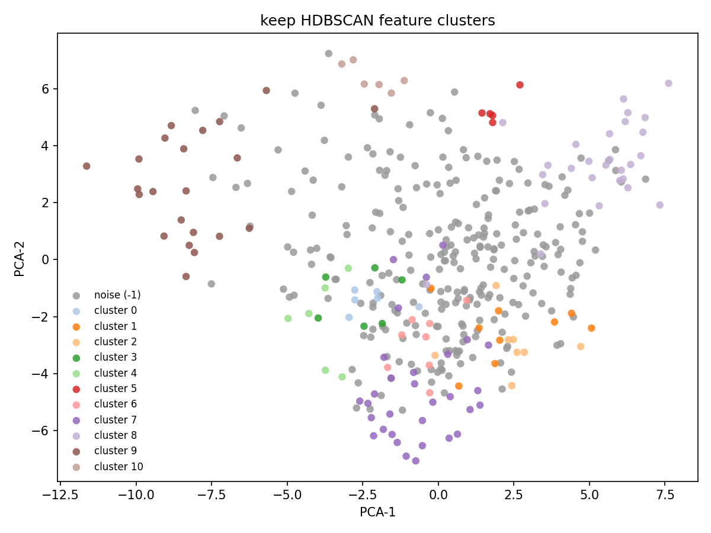
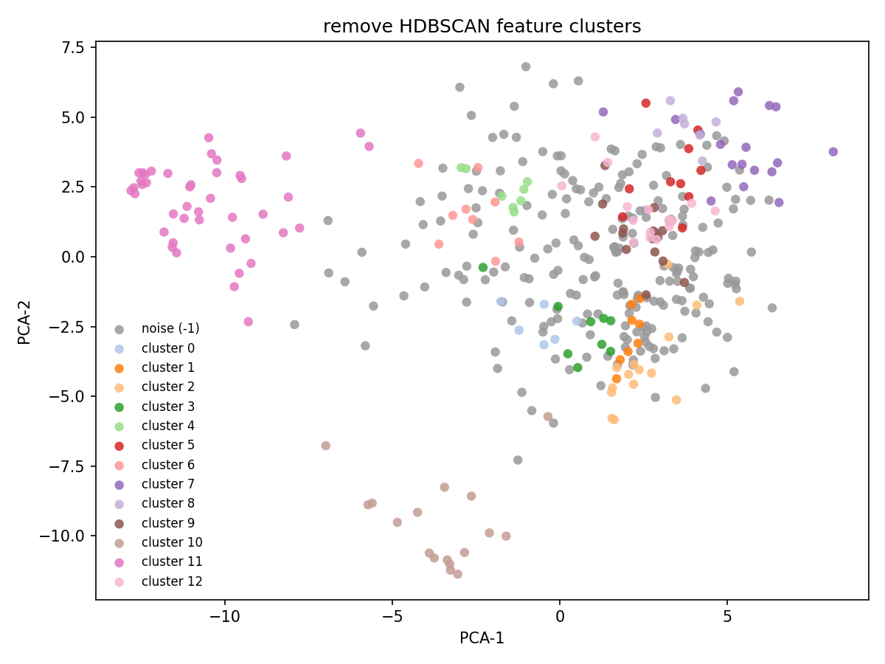

# Feature extraction methods

In the latest study, we annotated 8,791 posts from 1,178 users. Each user was tasked with annotating 20 unique posts.

## Method 1: BERTopic

BERTopic is a topic modeling method that treats topic discovery as a pipeline. That pipeline has the following steps:

1. Embed documents: Convert documents to high-dimensional embeddings using transformer models like BERT.
2. Reduce dimensionality: Apply UMAP to reduce embeddings to 2D or 3D for effective clustering.
3. Cluster the reduced embeddings: Use HDBSCAN or similar algorithms to group similar documents.
4. Extract topic representations: Generate topic labels by identifying the most important words in each cluster.

BERTopic collapses the task of feature discovery into two tasks:

1. Generate groups of similar items (via clustering).
2. Generate descriptions of each group (via topic representation).

We leveraged BERTopic in order to generate features from the original and mirrored post stimuli. We generated embeddings for all posts (n=17,582), clustered them (using both HDBSCAN and K-Means), and generated human-readable labels using AI.

Using this approach, we derived n=53 topics across the dataset. We filter features that are artifacts of the keywords that were used during ingestion. We also did other filtering related to duplication and quality. We then arrived at a list of top n=20 features.

Number of posts	LLM-generated label
210	Criticism of MAGA and related political beliefs
201	Criticism of Democrats vs Republicans (DNC/MAGA) and claims of dishonesty and weak agendas
200	Criticism of Republicans and GOP policies/actions
179	Deportation and illegal immigration debate
145	Biden and Democratic immigration policy criticism
143	Political debate and criticism of left vs. right wing rhetoric
129	Trump corruption and alleged sexual abuse/pardon/power of the president
124	Conservative politics and party loyalty versus progressive change
112	Billionaire and government taxation, spending, and wealth extraction concerns
106	Reproductive and Equal Rights (Women’s Healthcare, Abortion Access, Voting Rights)
97	Anti-fascist and anti-nazi denunciation of white nationalism and alleged voter suppression
87	Tariffs driving higher prices and affordability concerns (Trump, economy, inflation)
84	Anti-Trump anger and criticism of political and corporate figures
74	Federal immigration enforcement and sanctuary cities (DHS/ICE/CBP, airports and international flights)
74	ICE and DHS detention enforcement, protests, and deportation demands
72	Debate over abortion (pro-life vs pro-choice) and definitions of fetal personhood and women’s rights
68	Trans rights and women’s safety amid transphobic political attacks
68	Abortion rights and pro-life vs pro-choice debate
68	Criticism of Donald Trump (idiocy, dementia, and related allegations)
63	LGBTQ+ Pride and Rights Debates (Marriage, Support, Trans Rights, Palestine)
62	Criticism of Trump supporters and alleged anti-intellectual, anti-minority voting behavior
56	US–Iran nuclear deal and regional war tensions involving Trump, Israel, and Netanyahu

## Method 2: LLM-based feature extraction

...

## Methods

We used two analyses to describe the content and linguistic form of Study Phase 2 Part 2 posts. First, we identified topics in the full set of original posts without using moderation decisions to guide the analysis. Second, we analyzed keep-rated and remove-rated posts separately to identify recurring linguistic features associated with each decision. We used moderation decisions only to define the two feature-extraction samples and to color the visualizations.

For the topic analysis, we used BERTopic to group semantically similar original posts and describe each group with distinctive words. We then used a language model to produce short, readable labels from those words and representative posts. We visualized the resulting topic structure in two dimensions and overlaid modal moderation decisions and rater agreement to show how they were distributed across the topic space.

For the feature analysis, we randomly sampled 500 keep-rated and 500 remove-rated posts. A language model extracted observable features of each post, including wording, topic, meaning, communicative intent, target, and sentence structure. We grouped similar features within each decision group and used a language model to assign each group a short label and definition. The resulting clusters summarize recurring rhetorical and linguistic patterns in keep-rated and remove-rated posts (Tables 3 and 4, Figure 2).

The topic analysis describes the policy areas and political themes in the corpus. The feature analysis describes rhetorical and linguistic patterns associated with each moderation decision. We use the two analyses as separate descriptive views of the data.

---

## Figures

### Figure 1. BERTopic 2-D UMAP overlays (original posts)

Two-dimensional projection of the 8,790 post embeddings. Color shows topic, modal keep (green) or remove (red), and unanimous (green) or non-unanimous (red) linked-fate ratings.

| Overlay | PNG |
| ------- | --- |
| By topic |  |
| By keep / remove |  |
| By rater unanimity |  |

### Figure 2. LLM feature clusters (HDBSCAN, PCA-2 for display)

Two-dimensional principal component projections of language-model feature embeddings, colored by HDBSCAN cluster. Noise features were not labeled.

| Class | PNG |
| ----- | --- |
| Keep |  |
| Remove |  |

---

## Tables

### Table 1. Pipeline summary

| Analysis | Corpus | Embedding target | Clustering | Naming | Output scale |
| -------- | ------ | ---------------- | ---------- | ------ | ------------ |
| Topic analysis | 8,790 original posts | Post text | UMAP then HDBSCAN, minimum cluster size 15 | Distinctive words and language-model labels | 53 topics, 3,030 noise assignments |
| Keep feature analysis | 500 keep posts, 50 batches, at most 8 features each | Feature description | HDBSCAN, minimum cluster size 5 | Language-model labels from cluster samples | 400 features, 11 labeled clusters, 266 noise features |
| Remove feature analysis | 500 remove posts, 50 batches, at most 8 features each | Feature description | HDBSCAN, minimum cluster size 5 | Language-model labels from cluster samples | 400 features, 13 labeled clusters, 220 noise features |

### Table 2. Largest BERTopic topics (original posts)

Largest topics by document count, excluding the noise group (topic id -1).

| topic_id | n_docs | LLM topic label |
| -------: | -----: | --------------- |
| 0 | 1586 | Debate over U.S. gun rights and gun control (Second Amendment, NRA, and violence) |
| 1 | 947 | Climate policy and energy transition amid global crisis |
| 2 | 210 | Criticism of MAGA and related political beliefs |
| 3 | 201 | Criticism of Democrats vs Republicans (DNC/MAGA) and claims of dishonesty and weak agendas |
| 4 | 200 | Criticism of Republicans and GOP policies/actions |
| 5 | 179 | Deportation and illegal immigration debate |
| 6 | 145 | Biden and Democratic immigration policy criticism |
| 7 | 143 | Political debate and criticism of left vs. right wing rhetoric |
| 8 | 129 | Trump corruption and alleged sexual abuse/pardon/power of the president |
| 9 | 124 | Conservative politics and party loyalty versus progressive change |

### Table 3. Keep-feature HDBSCAN cluster labels

| cluster_id | n | Label |
| ---------: | -: | ----- |
| 0 | 6 | Mixed-length argumentative commentary |
| 1 | 9 | Conditional if/then policy or prediction |
| 2 | 8 | Declarative claims with quantified evidence |
| 3 | 6 | Hashtag/mention-driven political framing |
| 4 | 6 | High-density political proper-noun referencing |
| 5 | 5 | Conspiratorial manipulation framing |
| 6 | 8 | Direct second-person imperative persuasion |
| 7 | 31 | Imperative policy or punishment demands |
| 8 | 27 | Us-vs-them mirror blame targeting parties |
| 9 | 22 | Profane, punctuation-heavy aggressive condemnation |
| 10 | 6 | Ridicule, slurs, and derisive targeting |

### Table 4. Remove-feature HDBSCAN cluster labels

| cluster_id | n | Label |
| ---------: | -: | ----- |
| 0 | 6 | Dense named political/religious entities |
| 1 | 8 | Explicit policy or legal prescriptions |
| 2 | 15 | Gun policy framed as rights/violence |
| 3 | 9 | Brevity with direct ideological insult |
| 4 | 8 | Derisive ridicule and mockery toward targets |
| 5 | 10 | Conspiracy-style motive and cover-up framing |
| 6 | 9 | Moralized, hostile political condemnation |
| 7 | 18 | Partisan voters blamed via us-vs-them |
| 8 | 7 | Victim/persecution framing with blame |
| 9 | 15 | Imperative political/speech-action demands |
| 10 | 17 | Exclamatory imperative and insult punctuation |
| 11 | 43 | Profanity and sexual slur attacks |
| 12 | 15 | Imperative second-person confrontations |

The language model wrote one-sentence definitions for every cluster. The definitions describe the observed features and do not predict a new post's keep or remove decision.
