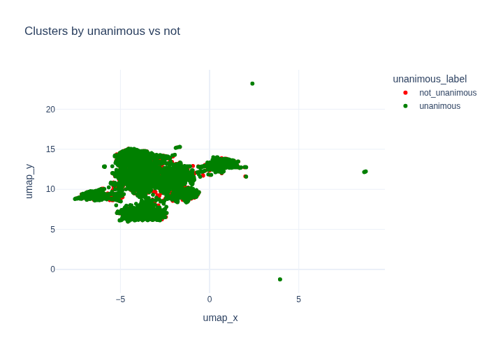
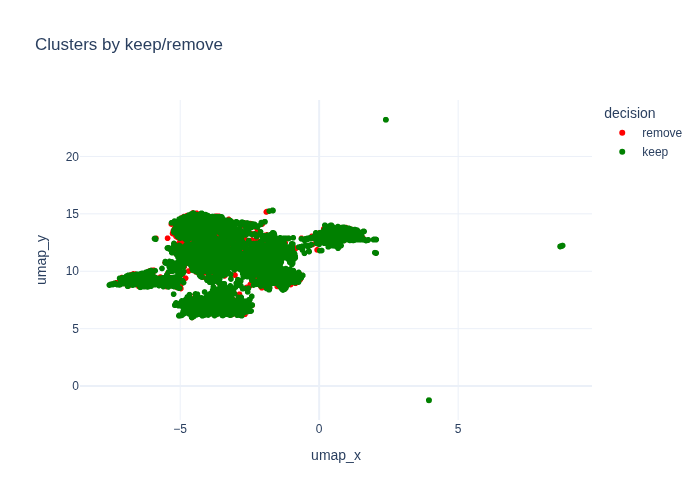
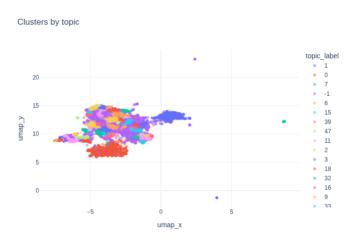
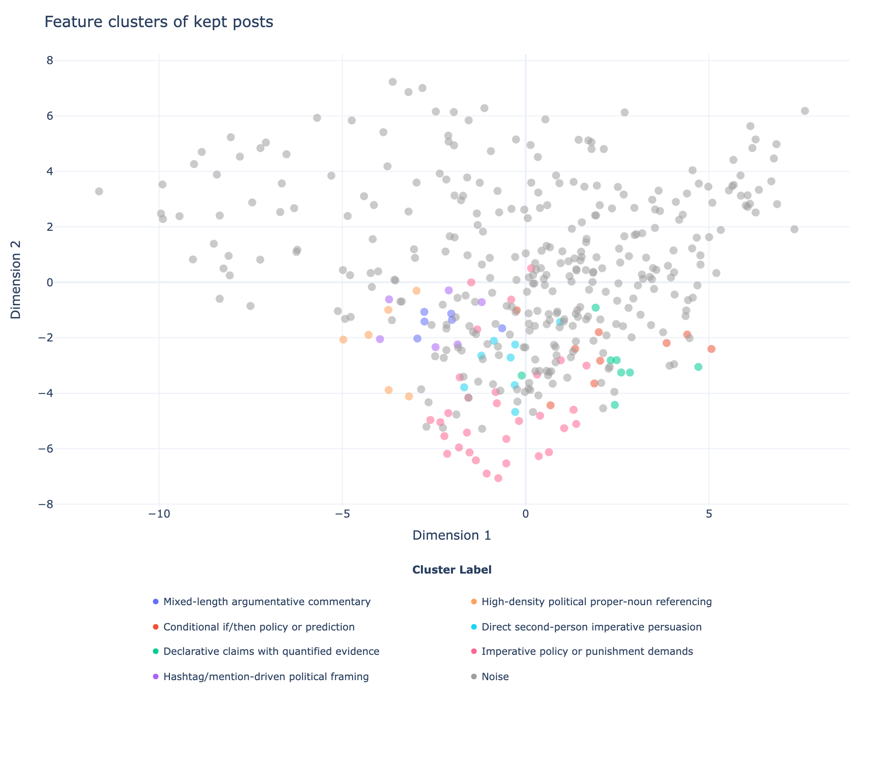
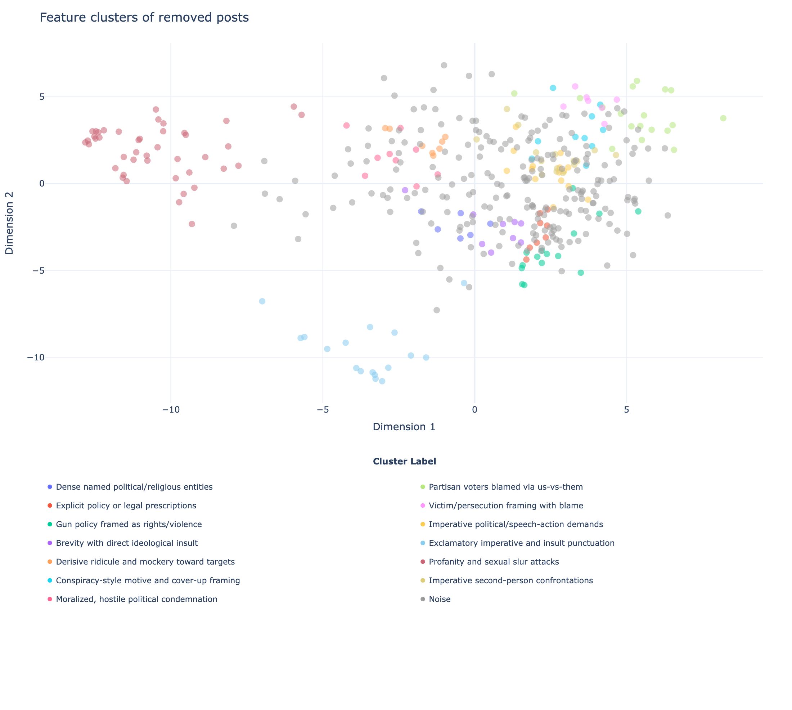

# Feature extraction methods

In the latest study, we annotated 8,791 posts from 1,178 users. Each user was tasked with annotating 20 unique posts.

## Method 1: BERTopic

BERTopic is a topic modeling method that treats topic discovery as a pipeline. That pipeline has the following steps:

1. Embed documents: Convert documents to high-dimensional embeddings using transformer models like BERT.
2. Reduce dimensionality: Apply UMAP to reduce embeddings to 2D or 3D for effective clustering.
3. Cluster the reduced embeddings: Use HDBSCAN or similar algorithms to group similar documents.
4. Extract topic representations: Generate topic labels by identifying the most important words in each cluster.

BERTopic collapses the task of feature discovery into two tasks:

1. Generate groups of similar items (via clustering).
2. Generate descriptions of each group (via topic representation).

We leveraged BERTopic in order to generate features from the original and mirrored post stimuli. We generated embeddings for all posts (n=17,582), clustered them (using both HDBSCAN and K-Means), and generated human-readable labels using AI.

Using this approach, we derived n=53 topics across the dataset. We filter features that are artifacts of the keywords that were used during ingestion. We also did other filtering related to duplication and quality. We then arrived at a list of top n=20 features.

| Number of posts | LLM-generated label                                                                                          |
|-----------------|-------------------------------------------------------------------------------------------------------------|
| 210             | Criticism of MAGA and related political beliefs                                                             |
| 201             | Criticism of Democrats vs Republicans (DNC/MAGA) and claims of dishonesty and weak agendas                  |
| 200             | Criticism of Republicans and GOP policies/actions                                                           |
| 179             | Deportation and illegal immigration debate                                                                  |
| 145             | Biden and Democratic immigration policy criticism                                                           |
| 143             | Political debate and criticism of left vs. right wing rhetoric                                              |
| 129             | Trump corruption and alleged sexual abuse/pardon/power of the president                                     |
| 124             | Conservative politics and party loyalty versus progressive change                                           |
| 112             | Billionaire and government taxation, spending, and wealth extraction concerns                               |
| 106             | Reproductive and Equal Rights (Women’s Healthcare, Abortion Access, Voting Rights)                         |
| 97              | Anti-fascist and anti-nazi denunciation of white nationalism and alleged voter suppression                  |
| 87              | Tariffs driving higher prices and affordability concerns (Trump, economy, inflation)                       |
| 84              | Anti-Trump anger and criticism of political and corporate figures                                           |
| 74              | Federal immigration enforcement and sanctuary cities (DHS/ICE/CBP, airports and international flights)      |
| 74              | ICE and DHS detention enforcement, protests, and deportation demands                                        |
| 72              | Debate over abortion (pro-life vs pro-choice) and definitions of fetal personhood and women’s rights        |
| 68              | Trans rights and women’s safety amid transphobic political attacks                                          |
| 68              | Abortion rights and pro-life vs pro-choice debate                                                          |
| 68              | Criticism of Donald Trump (idiocy, dementia, and related allegations)                                       |
| 63              | LGBTQ+ Pride and Rights Debates (Marriage, Support, Trans Rights, Palestine)                                |
| 62              | Criticism of Trump supporters and alleged anti-intellectual, anti-minority voting behavior                  |
| 56              | US–Iran nuclear deal and regional war tensions involving Trump, Israel, and Netanyahu                       |

We visualize the post as two-dimensional UMAP embeddings. We observe no clear linear separation between posts that were kept by human annotators versus removed. We also see no clear linear separation between posts that were unanimously labeled as keep or remove by human annotators versus posts labeled by split decision. This tells us that semantic meaning of posts by itself doesn't clearly determine keep vs. remove decisions. Topic and content alone is a weak separator. However, an exploratory 2-D representation itself doesn't tell us that there is no meaningful distinction between posts kept vs. removed by human annotators. This motivates our use of LLM-based feature extraction to mine for richer rhetorical and lexical patterns beyond what is available at a surface embedding level.

## Method 2: LLM-based feature extraction

We also use LLMs to extract features. LLMs, unlike embeddings, can be steered to extract features from a richer set of categories, evaluating rhetorical, topical, lexical, and other patterns of the text.

We followed the following pipeline, [inspired by current work out of Google DeepMind](https://www.lesswrong.com/posts/WAZWA6FPQvH8okouJ/llm-driven-feature-discovery):

1. Give an LLM batches documents all at once and then ask it to generate features.
2. Get a semantic embedding of each generated feature.
3. Cluster the semantic embeddings.
4. Give an LLM a random sample of documents from each cluster and ask it to generate human-readable labels.

We use a systematic prompt to extract features across all these categories. We take a random sample of 500 posts removed by human annotators and 500 posts kept by human annotators. We then generated n=100 total LLM prompts for our initial data exploration. In each, we group n=10 posts (either all removed or all kept) and we ask the LLMs to generate features to explain why the human annotators could have chosen to keep or remove these posts.

The resulting clusters summarize recurring rhetorical and linguistic patterns in keep-rated and remove-rated posts. The topic analysis describes the policy areas and political themes in the corpus. The feature analysis describes rhetorical and linguistic patterns associated with each moderation decision. We use the two analyses as separate descriptive views of the data.

We observe a cleaner separation of features used to decide what posts to keep or what posts to remove using this new LLM-based method as compared to the BERTopic-based method. This is because our LLM prompting scheme can consider a richer set of criteria for what features to extract. We also notice a wider set of features uncovered for posts that were removed as compared to posts that were kept.

## Comparing extracted features against reasons cited by participants

Both BERTopic and the LLM-based feature extraction generated a list of candidate features. We now compare them against features that were cited by study participants themselves. W We analyzed free-text reflections from participants who reported low vs high influence of the pair view (Likert < 4: n=255; >= 4: n=922). An LLM extracted decision-rule features from these texts. Then, we embedded those features and clustered them with HDBSCAN. Because responses are heterogeneous and noisy, many features were left as noise. Below we report the largest coherent themes.

For users (n=255) who said that the political mirror intervention didn't affect their moderation decision strongly (score < 4), we found that they commonly cited some variation of what we coded as "Harm/toxicity thresholds within free speech", where as long as they didn't perceive the text to be doing harm, they permitted it.

| Feature                                     | Number of samples | Example                                                                                                  |
|----------------------------------------------|-------------------|----------------------------------------------------------------------------------------------------------|
| Harm/toxicity thresholds within free speech  | 130                | “So long as nothing harmful or threatening towards a group, person, or identity (like actually telling a person to die…)” |
| Pair comparison barely influenced decisions  | 24                 | “I tried to look at the content of each post individually.”                                              |

For users (n=922) who said that the intervention did affect their moderation decision (score >= 4), we found more heterogeneity around the justifications they used for their removals. Some annotators cited removing toxic or threatening posts, while others cited fairness in moderating both sides. A third common theme observed was citing exceptions to free speech.
 

| Feature                                   | Number of samples | Example                                                                                                                           |
|--------------------------------------------|-------------------|-----------------------------------------------------------------------------------------------------------------------------------|
| Remove for threats and toxicity            | 320               | “I looked for offensive or targeting language toward another individual or group or people, and if I saw a post with that language then I removed them.” |
| Apply same moderation standard across both sides | 118                | “Seeing them as pairs helped me check my own bias, because I had to ask whether I would allow the same tone if it came from the opposite side.” |
| Free speech with violence/threat exceptions| 59                | “I believe in free speech, unless it is very hateful hate speech or threats of violence.”                                         |

## Training a preliminary model with these features

Given our uncovered features, we prompted an LLM to perform the keep/remove classification task. In our control prompt, we gave the exact same stimuli and instructions that we gave to human participants. In our prompt-tuned version, we added the list of keep/remove criteria mined from the BERTopic and LLM feature exploration. We sampled 1,000 posts, 500 posts kept and 500 posts removed by human annotators, and used Qwen 3.6 as our LLM for open-source reproducibility. For our task, we asked the LLM to predict if a post would be removed by human annotators. We observed a significant improvement in both recall and F1 driven by our ablation.

| Arm | Accuracy | Precision | Recall | F1 |
| --- | ---: | ---: | ---: | ---: |
| control | 0.6600 | 0.6932 | 0.5740 | 0.6280 |
| prompt-tuned | 0.6490 | 0.6114 | 0.8180 | 0.6997 |

Our approach of extracting features across posts that were kept versus removed by human annotators led to a data-driven set of community norms, broadly agreed to by our annotators, around content moderation, allowable speech, and permissible disagreement. Passing these rules to an LLM and asking it to make decisions with respect to those rules generated a 42.5% increase in the recall and an 11% improvement in F1 score. This suggests that with additional scale, feature generation, and prompt engineering, we could possibly generate a more comprehensive and fine-grained series of annotator-driven human norms that align with how real people make content moderation decisions.

